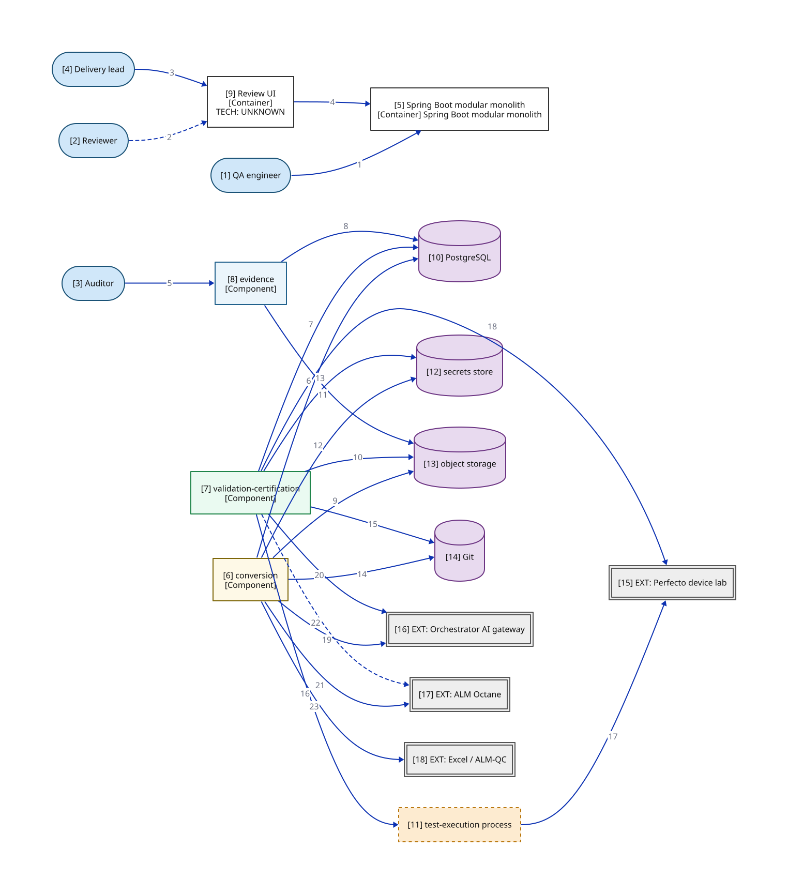

# C2b — Container drill-down: module wiring

> Which module owns which store/external edge? This view opens the APP box from C2a into its three modules; every rolled-up C2a edge reappears here at module grain. Canvas carries numbered edge refs only (1–23); the full claim lives in the edge-detail table keyed by number. This is the completeness reference for module-granular edges — the C2c–e overlays each repeat a subset of it.

**Locator:** this view opens `APP` from `02-container`. It is a **completeness reference** at this grain.

## Node explainer (numbered — matches the `[n]` on the canvas)

| # | Node | Detail the short label hides |
|---|------|------------------------------|
| 5 | APP | Module boundaries are the three clusters, NOT the blueprint's five pipeline stages (ADR 0005). Drawn opaque in C2a; opened at module grain in C2b and at component grain in C3a |
| 6 | CONVERSION | Conversion (cluster A) — 10 components incl. the Invoke Models seam |
| 7 | VALIDATION_CERTIFICATION | Validation-certification (cluster B) — 5 components; static gate → device gate → classify → certify. Device-gate worker holds NO gateway credential (ADR 0013) |
| 8 | EVIDENCE | Evidence (cluster C) — Preserve Provenance + metrics read model + auditor export |
| 9 | WEB | One authenticated internal API, no BFF (ADR 0008). SSO against the bank IdP is a HARD requirement, not a nice-to-have (M37). The ONLY UI in Phase 1 |
| 10 | POSTGRESQL | WORKING ASSUMPTION (spine C3); dev/CI embedded or containerized, ephemeral-only (D1, M40). Schemas: conversion-state · lineage (append-only: app role INSERT/SELECT only, per-conversion hash chain, supersede-not-update — ADR 0012) · outbox+queue (bounded retries, dead-letter quarantine — M21) · judge-response cache (M27, CF7). No cross-lifecycle foreign keys (F4, ADR 0006) |
| 11 | TEST_EXECUTION | Test-execution process, spawned per device run. Separate OS process — shape committed NOW, sandbox technology weeks 3–8 (ADR 0013). NO long-lived credentials; single-run device session token; NEVER the gateway credential. Static capability rules gate entry (supplement, not the control) |
| 12 | SECRETS_STORE | Interim: CI secret store; the vault is named by the M33 controls-baseline read — PENDING. All credentials resolved by injected reference, never literals (M34/CF8) |
| 13 | OBJECT_STORAGE | Evidence object storage behind an S3-compatible port (ADR 0011). Dev/CI: containerized MinIO; production BINDING PROBE-PENDING (week-0 platform probe; default = self-operated MinIO). Write-once / object-lock REQUIRED — ADR 0012's precondition, deployment-checked. Holds: classified artifacts + retention classes (M39) · canonicalized source snapshots (M15) · lineage chain anchors (ADR 0012). Envelope encryption + crypto-shredding before the first audit-retained artifact (ADR 0011 as amended) |
| 14 | GIT | Prompts / exemplars / golden set / test code; version identity is free |
| 15 | PERFECTO | Same standing as the C1 node-detail table (E1/E2). INCUMBENT vendor — MSA on file, unread (E1); flows run on mock/synthetic data (E2); NOT covered by E3 |
| 16 | GATEWAY | Same standing as the C1 node-detail table (E4). Model providers hosted INSIDE the bank — prompts never leave (E4); version-report contract UNVERIFIED (M5 held) |
| 17 | OCTANE | Same standing as the C1 node-detail table (E5). At BOTH ends of the pipeline (E5): ingest source AND publish target; asset-versioning UNVERIFIED (M7 held) |
| 18 | XLS | Same standing as the C1 node-detail table (E3/S9). File input originating from bank teams inside the network (E3/S9) |

## Edge detail

| # | Edge | Mode | Claim |
|---|------|------|-------|
| 1 | QA → APP | sync | 2 CLIs (ingestion + hierarchy-tool), no BFF (ADR 0008) |
| 2 | REVIEWER → WEB | async | Review queue; human latency, hours–days |
| 3 | LEAD → WEB | sync | Read-only metrics dashboard |
| 4 | WEB → APP | sync | One authenticated internal API; SSO against bank IdP (M37) |
| 5 | AUDITOR → EVIDENCE | sync | Versioned export; itself an attributable lineage event (CF11) |
| 6 | CONVERSION → POSTGRESQL | sync | State + lineage, same local transaction (ADR 0007) |
| 7 | VALIDATION_CERTIFICATION → POSTGRESQL | sync | State + lineage, same local transaction (ADR 0007) |
| 8 | EVIDENCE → POSTGRESQL | sync | Append-only lineage writes + read-model reads |
| 9 | CONVERSION → OBJECT_STORAGE | sync | Canonicalized source snapshots (M15) |
| 10 | VALIDATION_CERTIFICATION → OBJECT_STORAGE | sync | Classified artifacts + retention class (ADR 0006, M39) |
| 11 | EVIDENCE → OBJECT_STORAGE | sync | Chain-head anchors at interval; a stale anchor is an alert (ADR 0012) |
| 12 | CONVERSION → SECRETS_STORE | sync | Gateway credential, by injected reference (M34) |
| 13 | VALIDATION_CERTIFICATION → SECRETS_STORE | sync | Perfecto + test-account credentials, by injected reference (M34) |
| 14 | CONVERSION → GIT | sync | Versioned assets (prompts / exemplars / golden set / test code) |
| 15 | VALIDATION_CERTIFICATION → GIT | sync | Grow exemplar + golden set |
| 16 | VALIDATION_CERTIFICATION → TEST_EXECUTION | sync | Spawn per device run (ADR 0013) |
| 17 | TEST_EXECUTION → PERFECTO | sync | Single-run device session token; expires with the run (ADR 0013) |
| 18 | VALIDATION_CERTIFICATION → PERFECTO | sync | Pool + artifact pull; dominant cost |
| 19 | CONVERSION → GATEWAY | sync | Model calls (P2) via the Invoke Models seam |
| 20 | VALIDATION_CERTIFICATION → GATEWAY | sync | Fidelity grade (ADR 0004); from day one |
| 21 | CONVERSION → OCTANE | sync | Manual-test ingest, API-key; hash-at-ingest (M15) |
| 22 | VALIDATION_CERTIFICATION → OCTANE | async | A3: publish certified assets (CF3); never a verdict precondition |
| 23 | CONVERSION → XLS | sync | Workbook file input; raw workbooks never enter Git (M35) |

## Key

- stadium/pill = a person or role (actor)
- rectangle = an application or data store (C4 container)
- rectangle = a grouping of code inside a container (C4 component)
- double-bordered rectangle, `EXT:` = an external system we don't own
- cylinder = a data store (used for datastores ONLY)
- dash-bordered rectangle = a runtime process, not a deployable
- module-a colour = the same module tracked by colour across every view
- module-b colour = the same module tracked by colour across every view
- module-c colour = the same module tracked by colour across every view
- solid arrow = synchronous call
- dashed arrow = asynchronous message/event
- `[Type]` under a name = the element's C4 type (container/component)

> **Export caveat:** if this diagram's SVG is used detached from this page (e.g. a slide), re-inline its honesty tags onto the affected nodes — off-canvas tags do not travel with a bare SVG.

