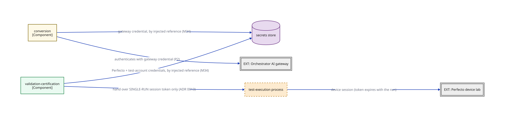

# C2d — Container overlay: credential topology

> Who holds which credential — and who does not? A subset of C2b (the module-wiring view) — who resolves which credential, and the one absence that matters most.

**Locator:** this view opens `APP` from `03-container-module-wiring`. It is a **subset** of `03-container-module-wiring` — not the complete edge set.

## Node detail (keyed by node ID)

| Node | Detail the short label hides |
|------|------------------------------|
| CONVERSION | Conversion (cluster A) — 10 components incl. the Invoke Models seam. Only MA holds the gateway credential |
| VALIDATION_CERTIFICATION | Validation-certification (cluster B) — 5 components; static gate → device gate → classify → certify. Device-gate worker holds NO gateway credential (ADR 0013) |
| SECRETS_STORE | Interim: CI secret store; the vault is named by the M33 controls-baseline read — PENDING. All credentials resolved by injected reference, never literals (M34/CF8) |
| TEST_EXECUTION | Test-execution process, spawned per device run. Separate OS process — shape committed NOW, sandbox technology weeks 3–8 (ADR 0013). NO long-lived credentials; single-run device session token; NEVER the gateway credential. Static capability rules gate entry (supplement, not the control) |
| PERFECTO | INCUMBENT vendor — MSA on file, unread (E1); flows run on mock/synthetic data (E2); NOT covered by E3 |
| GATEWAY | Internal gateway; model providers hosted INSIDE the bank — prompts never leave (E4). Version-report contract UNVERIFIED (M5 probe held) |

## Key

- rectangle = a grouping of code inside a container (C4 component)
- double-bordered rectangle, `EXT:` = an external system we don't own
- cylinder = a data store (used for datastores ONLY)
- dash-bordered rectangle = a runtime process, not a deployable
- module-a colour = the same module tracked by colour across every view
- module-b colour = the same module tracked by colour across every view
- solid arrow = synchronous call
- `[Type]` under a name = the element's C4 type (container/component)

> **Export caveat:** if this diagram's SVG is used detached from this page (e.g. a slide), re-inline its honesty tags onto the affected nodes — off-canvas tags do not travel with a bare SVG.

