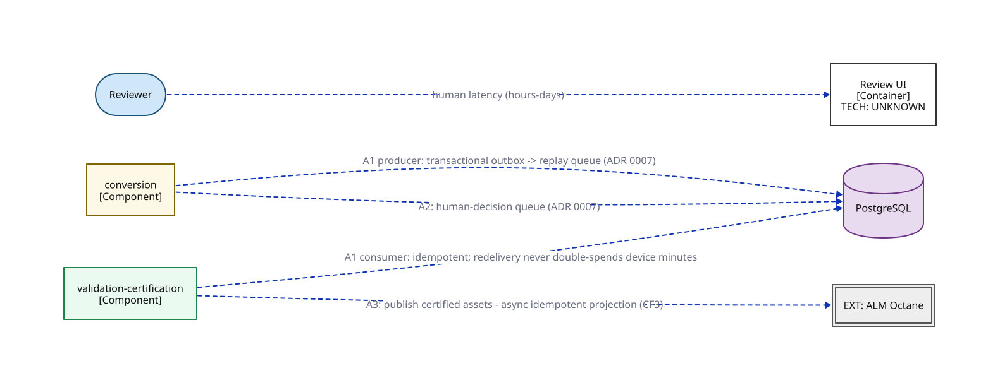

# C2e — Container overlay: async edges & queues

> Which edges are queued, and on what machinery? A subset of C2b (the module-wiring view) — every dotted edge in the architecture, and the machinery under each.

**Locator:** this view opens `APP` from `03-container-module-wiring`. It is a **subset** of `03-container-module-wiring` — not the complete edge set.

## Node detail (keyed by node ID)

| Node | Detail the short label hides |
|------|------------------------------|
| REVIEWER | HITL queue; responds in hours–days |
| WEB | One authenticated internal API, no BFF (ADR 0008). SSO against the bank IdP is a HARD requirement, not a nice-to-have (M37). The ONLY UI in Phase 1 |
| CONVERSION | Conversion (cluster A) — 10 components incl. the Invoke Models seam |
| VALIDATION_CERTIFICATION | Validation-certification (cluster B) — 5 components; static gate → device gate → classify → certify. Device-gate worker holds NO gateway credential (ADR 0013) |
| POSTGRESQL | WORKING ASSUMPTION (spine C3); dev/CI embedded or containerized, ephemeral-only (D1, M40). Schemas: conversion-state · lineage (append-only: app role INSERT/SELECT only, per-conversion hash chain, supersede-not-update — ADR 0012) · outbox+queue (bounded retries, dead-letter quarantine — M21) · judge-response cache (M27, CF7). No cross-lifecycle foreign keys (F4, ADR 0006). Outbox + queues: DB-backed queue acceptable (spine C2); bounded retries, exponential backoff, dead-letter quarantine with alert (M21) |
| OCTANE | At BOTH ends of the pipeline (E5): ingest source AND publish target; asset-versioning UNVERIFIED (M7 held) |

## Key

- stadium/pill = a person or role (actor)
- rectangle = an application or data store (C4 container)
- rectangle = a grouping of code inside a container (C4 component)
- double-bordered rectangle, `EXT:` = an external system we don't own
- cylinder = a data store (used for datastores ONLY)
- module-a colour = the same module tracked by colour across every view
- module-b colour = the same module tracked by colour across every view
- dashed arrow = asynchronous message/event
- `[Type]` under a name = the element's C4 type (container/component)

> **Export caveat:** if this diagram's SVG is used detached from this page (e.g. a slide), re-inline its honesty tags onto the affected nodes — off-canvas tags do not travel with a bare SVG.

