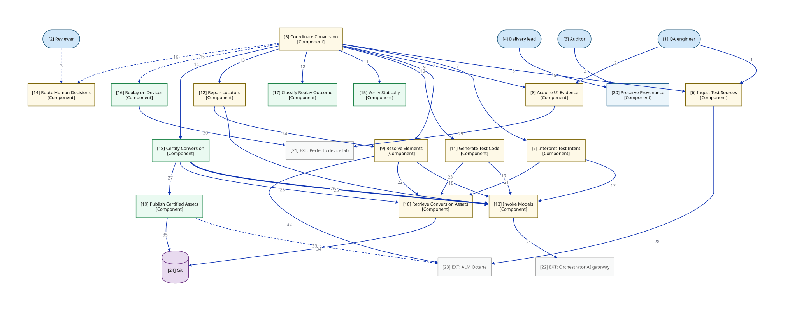

# C3a — Component view: module flow

> How does a conversion move through the 16 components? This view opens the APP container from C2a (whose module-grain wiring is C2b) — all sixteen components in their three modules. Flow only — screening edges are C3b, provenance edges are C3c. Canvas carries numbered edge refs; the full claim lives in the edge-detail table keyed by number.

**Locator:** this view opens `APP` from `02-container`. It is a **completeness reference** at this grain.

## Node explainer (numbered — matches the `[n]` on the canvas)

| # | Node | Detail the short label hides |
|---|------|------------------------------|
| 1 | QA | IDE + 2 CLIs. In P1 the conversion reasoning happens in THIS actor's IDE (Copilot, ADR 0001); the system receives only committed artifacts |
| 2 | REVIEWER | HITL queue; responds in hours–days |
| 3 | AUDITOR | Must reconstruct verdicts from stored evidence alone, without access to the running system (ADR 0008) |
| 4 | LEAD | Read-only metrics |
| 5 | COORDINATE_CONVERSION | State machine + retry budgets; CE=11, CA=0 (ADR 0003). Repair budgets: 3 static, 3 device |
| 6 | INGEST_TEST_SOURCES | Adapters: Excel + Octane now, ALM/QC later (C1). Hash-at-ingest snapshot digest (M15) |
| 7 | INTERPRET_TEST_INTENT | Emits TestCaseIR; flags ambiguity |
| 8 | ACQUIRE_UI_EVIDENCE | Hierarchy tool: page source, Object Spy, pruned tree. Records device + pool identity; off-pool captures flagged (M24) |
| 9 | RESOLVE_ELEMENTS | Owns the locator cascade. Octane locator lookup STUBBED IN SPINE (C5) |
| 10 | RETRIEVE_CONVERSION_ASSETS | Versioned prompts, house rules, exemplars |
| 11 | GENERATE_TEST_CODE | Page Objects + Appium Java/TestNG |
| 12 | REPAIR_LOCATORS | Bounded re-grounding |
| 13 | INVOKE_MODELS | THE model seam (ADR 0001): P1 Copilot impl / P2 gateway impl, config-selected. Cache key incl. model+provider version (ADR 0002). P2 edge tags = runtime call exists in Phase 2 only; the seam and its callers exist from the first commit (F1) |
| 14 | ROUTE_HUMAN_DECISIONS | Authenticated; every decision attributed to an individual principal (M37) |
| 15 | VERIFY_STATICALLY | Free, fast, deterministic. Capability rules gate generated code (ADR 0013) |
| 16 | REPLAY_ON_DEVICES | K runs, pinned pools; dominant cost. Spawns the separate execution process, single-run token, NO gateway credential (ADR 0013). Records ACTUAL context beside requested; pinned-facet mismatch quarantines (M24) |
| 17 | CLASSIFY_REPLAY_OUTCOME | Rule-based taxonomy; unmapped outcome quarantines, never defaults (M10a) |
| 18 | CERTIFY_CONVERSION | Grades fidelity + applies gates conjunctively; grade is ADVISORY to a human certifier (CF9). Custody-before-certify: every reference must resolve locally first (CF1) |
| 19 | PUBLISH_CERTIFIED_ASSETS | Single-writer; certify-locally, publish-async (CF3) |
| 20 | PRESERVE_PROVENANCE | Append-only hash-chained lineage, CA=13 (ADR 0012); + metrics read model + auditor export (ADR 0008, CF11) |
| 21 | PERFECTO | Drawn faded for location only; detail lives in the C2 tables |
| 22 | GATEWAY | Drawn faded for location only; detail lives in the C2 tables |
| 23 | OCTANE | Drawn faded for location only; detail lives in the C2 tables |
| 24 | GIT | Drawn faded for location only; detail lives in the C2 tables. Prompts / exemplars / golden set / test code; version identity is free |

## Edge detail

| # | Edge | Mode | Claim |
|---|------|------|-------|
| 1 | QA → INGEST_TEST_SOURCES | sync | ingestion CLI |
| 2 | QA → ACQUIRE_UI_EVIDENCE | sync | hierarchy-tool CLI |
| 3 | REVIEWER → ROUTE_HUMAN_DECISIONS | async | review-queue UI |
| 4 | AUDITOR → PRESERVE_PROVENANCE | sync | versioned export |
| 5 | LEAD → PRESERVE_PROVENANCE | sync | metrics |
| 6 | COORDINATE_CONVERSION → INGEST_TEST_SOURCES | sync | acquire source |
| 7 | COORDINATE_CONVERSION → INTERPRET_TEST_INTENT | sync | interpret |
| 8 | COORDINATE_CONVERSION → ACQUIRE_UI_EVIDENCE | sync | capture evidence |
| 9 | COORDINATE_CONVERSION → RESOLVE_ELEMENTS | sync | resolve locators |
| 10 | COORDINATE_CONVERSION → GENERATE_TEST_CODE | sync | generate |
| 11 | COORDINATE_CONVERSION → VERIFY_STATICALLY | sync | static gate |
| 12 | COORDINATE_CONVERSION → CLASSIFY_REPLAY_OUTCOME | sync | classify |
| 13 | COORDINATE_CONVERSION → REPAIR_LOCATORS | sync | repair (bounded) |
| 14 | COORDINATE_CONVERSION → CERTIFY_CONVERSION | sync | certify |
| 15 | COORDINATE_CONVERSION → REPLAY_ON_DEVICES | async | A1: replay request |
| 16 | COORDINATE_CONVERSION → ROUTE_HUMAN_DECISIONS | async | A2: escalate |
| 17 | INTERPRET_TEST_INTENT → INVOKE_MODELS | sync | P2 |
| 18 | RESOLVE_ELEMENTS → INVOKE_MODELS | sync | P2 |
| 19 | GENERATE_TEST_CODE → INVOKE_MODELS | sync | P2 |
| 20 | REPAIR_LOCATORS → INVOKE_MODELS | sync | P2 |
| 21 | INTERPRET_TEST_INTENT → RETRIEVE_CONVERSION_ASSETS | sync | retrieves conversion assets |
| 22 | RESOLVE_ELEMENTS → RETRIEVE_CONVERSION_ASSETS | sync | retrieves conversion assets |
| 23 | GENERATE_TEST_CODE → RETRIEVE_CONVERSION_ASSETS | sync | retrieves conversion assets |
| 24 | REPAIR_LOCATORS → RESOLVE_ELEMENTS | sync | re-run cascade |
| 25 | CERTIFY_CONVERSION → INVOKE_MODELS | entangled | ENTANGLEMENT: fidelity grade (ADR 0004) |
| 26 | CERTIFY_CONVERSION → RETRIEVE_CONVERSION_ASSETS | sync | retrieves conversion assets |
| 27 | CERTIFY_CONVERSION → PUBLISH_CERTIFIED_ASSETS | sync | publish on PASS |
| 28 | INGEST_TEST_SOURCES → OCTANE | sync | ingest |
| 29 | ACQUIRE_UI_EVIDENCE → PERFECTO | sync | live capture |
| 30 | REPLAY_ON_DEVICES → PERFECTO | sync | K device runs |
| 31 | INVOKE_MODELS → GATEWAY | sync | P2 model calls |
| 32 | RESOLVE_ELEMENTS → OCTANE | sync | locator lookup (stub) |
| 33 | PUBLISH_CERTIFIED_ASSETS → OCTANE | async | A3: write-back |
| 34 | RETRIEVE_CONVERSION_ASSETS → GIT | sync | versioned assets |
| 35 | PUBLISH_CERTIFIED_ASSETS → GIT | sync | grow exemplar + golden set |

## Key

- stadium/pill = a person or role (actor)
- rectangle = a grouping of code inside a container (C4 component)
- double-bordered rectangle, `EXT:` = an external system we don't own
- cylinder = a data store (used for datastores ONLY)
- faded fill/grey text = shown for context, not the subject of this view
- module-a colour = the same module tracked by colour across every view
- module-b colour = the same module tracked by colour across every view
- module-c colour = the same module tracked by colour across every view
- solid arrow = synchronous call
- dashed arrow = asynchronous message/event
- thick arrow = a deliberately-marked entanglement edge
- `[Type]` under a name = the element's C4 type (container/component)

> **Export caveat:** if this diagram's SVG is used detached from this page (e.g. a slide), re-inline its honesty tags onto the affected nodes — off-canvas tags do not travel with a bare SVG.

