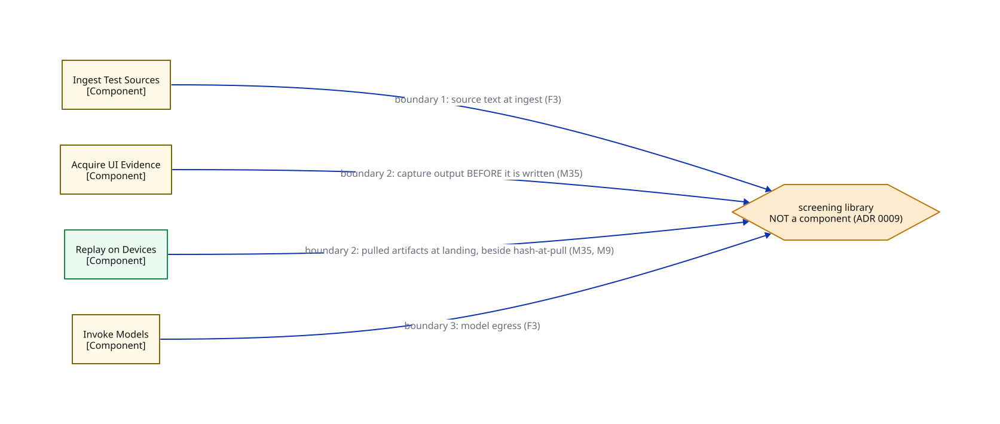

# C3b — Component overlay: screening boundaries

> Where does untrusted content get screened (ADR 0009)? A subset of C3a — the screening library and the four edges that cross its three boundaries.

**Locator:** this view opens `APP` from `07-component`. It is a **subset** of `07-component` — not the complete edge set.

## Node detail (keyed by node ID)

| Node | Detail the short label hides |
|------|------------------------------|
| INGEST_TEST_SOURCES | Adapters: Excel + Octane now, ALM/QC later (C1). Hash-at-ingest snapshot digest (M15) |
| ACQUIRE_UI_EVIDENCE | Hierarchy tool: page source, Object Spy, pruned tree. Records device + pool identity; off-pool captures flagged (M24) |
| REPLAY_ON_DEVICES | K runs, pinned pools; dominant cost. Spawns the separate execution process, single-run token, NO gateway credential (ADR 0013). Records ACTUAL context beside requested; pinned-facet mismatch quarantines (M24) |
| INVOKE_MODELS | THE model seam (ADR 0001): P1 Copilot impl / P2 gateway impl, config-selected. Cache key incl. model+provider version (ADR 0002). P2 edge tags = runtime call exists in Phase 2 only; the seam and its callers exist from the first commit (F1) |
| SCREENING_LIBRARY | Screening library — NOT a component (ADR 0009, amended M35). Boundaries defined by DATA CLASS. Quarantine-and-review failure mode, recorded overrides; flip counter 2 of 3 |

## Key

- rectangle = a grouping of code inside a container (C4 component)
- hexagon = an element deliberately NOT modelled as a component
- module-a colour = the same module tracked by colour across every view
- module-b colour = the same module tracked by colour across every view
- solid arrow = synchronous call
- `[Type]` under a name = the element's C4 type (container/component)

> **Export caveat:** if this diagram's SVG is used detached from this page (e.g. a slide), re-inline its honesty tags onto the affected nodes — off-canvas tags do not travel with a bare SVG.

