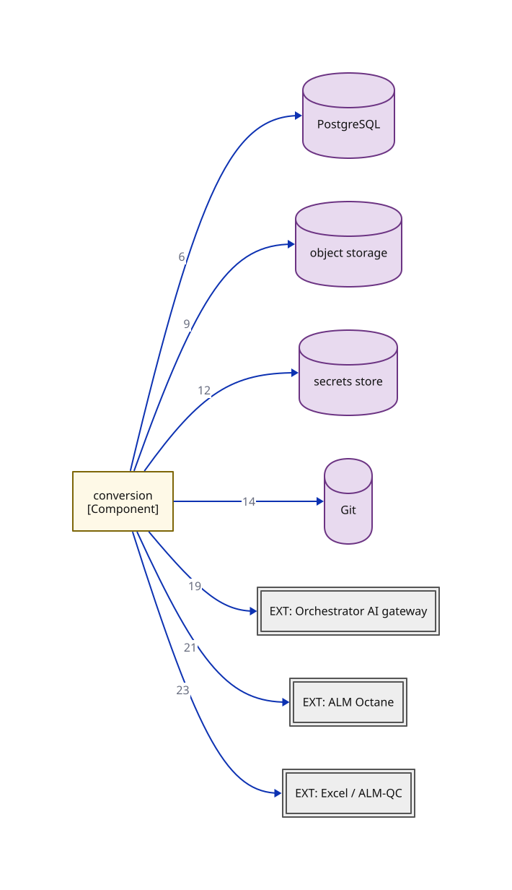

# C2b — Container drill-down: module wiring — module-a overlay

> This view is a subset of `03-container-module-wiring` opening `APP` — only the edges owned by `module-a`. Edge numbers match the primary; see `03-container-module-wiring` for the complete edge set.

**Locator:** this view opens `APP` from `03-container-module-wiring`. It is a **subset** of `03-container-module-wiring` — not the complete edge set.

## Node detail (keyed by node ID)

| Node | Detail the short label hides |
|------|------------------------------|
| CONVERSION | Conversion (cluster A) — 10 components incl. the Invoke Models seam |
| POSTGRESQL | WORKING ASSUMPTION (spine C3); dev/CI embedded or containerized, ephemeral-only (D1, M40). Schemas: conversion-state · lineage (append-only: app role INSERT/SELECT only, per-conversion hash chain, supersede-not-update — ADR 0012) · outbox+queue (bounded retries, dead-letter quarantine — M21) · judge-response cache (M27, CF7). No cross-lifecycle foreign keys (F4, ADR 0006) |
| OBJECT_STORAGE | Evidence object storage behind an S3-compatible port (ADR 0011). Dev/CI: containerized MinIO; production BINDING PROBE-PENDING (week-0 platform probe; default = self-operated MinIO). Write-once / object-lock REQUIRED — ADR 0012's precondition, deployment-checked. Holds: classified artifacts + retention classes (M39) · canonicalized source snapshots (M15) · lineage chain anchors (ADR 0012). Envelope encryption + crypto-shredding before the first audit-retained artifact (ADR 0011 as amended) |
| SECRETS_STORE | Interim: CI secret store; the vault is named by the M33 controls-baseline read — PENDING. All credentials resolved by injected reference, never literals (M34/CF8) |
| GIT | Prompts / exemplars / golden set / test code; version identity is free |
| GATEWAY | Same standing as the C1 node-detail table (E4). Model providers hosted INSIDE the bank — prompts never leave (E4); version-report contract UNVERIFIED (M5 held) |
| OCTANE | Same standing as the C1 node-detail table (E5). At BOTH ends of the pipeline (E5): ingest source AND publish target; asset-versioning UNVERIFIED (M7 held) |
| XLS | Same standing as the C1 node-detail table (E3/S9). File input originating from bank teams inside the network (E3/S9) |

## Edge detail

| # | Edge | Mode | Claim |
|---|------|------|-------|
| 6 | CONVERSION → POSTGRESQL | sync | State + lineage, same local transaction (ADR 0007) |
| 9 | CONVERSION → OBJECT_STORAGE | sync | Canonicalized source snapshots (M15) |
| 12 | CONVERSION → SECRETS_STORE | sync | Gateway credential, by injected reference (M34) |
| 14 | CONVERSION → GIT | sync | Versioned assets (prompts / exemplars / golden set / test code) |
| 19 | CONVERSION → GATEWAY | sync | Model calls (P2) via the Invoke Models seam |
| 21 | CONVERSION → OCTANE | sync | Manual-test ingest, API-key; hash-at-ingest (M15) |
| 23 | CONVERSION → XLS | sync | Workbook file input; raw workbooks never enter Git (M35) |

## Key

- rectangle = a grouping of code inside a container (C4 component)
- double-bordered rectangle, `EXT:` = an external system we don't own
- cylinder = a data store (used for datastores ONLY)
- module-a colour = the same module tracked by colour across every view
- solid arrow = synchronous call
- `[Type]` under a name = the element's C4 type (container/component)

> **Export caveat:** if this diagram's SVG is used detached from this page (e.g. a slide), re-inline its honesty tags onto the affected nodes — off-canvas tags do not travel with a bare SVG.

