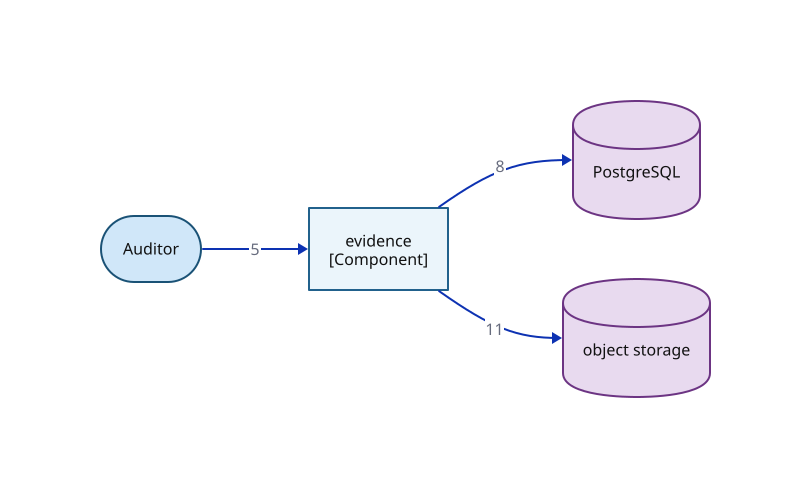

# C2b — Container drill-down: module wiring — module-c overlay

> This view is a subset of `03-container-module-wiring` opening `APP` — only the edges owned by `module-c`. Edge numbers match the primary; see `03-container-module-wiring` for the complete edge set.

**Locator:** this view opens `APP` from `03-container-module-wiring`. It is a **subset** of `03-container-module-wiring` — not the complete edge set.

## Node detail (keyed by node ID)

| Node | Detail the short label hides |
|------|------------------------------|
| EVIDENCE | Evidence (cluster C) — Preserve Provenance + metrics read model + auditor export |
| POSTGRESQL | WORKING ASSUMPTION (spine C3); dev/CI embedded or containerized, ephemeral-only (D1, M40). Schemas: conversion-state · lineage (append-only: app role INSERT/SELECT only, per-conversion hash chain, supersede-not-update — ADR 0012) · outbox+queue (bounded retries, dead-letter quarantine — M21) · judge-response cache (M27, CF7). No cross-lifecycle foreign keys (F4, ADR 0006) |
| OBJECT_STORAGE | Evidence object storage behind an S3-compatible port (ADR 0011). Dev/CI: containerized MinIO; production BINDING PROBE-PENDING (week-0 platform probe; default = self-operated MinIO). Write-once / object-lock REQUIRED — ADR 0012's precondition, deployment-checked. Holds: classified artifacts + retention classes (M39) · canonicalized source snapshots (M15) · lineage chain anchors (ADR 0012). Envelope encryption + crypto-shredding before the first audit-retained artifact (ADR 0011 as amended) |

## Edge detail

| # | Edge | Mode | Claim |
|---|------|------|-------|
| 5 | AUDITOR → EVIDENCE | sync | Versioned export; itself an attributable lineage event (CF11) |
| 8 | EVIDENCE → POSTGRESQL | sync | Append-only lineage writes + read-model reads |
| 11 | EVIDENCE → OBJECT_STORAGE | sync | Chain-head anchors at interval; a stale anchor is an alert (ADR 0012) |

## Key

- stadium/pill = a person or role (actor)
- rectangle = a grouping of code inside a container (C4 component)
- cylinder = a data store (used for datastores ONLY)
- module-c colour = the same module tracked by colour across every view
- solid arrow = synchronous call
- `[Type]` under a name = the element's C4 type (container/component)

> **Export caveat:** if this diagram's SVG is used detached from this page (e.g. a slide), re-inline its honesty tags onto the affected nodes — off-canvas tags do not travel with a bare SVG.

