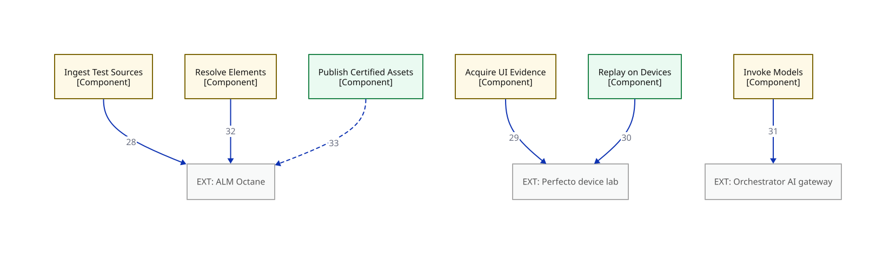

# C3a — Component view: module flow — external-boundary overlay

> This view is a subset of `07-component` opening `APP` — only the edges that cross the system's external boundary. Edge numbers match the primary; see `07-component` for the complete edge set.

**Locator:** this view opens `APP` from `07-component`. It is a **subset** of `07-component` — not the complete edge set.

## Node detail (keyed by node ID)

| Node | Detail the short label hides |
|------|------------------------------|
| INGEST_TEST_SOURCES | Adapters: Excel + Octane now, ALM/QC later (C1). Hash-at-ingest snapshot digest (M15) |
| OCTANE | Drawn faded for location only; detail lives in the C2 tables |
| ACQUIRE_UI_EVIDENCE | Hierarchy tool: page source, Object Spy, pruned tree. Records device + pool identity; off-pool captures flagged (M24) |
| PERFECTO | Drawn faded for location only; detail lives in the C2 tables |
| REPLAY_ON_DEVICES | K runs, pinned pools; dominant cost. Spawns the separate execution process, single-run token, NO gateway credential (ADR 0013). Records ACTUAL context beside requested; pinned-facet mismatch quarantines (M24) |
| INVOKE_MODELS | THE model seam (ADR 0001): P1 Copilot impl / P2 gateway impl, config-selected. Cache key incl. model+provider version (ADR 0002). P2 edge tags = runtime call exists in Phase 2 only; the seam and its callers exist from the first commit (F1) |
| GATEWAY | Drawn faded for location only; detail lives in the C2 tables |
| RESOLVE_ELEMENTS | Owns the locator cascade. Octane locator lookup STUBBED IN SPINE (C5) |
| PUBLISH_CERTIFIED_ASSETS | Single-writer; certify-locally, publish-async (CF3) |

## Edge detail

| # | Edge | Mode | Claim |
|---|------|------|-------|
| 28 | INGEST_TEST_SOURCES → OCTANE | sync | ingest |
| 29 | ACQUIRE_UI_EVIDENCE → PERFECTO | sync | live capture |
| 30 | REPLAY_ON_DEVICES → PERFECTO | sync | K device runs |
| 31 | INVOKE_MODELS → GATEWAY | sync | P2 model calls |
| 32 | RESOLVE_ELEMENTS → OCTANE | sync | locator lookup (stub) |
| 33 | PUBLISH_CERTIFIED_ASSETS → OCTANE | async | A3: write-back |

## Key

- rectangle = a grouping of code inside a container (C4 component)
- double-bordered rectangle, `EXT:` = an external system we don't own
- faded fill/grey text = shown for context, not the subject of this view
- module-a colour = the same module tracked by colour across every view
- module-b colour = the same module tracked by colour across every view
- solid arrow = synchronous call
- dashed arrow = asynchronous message/event
- `[Type]` under a name = the element's C4 type (container/component)

> **Export caveat:** if this diagram's SVG is used detached from this page (e.g. a slide), re-inline its honesty tags onto the affected nodes — off-canvas tags do not travel with a bare SVG.

