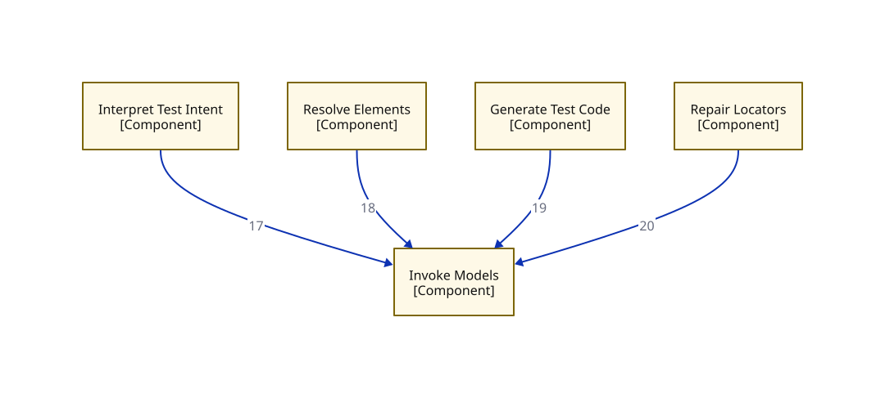

# C3a — Component view: module flow — model-call overlay

> This view is a subset of `07-component` opening `APP` — only the model-call seam and its gateway. Edge numbers match the primary; see `07-component` for the complete edge set.

**Locator:** this view opens `APP` from `07-component`. It is a **subset** of `07-component` — not the complete edge set.

## Node detail (keyed by node ID)

| Node | Detail the short label hides |
|------|------------------------------|
| INTERPRET_TEST_INTENT | Emits TestCaseIR; flags ambiguity |
| INVOKE_MODELS | THE model seam (ADR 0001): P1 Copilot impl / P2 gateway impl, config-selected. Cache key incl. model+provider version (ADR 0002). P2 edge tags = runtime call exists in Phase 2 only; the seam and its callers exist from the first commit (F1) |
| RESOLVE_ELEMENTS | Owns the locator cascade. Octane locator lookup STUBBED IN SPINE (C5) |
| GENERATE_TEST_CODE | Page Objects + Appium Java/TestNG |
| REPAIR_LOCATORS | Bounded re-grounding |

## Edge detail

| # | Edge | Mode | Claim |
|---|------|------|-------|
| 17 | INTERPRET_TEST_INTENT → INVOKE_MODELS | sync | P2 |
| 18 | RESOLVE_ELEMENTS → INVOKE_MODELS | sync | P2 |
| 19 | GENERATE_TEST_CODE → INVOKE_MODELS | sync | P2 |
| 20 | REPAIR_LOCATORS → INVOKE_MODELS | sync | P2 |

## Key

- rectangle = a grouping of code inside a container (C4 component)
- module-a colour = the same module tracked by colour across every view
- solid arrow = synchronous call
- `[Type]` under a name = the element's C4 type (container/component)

> **Export caveat:** if this diagram's SVG is used detached from this page (e.g. a slide), re-inline its honesty tags onto the affected nodes — off-canvas tags do not travel with a bare SVG.

