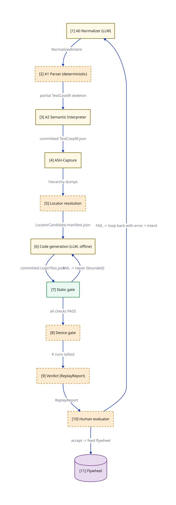

# O1 Pipeline - End-to-end flow

> The end-to-end pipeline as a process flow. The authoring arm (A0 -> A1 -> A2 -> ASH-Capture -> locator resolution -> code gen) is LLM-bounded; the spine (static gate -> device gate -> verdict) is LLM-free and consumes only committed artifacts. Two bounded loops: static-gate repair and ASH-Capture discovery. The flywheel closes the loop on accept. ASH-Capture stages are PROPOSED (ADR 0014 in flight).

**Locator:** this view opens `Pipeline` from `01-context`. It is a **completeness reference** at this grain.

## Node explainer (numbered — matches the `[n]` on the canvas)

| # | Node | Detail the short label hides |
|---|------|------------------------------|
| 1 | A0 | PROPOSED this session free-form English / manual script -> NormalizedIntent does NOT produce TestCaseIR; F1 flywheel does not apply concrete mocks: NormalizedIntent.input.txt -> NormalizedIntent.prompt.md -> NormalizedIntent.json |
| 2 | A1 | structure only; splits into N steps, raw intent per step does NOT fill action/locator/assertion/controlFlow concrete mock: TestCaseIR.skeleton.json |
| 3 | A2 | deterministic-first, LLM fallback expands steps, normalizes navigation, extracts loops, flags ambiguity emits committed TestCaseIR.json concrete mock: TestCaseIR.json (the committed handoff to the spine) |
| 4 | ASH | PROPOSED ADR 0014 drives app to screenContext, dumps hierarchy (pageSource + pruned + objectSpy) commits NavigationManifest + ScreenGraph edges concrete mocks: ASHCapture.discovery.*, ASHCapture.deeplink.*, ASHCapture.driftrepair.input.json; see 05-discovery-loop for the internal runtime cycle |
| 5 | LOC | deterministic cascade: accessibility id > id > class chain > xpath sources: OBJECT_REPO > PAGE_SOURCE > OBJECT_SPY > VLM > LLM-guess emits LocatorCandidate.manifest.json concrete mocks: LocatorResolution.fallback.{input.json,prompt.md,output.json} (the LLM fallback path); see 06-locator-cascade for the full cascade |
| 6 | CG | IR + manifest -> Appium Java (page objects, BaseTest) credentials via vault() calls, never literals emits committed LoginTest.java (the audit pin) concrete mock: LoginTest.java |
| 7 | SG | THE SPINE BEGINS - LLM-free from here format, mvn compile, Checkstyle, Error Prone, locator-manifest rule FAIL -> loop back to code gen (bounded) concrete mock: StaticGate.report.json |
| 8 | DG | Perfecto; K=1 signed-off baseline (K=3/5 weeks-3-8+ target - raising K is a CF6 recorded decision) flakiness: STABLE / FLAKY / UNKNOWN |
| 9 | VR | pins codeCommit SHA (the audit pin) verdict CERTIFIED only if static PASS + device STABLE healsApplied: NONE (spine does not self-heal) concrete mock: ReplayReport.json |
| 10 | HE | validates result against original input intent PASS -> flywheel; FAIL -> loop back to A0 with error |
| 11 | FW | accepted locators -> object repository accepted exemplars -> prompt library accept/reject labels -> preference training data (O6 ensemble) |

## Key

- cylinder = a data store (used for datastores ONLY)
- dash-bordered rectangle = a runtime process, not a deployable
- module-a colour = the same module tracked by colour across every view
- module-b colour = the same module tracked by colour across every view
- solid arrow = synchronous call

> **Export caveat:** if this diagram's SVG is used detached from this page (e.g. a slide), re-inline its honesty tags onto the affected nodes — off-canvas tags do not travel with a bare SVG.

