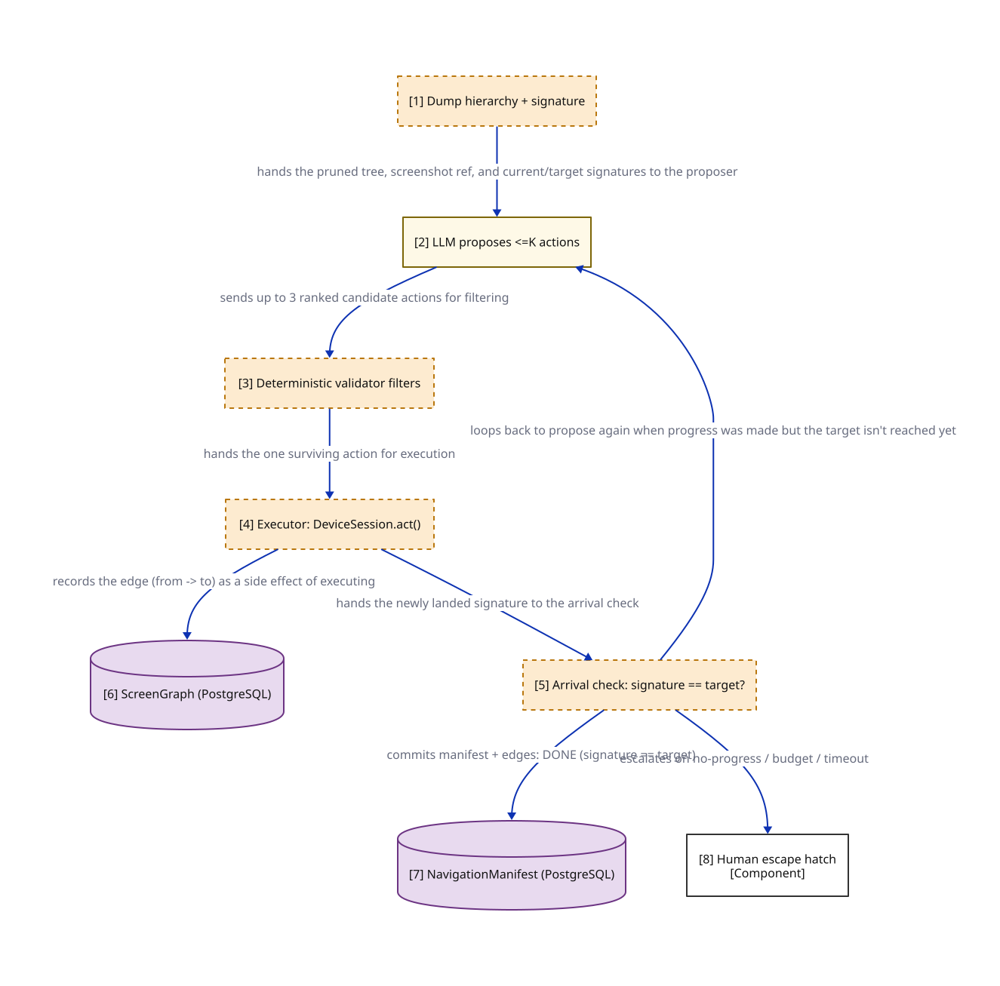

# ASH-Capture Discovery Loop - Runtime cycle

> Zooms into the Discovery loop component from the ASH-Capture Component view. The step-by-step runtime cycle entered only when a screen is NOT in the ScreenGraph or its path is BROKEN - the graph-search happy path (target ~90% of runs, unmeasured) uses no LLM at all. Every node here is PROPOSED (ADR 0014 in flight).

**Locator:** this view opens `DISC` from `03-component-ash`. It is a **completeness reference** at this grain.

## Node explainer (numbered — matches the `[n]` on the canvas)

| # | Node | Detail the short label hides |
|---|------|------------------------------|
| 1 | DUMP | PROPOSED ADR 0014 dumps the current screen's hierarchy and computes its signature (skeletonHash, titleAnchor) - see the SIG component in 03-component-ash entered only when the screen is NOT already in the ScreenGraph, or its stored path is BROKEN |
| 2 | PROPOSE | PROPOSED ADR 0014 proposes at most K (maxProposalsK=3) candidate next actions, ranked by confidence, from the pruned tree + screenshotRef + current/target signatures + denylist + known edges concrete mock: ASHCapture.discovery.{input.json,prompt.md,output.json} - HomeScreen -> AccountOverview scenario, ranks accountsTab 0.90 / hamburgerMenu 0.62 / paymentsTab 0.48 screening call-site adr-0009:ash-discovery-proposer-egress; does NOT execute, touch the device, or propose elements outside the pruned tree |
| 3 | VALIDATE | PROPOSED ADR 0014 filters the proposed actions by locator cascade + confidence floor (0.85), the denylist (logout/transfer/pay/confirm/sign out), known graph edges from the current node (preferred), and the remaining step budget denylist is defense-in-depth, not the safety guarantee - safety is environmental (lower test env, resettable data) |
| 4 | EXECUTE | PROPOSED ADR 0014 applies the one surviving action via DeviceSession.act(), then re-dumps the hierarchy and computes the newly landed screen signature |
| 5 | CHECK | PROPOSED ADR 0014 success predicate: landed signature equals the target signature known defect (Replan R1 D1/S1): the predicate compares against the STORED target signature, so a screen that legitimately changed can never match - the loop then deterministically exhausts its budget into the escape hatch; this is the single biggest threat to automatic drift repair until signature re-keying is designed |
| 6 | GRAPH | PROPOSED ADR 0014 nodes = screen signatures, edges = deterministic locator-actions snapshot per graph_version_sha; auditable-not-gated cost weights: DEEP_LINK=1 < SCROLL/TAP=2 < TYPE=3 in this loop the edge (from -> to) is recorded as a side effect of EXECUTE, before the arrival check runs |
| 7 | MAN | PROPOSED ADR 0014 per-screen deterministic path the spine replays rootMode FRESH_LOGIN or DEEP_LINK; always starts from a known root provenance: DISCOVERY | GRAPH_SEARCH | DEEP_LINK_PROBE | DRIFT_REPAIR | MANUAL_CAPTURE committed here only on arrival (signature == target); a failed loop commits nothing here and falls through to the human escape hatch instead |
| 8 | HATCH | PROPOSED ADR 0014 triggered by 3 no-progress strikes, the <=15-action / <=60s-per-step budget being exhausted, the 10-minute session cap, or an ANCHOR_LESS screen (<10% target) human steers; the system records the action stream and commits the manifest + edges with provenance: MANUAL_CAPTURE |

## Key

- rectangle = a grouping of code inside a container (C4 component)
- cylinder = a data store (used for datastores ONLY)
- dash-bordered rectangle = a runtime process, not a deployable
- module-a colour = the same module tracked by colour across every view
- solid arrow = synchronous call
- `[Type]` under a name = the element's C4 type (container/component)

> **Export caveat:** if this diagram's SVG is used detached from this page (e.g. a slide), re-inline its honesty tags onto the affected nodes — off-canvas tags do not travel with a bare SVG.

