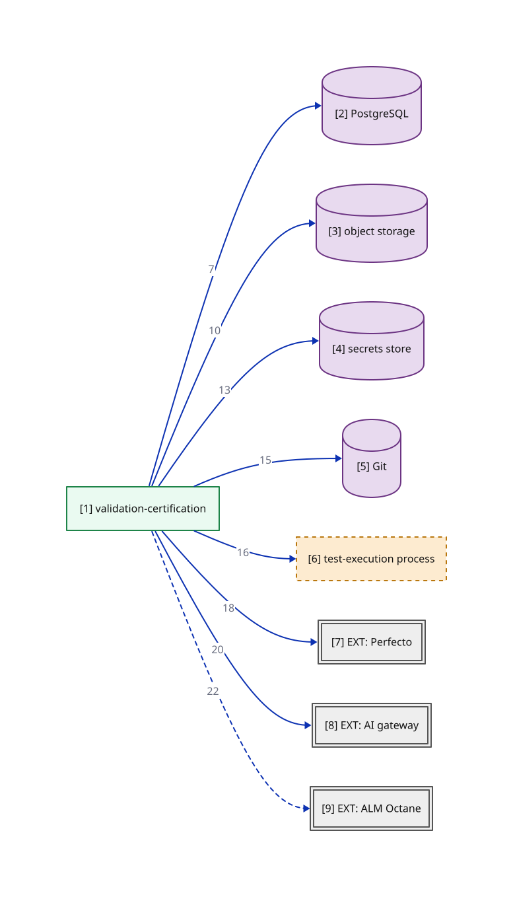

# C2b - Container drill-down: module wiring — module-b overlay

> This view is a subset of `03-container-module-wiring` opening `APP` — only the edges owned by `module-b`. Edge numbers match the primary; see `03-container-module-wiring` for the complete edge set.

**Locator:** this view opens `APP` from `03-container-module-wiring`. It is a **subset** of `03-container-module-wiring` — not the complete edge set.

## Node explainer (numbered — matches the `[n]` on the canvas)

| # | Node | Detail the short label hides |
|---|------|------------------------------|
| 1 | MB | Validation-certification (cluster B) - 5 components; static gate to device gate to classify to certify. Device-gate worker holds NO gateway credential (ADR 0013). |
| 2 | PG | WORKING ASSUMPTION (spine C3); dev/CI embedded or containerized, ephemeral-only (D1, M40). Schemas: conversion-state; lineage (append-only: app role INSERT/SELECT only, per-conversion hash chain, supersede-not-update - ADR 0012); outbox+queue (bounded retries, dead-letter quarantine - M21); judge-response cache (M27, CF7). No cross-lifecycle foreign keys (F4, ADR 0006). |
| 3 | OBJ | Evidence object storage behind an S3-compatible port (ADR 0011). Dev/CI: containerized MinIO; production BINDING PROBE-PENDING (week-0 platform probe; default = self-operated MinIO). Write-once / object-lock REQUIRED - ADR 0012's precondition, deployment-checked. Holds: classified artifacts + retention classes (M39); canonicalized source snapshots (M15); lineage chain anchors (ADR 0012). Envelope encryption + crypto-shredding before the first audit-retained artifact (ADR 0011 as amended). |
| 4 | SEC | Interim: CI secret store; the vault is named by the M33 controls-baseline read - PENDING. All credentials resolved by injected reference, never literals (M34/CF8). |
| 5 | GIT | Prompts / exemplars / golden set / test code; version identity is free. |
| 6 | EXEC | Test-execution process, spawned per device run. Separate OS process - shape committed NOW, sandbox technology weeks 3-8 (ADR 0013). NO long-lived credentials; single-run device session token; NEVER the gateway credential. Static capability rules gate entry (supplement, not the control). |
| 7 | PERF | Same standing as the C1 node-detail table (E1/E2). INCUMBENT vendor - MSA on file, unread (E1); flows run on mock/synthetic data (E2); NOT covered by E3. |
| 8 | GW | Same standing as the C1 node-detail table (E4). Model providers hosted INSIDE the bank - prompts never leave (E4); version-report contract UNVERIFIED (M5 held). |
| 9 | OCT | Same standing as the C1 node-detail table (E5). At BOTH ends of the pipeline (E5): ingest source AND publish target; asset-versioning UNVERIFIED (M7 held). |

## Edge detail

| # | Edge | Mode | Claim |
|---|------|------|-------|
| 7 | MB → PG | sync | State + lineage, same local transaction (ADR 0007) |
| 10 | MB → OBJ | sync | Classified artifacts + retention class (ADR 0006, M39) |
| 13 | MB → SEC | sync | Perfecto + test-account credentials, by injected reference (M34) |
| 15 | MB → GIT | sync | Grow exemplar + golden set |
| 16 | MB → EXEC | sync | Spawn per device run (ADR 0013) |
| 18 | MB → PERF | sync | Pool + artifact pull; dominant cost |
| 20 | MB → GW | sync | Fidelity grade (ADR 0004); from day one |
| 22 | MB → OCT | async | A3: publish certified assets (CF3); never a verdict precondition |

> **Export caveat:** if this diagram's SVG is used detached from this page (e.g. a slide), re-inline its honesty tags onto the affected nodes — off-canvas tags do not travel with a bare SVG.

