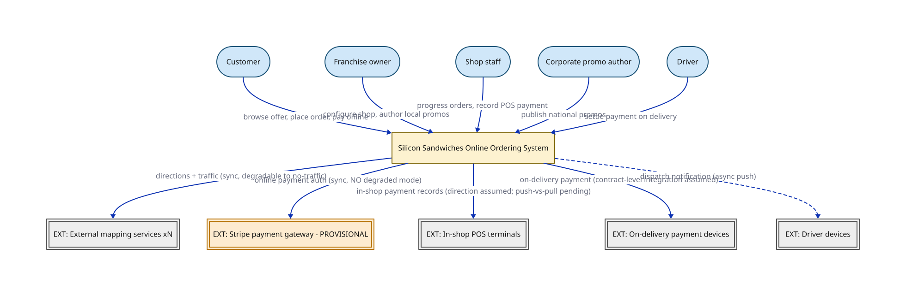

# Silicon Sandwiches - Context view

> The whole. Silicon Sandwiches' online ordering system, its five user types, and its external dependencies. The single system box drawn here is opened in the Container view.

## Node detail (keyed by node ID)

| Node | Detail the short label hides |
|------|------------------------------|
| CUST | mobile/web ordering (thousands today, millions bet) |
| OWNER | shop settings, local daily promos |
| STAFF | fulfil orders, in-shop POS |
| CORP | national daily promos |
| DRV | delivery + collect-on-delivery |
| SYS | ACCEPTED: modular monolith, ONE architecture quantum (opened in the Container view) |
| MAPX | several, interchangeable; directions + live traffic |
| PGW | direct tokenization required; contract/tier/SLA pending (risk cells 4 and 5 remain HIGH) |
| POSX | franchise-owned, plausibly heterogeneous (needs-input:data-constraints) |
| DDEV | dispatch notifications |

## Key

- stadium/pill = a person or role (actor)
- heavy-stroke rectangle = the software system in focus
- double-bordered rectangle, `EXT:` = an external system we don't own
- orange fill = unresolved production evidence (provisional/pending)
- solid arrow = synchronous call
- dashed arrow = asynchronous message/event

> **Export caveat:** if this diagram's SVG is used detached from this page (e.g. a slide), re-inline its honesty tags onto the affected nodes — off-canvas tags do not travel with a bare SVG.

