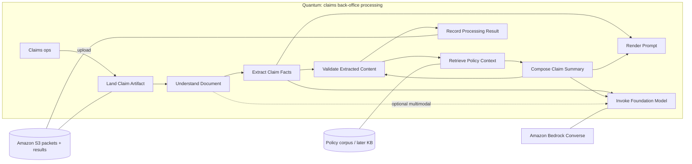

# Logical components — insurance claim document processor

**Approach:** Workflow (one happy-path: land → understand → extract → ground →
validate → summarize → record). Actor/Action would overfit: only one
named actor class (claims operations) in the brief.

First pass is a **best guess** — perfecting it now is the named mistake
(`ComponentBased.md:68`).

**GATE: PENDING HUMAN.** Accept or redirect the table and the splits.

Characteristics:
`../worksheets/characteristics-worksheet.md`.

---

## Cycle pass 1 — identify

Happy-path workflow steps → candidate components. Names are **verb-role**,
not `*Manager` / `*Processor` / `*Engine` (Entity Trap).

| Step | Candidate | Why it exists |
|---|---|---|
| Claim packet arrives | **Land Claim Artifact** | Durable SoR in S3; upload is a story of its own |
| Read the bytes | **Understand Document** | Text vs PDF vs image is a different job from extraction |
| Pull the five fields | **Extract Claim Facts** | Schema-valid JSON; integrity lives here |
| Look up what the policy allows | **Retrieve Policy Context** | RAG; knowledge vs behavior |
| Check the JSON + PII + citations | **Validate Extracted Content** | Conjunction test: not "also extract" |
| Write the adjuster-facing restatement | **Compose Claim Summary** | Cheaper model; must not silently invent policy |
| Keep the decision replayable | **Record Processing Result** | Audit tuple: model ids, template versions, chunks, validator |

Shared across steps: **Render Prompt** (templates used by extract and
summary — duplication would otherwise copy the template into both).
**Invoke Foundation Model** (Converse envelope used by understand / extract /
summary — one invoke shape, many model ids).

---

## Assign stories

| Story | Component(s) |
|---|---|
| Upload a claim document to S3 | Land Claim Artifact |
| Read text or multimodal bytes | Understand Document |
| Extract claimant, policy #, date, amount, description | Extract Claim Facts + Render Prompt + Invoke Foundation Model |
| Ground the claim in policy text | Retrieve Policy Context |
| Reject / flag bad JSON, missing fields, leaked PII | Validate Extracted Content |
| Generate a concise claim summary | Compose Claim Summary + Render Prompt + Invoke Foundation Model |
| Compare two model ids on the same doc | Invoke Foundation Model + Record Processing Result |
| Re-run after a transient fault without double-writing | Record Processing Result (idempotency key = bucket/key + template version) |
| HITL review of a flagged claim *(extension)* | not in PoC — would be **Review Flagged Claim**, same quantum |

A story that would be copied into Extract *and* Compose (the Converse call)
forced **Invoke Foundation Model** as a shared component plus edges. Same
for templates → **Render Prompt**.

---

## Roles (conjunction test)

| Component | One-sentence role | Conjunction? |
|---|---|---|
| Land Claim Artifact | Persist the inbound packet under a stable key and return its locator | No |
| Understand Document | Turn the locator into model-ready content blocks (text and/or document/image) | No |
| Extract Claim Facts | Produce the five-field JSON from those content blocks | No |
| Retrieve Policy Context | Return ranked policy chunks (with ids) for this claim's jurisdiction/line | No |
| Validate Extracted Content | Accept, flag, or reject an extraction+summary against schema, PII, and citation rules | No |
| Compose Claim Summary | Write a short restatement grounded in extraction + retrieved chunks | No |
| Render Prompt | Fill a named, versioned template | No |
| Invoke Foundation Model | Call Converse with a resolved model id and bounded timeouts; return text + usage | No |
| Record Processing Result | Write the provenance tuple next to the packet; replay on the same key | No |

**Split that was considered and rejected:** merging Extract + Compose into
"Process Claim" fails the conjunction test (*extract and also summarize*)
and hides the cascade (different models, different temperatures, different
failure modes).

---

## Characteristics per component

| Characteristic | Who it stresses | Split implication |
|---|---|---|
| Data integrity | Extract, Validate, Retrieve (wrong chunk) | Do not bury Validate inside Extract — a miss must be a *named* status |
| Privacy | Understand (raw bytes), Invoke (prompt body), Record (what gets logged) | Record stores encrypted/full; app logs get hashes. Guardrail sits on Invoke |
| Auditability | Record, Render (template version), Invoke (resolved model id) | Record cannot be an afterthought log line |
| Reliability | Invoke (Bedrock), Land (S3), Record | Timeouts + idempotent write; RAG is a **soft** dependency (C11) |
| Testability | Invoke (must be DI), Render, Validate (pure) | Validate and Render have no AWS client — cheapest tests |
| Configurability | Render + Invoke | Model id is Invoke's input, not a constant in Extract |
| Cost-efficiency | Invoke (extract vs summary ids), Retrieve (top-k) | Cascade lives in the workflow, not inside Invoke |

Divergent load: Retrieve can fail while Extract succeeded. That is a
**soft-dependency** split already reflected as two components, not a second
quantum.

---

## Coupling pass

```
Land → Understand → Extract → Validate → Retrieve → Compose → Validate → Record
                 ↘ Render ↗                    ↘ Render ↗
                 ↘ Invoke ↗                    ↘ Invoke ↗
```

| Check | Finding |
|---|---|
| Fan-out | Invoke is the hot shared callee (extract, summary, optional understand). Acceptable: it is a thin envelope, not a god object |
| Fan-in | Record receives from the workflow only — good |
| Law of Demeter | Extract must not know S3 or Bedrock clients; it asks Understand for content and Invoke for text. An "orchestrator function" that *only* forwards is not a win — the PoC `pipeline` module *is* the workflow, not a façade |
| Connascence | Connascence of meaning between Extract JSON keys and Validate schema — keep one schema module. Connascence of name between template keys and Render |

---

## Component table (revised)

| Name | Role | Assigned stories | Characteristics notes |
|---|---|---|---|
| Land Claim Artifact | Persist packet, return locator | Upload | Reliability of the SoR |
| Understand Document | Bytes → content blocks | Read text / PDF / image | Privacy of raw bytes |
| Extract Claim Facts | Content → five-field JSON | Extract | Integrity; uses Render + Invoke |
| Retrieve Policy Context | Claim → ranked chunks + ids | RAG | Integrity of grounding; **soft** |
| Validate Extracted Content | JSON/summary → pass/flag/reject | Validate | Integrity + privacy gate |
| Compose Claim Summary | Facts + chunks → summary | Summarize | Cost (cheap model); C11 if RAG empty |
| Render Prompt | Name + kwargs → prompt text | All FM steps | Configurability + audit (version) |
| Invoke Foundation Model | Prompt → text + usage | All FM steps | Reliability (C7/C2); configurability |
| Record Processing Result | Write provenance tuple | Compare models; reprocess | Audit + idempotency (C9) |

---

## Component diagram



Solid arrows = synchronous in the PoC. Dotted Understand→Invoke = only when
the packet is not already text.

---

## Exam mapping (Skill 1.1.1 boxes)

| Exam box | Component(s) |
|---|---|
| Document storage (Amazon S3) | Land Claim Artifact + Record Processing Result |
| Processing workflow | the pipeline edges above (not a `ClaimProcessor` blob) |
| Foundation model integration | Invoke Foundation Model + Render Prompt |
| Response generation | Compose Claim Summary + Validate |
