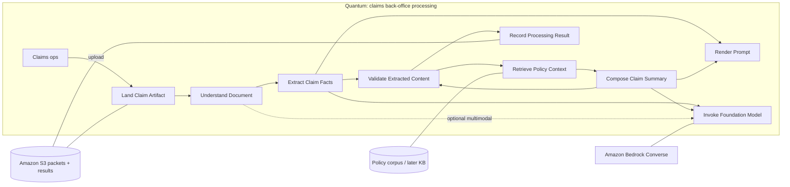

# Logical components — insurance claim document processor

**Approach:** Workflow (one happy-path: land → understand → extract → ground →
validate → summarize → record). Actor/Action would overfit: only one
named actor class (claims operations) in the brief.

First pass is a **best guess** — perfecting it now is the named mistake
(`ComponentBased.md:68`).

**GATE: PENDING HUMAN.** Accept or redirect the table and the splits.

Characteristics:
`../worksheets/characteristics-worksheet.md`.

---

## Cycle pass 1 — identify

Happy-path workflow steps → candidate components. Names are **verb-role**,
not `*Manager` / `*Processor` / `*Engine` (Entity Trap).

| Step | Candidate | Why it exists |
|---|---|---|
| Claim packet arrives | **Land Claim Artifact** | Durable SoR in S3; upload is a story of its own |
| Read the bytes | **Understand Document** | Text vs PDF vs image is a different job from extraction |
| Pull the five fields | **Extract Claim Facts** | Schema-valid JSON; integrity lives here |
| Look up what the policy allows | **Retrieve Policy Context** | RAG; knowledge vs behavior |
| Check the JSON + PII + citations | **Validate Extracted Content** | Conjunction test: not "also extract" |
| Write the adjuster-facing restatement | **Compose Claim Summary** | Cheaper model; must not silently invent policy |
| Keep the decision replayable | **Record Processing Result** | Audit tuple: model ids, template versions, chunks, validator |

Shared across steps: **Render Prompt** (templates used by extract and
summary — duplication would otherwise copy the template into both).
**Invoke Foundation Model** (Converse envelope used by understand / extract /
summary — one invoke shape, many model ids).

---

## Assign stories

| Story | Component(s) |
|---|---|
| Upload a claim document to S3 | Land Claim Artifact |
| Read text or multimodal bytes | Understand Document |
| Extract claimant, policy #, date, amount, description | Extract Claim Facts + Render Prompt + Invoke Foundation Model |
| Ground the claim in policy text | Retrieve Policy Context |
| Reject / flag bad JSON, missing fields, leaked PII | Validate Extracted Content |
| Generate a concise claim summary | Compose Claim Summary + Render Prompt + Invoke Foundation Model |
| Compare two model ids on the same doc | Invoke Foundation Model + Record Processing Result |
| Re-run after a transient fault without double-writing | Record Processing Result (idempotency key = bucket/key + template version) |
| HITL review of a flagged claim *(extension)* | not in PoC — would be **Review Flagged Claim**, same quantum |

A story that would be copied into Extract *and* Compose (the Converse call)
forced **Invoke Foundation Model** as a shared component plus edges. Same
for templates → **Render Prompt**.

---

## Roles (conjunction test)

| Component | One-sentence role | Conjunction? |
|---|---|---|
| Land Claim Artifact | Persist the inbound packet under a stable key and return its locator | No |
| Understand Document | Turn the locator into model-ready content blocks (text and/or document/image) | No |
| Extract Claim Facts | Produce the five-field JSON from those content blocks | No |
| Retrieve Policy Context | Return ranked policy chunks (with ids) for this claim's jurisdiction/line | No |
| Validate Extracted Content | Accept, flag, or reject an extraction+summary against schema, PII, and citation rules | No |
| Compose Claim Summary | Write a short restatement grounded in extraction + retrieved chunks | No |
| Render Prompt | Fill a named, versioned template | No |
| Invoke Foundation Model | Call Converse with a resolved model id and bounded timeouts; return text + usage | No |
| Record Processing Result | Write the provenance tuple next to the packet; replay on the same key | No |

**Split that was considered and rejected:** merging Extract + Compose into
"Process Claim" fails the conjunction test (*extract and also summarize*)
and hides the cascade (different models, different temperatures, different
failure modes).

---

## Characteristics per component

| Characteristic | Who it stresses | Split implication |
|---|---|---|
| Data integrity | Extract, Validate, Retrieve (wrong chunk) | Do not bury Validate inside Extract — a miss must be a *named* status |
| Privacy | Understand (raw bytes), Invoke (prompt body), Record (what gets logged) | Record stores encrypted/full; app logs get hashes. Guardrail sits on Invoke |
| Auditability | Record, Render (template version), Invoke (resolved model id) | Record cannot be an afterthought log line |
| Reliability | Invoke (Bedrock), Land (S3), Record | Timeouts + idempotent write; RAG is a **soft** dependency (C11) |
| Testability | Invoke (must be DI), Render, Validate (pure) | Validate and Render have no AWS client — cheapest tests |
| Configurability | Render + Invoke | Model id is Invoke's input, not a constant in Extract |
| Cost-efficiency | Invoke (extract vs summary ids), Retrieve (top-k) | Cascade lives in the workflow, not inside Invoke |

Divergent load: Retrieve can fail while Extract succeeded. That is a
**soft-dependency** split already reflected as two components, not a second
quantum.

---

## Coupling pass

```
Land → Understand → Extract → Validate → Retrieve → Compose → Validate → Record
                 ↘ Render ↗                    ↘ Render ↗
                 ↘ Invoke ↗                    ↘ Invoke ↗
```

| Check | Finding |
|---|---|
| Fan-out | Invoke is the hot shared callee (extract, summary, optional understand). Acceptable: it is a thin envelope, not a god object |
| Fan-in | Record receives from the workflow only — good |
| Law of Demeter | Extract must not know S3 or Bedrock clients; it asks Understand for content and Invoke for text. An "orchestrator function" that *only* forwards is not a win — the PoC `pipeline` module *is* the workflow, not a façade |
| Connascence | Connascence of meaning between Extract JSON keys and Validate schema — keep one schema module. Connascence of name between template keys and Render |

---

## Component table (revised)

| Name | Role | Assigned stories | Characteristics notes |
|---|---|---|---|
| Land Claim Artifact | Persist packet, return locator | Upload | Reliability of the SoR |
| Understand Document | Bytes → content blocks | Read text / PDF / image | Privacy of raw bytes |
| Extract Claim Facts | Content → five-field JSON | Extract | Integrity; uses Render + Invoke |
| Retrieve Policy Context | Claim → ranked chunks + ids | RAG | Integrity of grounding; **soft** |
| Validate Extracted Content | JSON/summary → pass/flag/reject | Validate | Integrity + privacy gate |
| Compose Claim Summary | Facts + chunks → summary | Summarize | Cost (cheap model); C11 if RAG empty |
| Render Prompt | Name + kwargs → prompt text | All FM steps | Configurability + audit (version) |
| Invoke Foundation Model | Prompt → text + usage | All FM steps | Reliability (C7/C2); configurability |
| Record Processing Result | Write provenance tuple | Compare models; reprocess | Audit + idempotency (C9) |

---

## Component diagram


```mermaid
flowchart LR
  subgraph quantum["Quantum: claims back-office processing"]
    U[Claims ops] -->|upload| LAND[Land Claim Artifact]
    LAND --> UND[Understand Document]
    UND --> EX[Extract Claim Facts]
    EX --> VAL[Validate Extracted Content]
    VAL --> RET[Retrieve Policy Context]
    RET --> SUM[Compose Claim Summary]
    SUM --> VAL
    VAL --> REC[Record Processing Result]
    EX --> TPL[Render Prompt]
    SUM --> TPL
    EX --> INV[Invoke Foundation Model]
    SUM --> INV
    UND -.->|optional multimodal| INV
  end
  S3[(Amazon S3 packets + results)] --- LAND
  S3 --- REC
  POL[(Policy corpus / later KB)] --- RET
  BR[Amazon Bedrock Converse] --- INV
```

Solid arrows = synchronous in the PoC. Dotted Understand→Invoke = only when
the packet is not already text.

---

## Exam mapping (Skill 1.1.1 boxes)

| Exam box | Component(s) |
|---|---|
| Document storage (Amazon S3) | Land Claim Artifact + Record Processing Result |
| Processing workflow | the pipeline edges above (not a `ClaimProcessor` blob) |
| Foundation model integration | Invoke Foundation Model + Render Prompt |
| Response generation | Compose Claim Summary + Validate |

---

## v2 addendum — data-preparation plane (2026-09-23)

**GATE: RATIFIED 2026-09-23 ("ratify as recommended" — design/hld-v2-data-prep.md §6; was PENDING HUMAN)** (provisional-gate batch run, A2-a). R2 accepted
the table and the characteristic-driven splits. Characteristics: the v2
addendum in `../worksheets/characteristics-worksheet.md` (top 3: data integrity
(inputs), privacy, auditability/lineage). Logical architecture only — no
deployment units here; arch-style decides those.

**Consistency pass (2026-09-23).** The ratified risk-storm amendments are
folded in below from `../design/hld-v2-fold-map.md`, each tagged with its id.
There are **no new components**: M14's watchdog is a second entry into
Account Batch Outcome.

**Approach: hybrid.**
- **Workflow** for the data path: batch → gate → per-claim sources →
  reconcile → bundle → hand-off. This is request/journey-shaped, like v1.
- **Actor/Action** for the governance loop, where several actors appear: intake
  ops (quarantine), the data-quality owner (approves proposals), adjusters
  (questions over a bundle), SIU (special investigations), upstream systems,
  and *the system itself* (event-driven agreement measurement).

First pass = best guess (`ComponentBased.md:68`).

### Review finding — v1 intended vs as-built (drift)

The v1 table above lists **9** components. The package is flat and has **25
modules**; leaf modules are the actual components (`ComponentBased.md:26-31`).
Actual components missing from the intended table:
- **Route Claim** — `routing.py:9`;
- **Apply Review Decision** — `review.py`;
- **Compare Models** — `compare.py`;
- the resilience cluster from ADRs 0010–0015: Resolve Configuration
  (`config_provider.py:58`), Evaluate Flags (`flags.py`), Adapt Model Call
  (`adapter.py`), Decide Breaker State (`breaker.py`), Degrade Extraction
  (`degrade.py`), Combine Ensemble (`ensemble.py`), Emit Metric
  (`metrics.py:89`), Decide Remediation (`remediation.py:52`).

The workflow component is `pipeline.py`; its SFN adapter is `handler.py`.

This is **not blocking for v2**; it is routed to the next v1 re-entry. Lesson
applied below: v2 keeps **one leaf module per logical component** in its own
subpackage, so the directory test stays true.

### Cycle pass 1 — identify (v2)

| Step / actor action | Candidate (verb-role) | Why it exists |
|---|---|---|
| A batch lands (at-least-once event) | **Admit Intake Batch** | Accept a batch object exactly once and make it addressable for validation |
| Batch-level quality | **Gate Batch Quality** | Dataset rules (uniqueness, completeness ratios, format thresholds) decide pass or quarantine |
| Row-level quality | **Gate Claim Rows** | Per-claim blocking vs warning decisions, then split into claims |
| Rule definitions for both gates | **Intake Rule Catalog** | Knowledge component: one definition per rule (severity, dimension, DQDL rendering) |
| Canonical forms (dates, amounts, policy #, VIN, text) | **Canonicalize Values** | Shared by the row gate, the narrative, OCR answers, reconciliation and replay |
| Narrative fitness | **Assess Narrative Quality** | Deterministic checks → score → flag |
| High-risk PII out | **Redact Sensitive Data** | Shared by the narrative, OCR text and transcripts (M6: transcripts are redacted, not only "verified") |
| Entities / key phrases / sentiment | **Extract Language Insights** | Comprehend over narratives and transcripts (chunked) |
| Police report / estimate text | **Read Document Text** | Textract lines + query answers with confidence |
| FNOL call → dialog | **Transcribe Call** | Async job, redacted at source, speaker turns |
| Loss runs → text | **Summarize Loss History** | Deterministic tabular → natural-language summary + frequency stats |
| Cross-source agreement | **Reconcile Claim Facts** | The integrity net for silent misparses |
| What the FM sees | **Format Model Context** | Converse context blocks: sections, dialog rendering, image refs within limits |
| One package per claim revision | **Assemble Claim Bundle** | Lineage + quality block + persistence |
| Start the decision | **Dispatch Claim Decision** | Idempotent hand-off to the v1 workflow |
| Batch closes | **Account Batch Outcome** | Conservation (rows_in = processed + quarantined + failed), quarantine records, DQ summary |
| Batch themes | **Aggregate Themes** | Ranked phrases / entity types across the batch |
| FM output vs sources | **Measure Extraction Agreement** | Per decision record: field agree/disagree (+ reviewer ground truth) |
| Patterns → config change | **Propose Quality Rule Change** | Bounded proposals with replay evidence; never applies |
| Adjuster asks about a claim *(extension)* | **Answer Adjuster Question** | Multi-turn Converse over the bundle context |

Reused v1 components: **Resolve Configuration** (new `data-quality` profile),
**Emit Metric** (new DQ vocabulary), **Render Prompt** (bundle templates +
`adjuster_dialog`), **Invoke Foundation Model** / **Adapt Model Call**,
**Understand Document** (now also bundle → content blocks), **Validate
Extracted Content**, **Route Claim** (new `bundle:` rule), **Record
Processing Result**.

Ratified amendments that land in touched v1 components:
- **Validate Extracted Content — M1.** For a bundle key, check the FM output
  against the canonical intake values before routing: `claim_amount` (within
  tolerance), `incident_date`, `policy_number`. A mismatch raises the blocking
  flag `bundle:fm_source_mismatch:<field>`. This resolves correction C-1.
- **Route Claim — M1, M18.** The amount threshold routes on the **canonical**
  amount, not the FM's (M1). A `bundles/` key whose state lacks
  `bundle_flags` goes to review: fail closed (M18).
- **Record Processing Result — M12, M18.** Result and pending keys follow the
  revision-scoped bundle key (`bundles/<claim_id>/r<rev>`), and the S3
  VersionId travels in the lineage, so feedback pairs by revision (M12).
  Record re-checks routing for dict payloads too (M18).
- **Retrieve Policy Context — M15.** For a bundle key, RAG scope = the canonical
  intake jurisdiction and line of business.
- **Degrade Extraction — M16.** For a bundle key, the rule-based degrade floor
  = the canonical intake fields (deterministic; still routes to review).

Rejected as Entity-Trap: `IntakeProcessor`, `BundleManager`,
`QualityEngine`, `FeedbackHandler`. Each was re-derived from behavior above.

### Assign stories (v2)

| Story (assignment bullet → claims) | Component(s) |
|---|---|
| 1.1 Glue DQ on structured data | Admit Intake Batch → Gate Batch Quality (+ Intake Rule Catalog) |
| 1.2 Lambda checks on unstructured text | Assess Narrative Quality + Redact Sensitive Data |
| 1.3 Monitor DQ over time | Emit Metric (reused) from every component + Account Batch Outcome |
| 2.1 Comprehend entities + sentiment | Extract Language Insights |
| 2.2 Textract on images | Read Document Text |
| 2.3 Transcribe calls | Transcribe Call (+ Extract Language Insights for turn sentiment) |
| 2.4 Table → natural-language summary | Summarize Loss History |
| 3.1 Format for Claude | Format Model Context → Understand Document (v1) |
| 3.2 Conversation templates | Format Model Context (transcript dialog) + Render Prompt `adjuster_dialog` → Answer Adjuster Question |
| 3.3 Multimodal request formatting | Format Model Context (image refs, limits) + Understand Document (bytes at invoke time) |
| 4.1 Entities + themes | Extract Language Insights + Aggregate Themes |
| 4.2 Text normalization | Canonicalize Values |
| 4.3 Feedback loop from model responses | Measure Extraction Agreement → Propose Quality Rule Change → *(actor: DQ owner applies config)* |
| Duplicate event must not double-process | Admit Intake Batch + Dispatch Claim Decision |
| A failed, timed-out or aborted intake execution still leaves a batch outcome (M14) | Account Batch Outcome (watchdog entry) |
| A bad row must not sink the batch; a bad batch must not flood review | Gate Claim Rows / Gate Batch Quality |
| Wrong date that parsed "successfully" | Reconcile Claim Facts (per claim) + Measure Extraction Agreement (per pattern) |
| Every fact traceable to its source | Assemble Claim Bundle (lineage block) |
| Re-run after an approved rule change | *(upstream actor: resubmission batch, revision + 1)* → Dispatch Claim Decision (revision-named) |

Two duplication-forced shared components:
- **Canonicalize Values** — the same date/amount/policy logic would otherwise
  be copied into the row gate, the narrative, OCR, reconciliation and replay.
  Five copies would give five subtly different parsers, which is exactly the
  misparse class v2 exists to stop.
- **Redact Sensitive Data** — the same logic would otherwise be copied into
  narrative and OCR handling.

### Roles (conjunction test, v2)

| Component | One-sentence role | Conjunction? |
|---|---|---|
| Admit Intake Batch | Accept a batch object exactly once and register it for validation | No |
| Intake Rule Catalog | Define each intake rule once (dimension, severity, row check, DQDL form) | No |
| Gate Batch Quality | Decide whether a batch is fit to process, from its dataset-level rule results | No |
| Gate Claim Rows | Split a fit batch into claims, quarantining blocking rows and flagging warnings | No — "split + classify" is one pass over rows (sequential cohesion) |
| Canonicalize Values | Rewrite raw values and text into canonical forms under the configured policy | No |
| Assess Narrative Quality | Score a narrative's fitness with deterministic checks | No |
| Redact Sensitive Data | Replace high-risk PII with typed placeholders and report the types | No |
| Extract Language Insights | Return entities, key phrases and sentiment for a text within service limits | No |
| Read Document Text | Return a document's lines and query answers with confidence | No |
| Transcribe Call | Turn a call recording into redacted, ordered speaker turns | No |
| Summarize Loss History | Describe a policy's prior claims as deterministic text + stats | No |
| Reconcile Claim Facts | Compare the same fact across sources and report agreement per field | No |
| Format Model Context | Decide what reaches the FM, and in which Converse block, within model limits | No — re-run 2026-09-23: input tagging (H-F14-a), the image rule (M6) and escaping (M10) are one responsibility: deciding what reaches the FM |
| Assemble Claim Bundle | Persist one claim revision's sources, lineage and quality block | No |
| Dispatch Claim Decision | Start exactly one decision workflow per claim revision | No |
| Account Batch Outcome | Prove every row's fate and write the batch's DQ summary, including `batch_failed` when the intake execution itself fails (M14) | No — re-run 2026-09-23: two entries (the batch join; the M14 watchdog), one responsibility: every batch ends with an accounted outcome |
| Aggregate Themes | Rank recurring phrases / entity types across a batch | No |
| Measure Extraction Agreement | Record where the FM's fields agree or disagree with each source | No |
| Propose Quality Rule Change | Turn recurring disagreement patterns into bounded, replay-proven proposals | No |
| Answer Adjuster Question | Answer follow-up questions over a bundle as a multi-turn dialog | No |

**Merges considered and rejected:**
- *"Validate Intake"* (batch gate + row gate) fails on divergent characteristics
  (below), not on the conjunction test alone.
- *"Enrich Narrative"* (quality + redaction + Comprehend) fails the conjunction
  test: *score and redact and analyze*.
- *"Build Bundle"* (assemble + format) fails the conjunction test: *persist
  lineage and also shape the FM request*.
- *"Feedback"* (measure + propose) has different triggers (every record, via
  events, vs on demand) and different actors.

**Too-small tell:** **Aggregate Themes** is one function. It stays separate
only because its characteristic (observability) differs from Account Batch
Outcome's (reliability/audit). Merging later is cheap and acceptable.

### Characteristics per component (v2) — and the splits they force

| Characteristic | Stressed components | Split / design implication |
|---|---|---|
| Data integrity | Gate Batch/Rows, **Canonicalize Values** (misparse risk), **Reconcile**, Measure Agreement | Reconcile must be a *named* step between sources and bundle, not a side effect inside Assemble |
| Privacy | **Redact Sensitive Data**, Transcribe Call (source redaction), Read Document Text, Format Model Context, Assemble (what persists), Emit Metric | Redaction is its own small component, so it can be tested and audited alone |
| Auditability | **Assemble Claim Bundle** (lineage), Account Batch Outcome, Propose Rule Change (evidence), Dispatch (revision-named) | Lineage is assembled from per-source records, never reconstructed later |
| Reliability | Admit (dedupe), **Transcribe Call** (async minutes), Read Document Text, Dispatch (idempotent), Account (conservation) | Every source reader returns a *status*, never an exception, to the join |
| Testability | Every service-facing component is dependency-injected. **Pure:** Rule Catalog, Canonicalize, Assess Quality, Reconcile, Summarize History, Format Context, Propose (replay) | 7 of 20 components need no AWS client |
| Observability | Emit Metric (all), Account Batch Outcome, Aggregate Themes | One vocabulary; no per-claim dimensions |
| Cost | Gate Batch Quality (Glue workers), Read Document Text (Queries), Transcribe Call (minutes), Format Model Context (image tokens) | Cost knobs sit on these four components, nowhere else |

**Splits made for characteristic reasons.** Each one adds communication
edges; that is the trade-off. **All five accepted (R2, 2026-09-23).**

- **CS-1 — Gate Batch Quality | Gate Claim Rows.** They differ in grain
  (dataset vs row), cost profile (a Spark job with DPU minimums vs a
  millisecond function), and failure semantics (quarantine the batch vs one
  row). Cost of the split: rule knowledge would be duplicated across the two.
  → Resolved by **Intake Rule Catalog** (next section).
- **CS-2 — Redact Sensitive Data** out of narrative handling. Privacy stakes
  justify an independently testable unit. Cost: an extra call per text source.
- **CS-3 — Transcribe Call** as its own component, because its latency and
  reliability profile diverges (an async job taking minutes, polled). Cost:
  temporal coupling at the join (next section).
- **CS-4 — Format Model Context | Assemble Claim Bundle.** What reaches the
  model is a privacy and cost concern; what persists is an audit concern.
  Cost: two edges instead of one.
- **CS-5 — Measure Extraction Agreement | Propose Quality Rule Change.**
  Measuring is always-on, cheap and event-driven. Proposing is occasional,
  heavier, and needs a human at the end. Cost: the feedback record becomes a
  contract between them.

### Coupling pass (v2)

| Check | Finding |
|---|---|
| **Connascence of meaning: DQDL ↔ row checks** | The draft spec keeps two rule sources and a parity test (**detects** drift). Recommended class-level fix: **Intake Rule Catalog** defines each rule once and *renders* the DQDL text. That turns connascence of meaning into connascence of name and **removes** the drift class instead of detecting it. Trade-off: rules DQDL can express but the catalog cannot (CustomSql, analyzers) need an escape hatch (a verbatim-DQDL rule type), and DQ analysts edit the catalog, not raw DQDL. → Recorded as spec delta **SD-1**. |
| Fan-in hot spot: **Canonicalize Values** (≥ 5 callers) | High afferent coupling on a concrete, stable module is the **Zone of Pain** — every change ripples. Mitigation: its *behavior* varies through configuration (formats, date order, lexicon) from Resolve Configuration, not through code; a golden-case suite pins it; the feedback loop edits config, never code. |
| Fan-out hot spot: **Assemble Claim Bundle** | High efferent coupling (reads every source record). It is unstable by design: it is the integration point and changes when a modality is added. **Law of Demeter:** Assemble must know *per-source records* (`processed/*` contracts), never Comprehend / Textract / Transcribe response shapes. That knowledge is pushed down into each reader. |
| **v1 ↔ v2 contract** | v1's Understand Document depends on the bundle's context-block contract (connascence of meaning on `context_blocks` + image `s3_key` refs). The *decision* side depends on data-prep **contracts only**, never its implementation. If arch-style makes these two quanta, the contract must be versioned (`schema_version`) with a tolerant reader in v1. |
| Dispatch Claim Decision → v1 | Connascence of name on v1's input `{bucket, key}` plus the bundle's S3 VersionId (M12). The key is revision-scoped (`bundles/<claim_id>/r<rev>`). Still the smallest possible cross-plane contract. |
| Measure Extraction Agreement → v1 records | Connascence of meaning on v1's result record (`models.py` `ProcessingResult.to_record`) — an existing, already-contracted shape (spec AC-F1). |
| **Temporal coupling** | The per-claim join waits for every source. Transcribe Call dominates (minutes) and sets each claim's latency; claims without a call finish fast. Invisible to code metrics, so it is recorded here (`ComponentBased.md:295`). |
| Propose → Canonicalize (replay) | Replay injects the *proposed* config into the same canonicalizer. Dependency injection, not a second implementation (no parser drift). |

### Component table (v2, revised)

| Name | Role | Stories | Characteristics notes |
|---|---|---|---|
| Admit Intake Batch | Accept once; register the partition | dedupe; 1.1 | Reliability (idempotency). **M13:** a self-retry (holder ARN == `$$.Execution.Id`) proceeds; takeover via `states:DescribeExecution`; `CreatePartition` `AlreadyExistsException` = success. **M3:** `intake/v=1/…` keys; attachments confined to `raw/claims/<claim_id>/`. **M17:** DQ config pinned per batch; `config_source=fallback` → quarantine (fail closed) |
| Intake Rule Catalog | One definition per rule; renders DQDL | 1.1 | Integrity (single source of truth). **M3:** completeness renders as non-empty; header exact-match → `invalid_schema`; report_date ≥ loss_date; exactly one CSV per partition |
| Gate Batch Quality | Batch fit / quarantine | 1.1 | Integrity; cost (Glue). **M17:** compares the catalog hash stamped into the Glue ruleset description |
| Gate Claim Rows | Rows → claims / quarantine / flags | 1.1 | Integrity |
| Canonicalize Values | Raw → canonical under policy | 4.2 | Integrity (Zone-of-Pain mitigation: config + golden tests). **M2:** a day ≤ 12 date valid both ways → blocking `dq_warn:ambiguous_date` unless independently corroborated; date order keyed by source / issuer, not channel |
| Assess Narrative Quality | Narrative → score + flags | 1.2 | Integrity |
| Redact Sensitive Data | High-risk PII → placeholders (narrative, OCR text, transcripts) | 1.2 | **Privacy**. **M6:** + `DRIVER_ID` / `PASSPORT_NUMBER` and peers; transcripts and OCR text are redacted; a stdlib scrub of runs of ≥ 4 digits in transcripts |
| Extract Language Insights | Text → entities / phrases / sentiment | 2.1, 4.1 | Cost (units); sentiment = context only |
| Read Document Text | Image → lines + answers | 2.2 | Integrity (confidence); cost (Queries) |
| Transcribe Call | Audio → redacted turns | 2.3 | Privacy; reliability (async) |
| Summarize Loss History | Loss runs → text + stats | 2.4 | Integrity (deterministic). **M4:** blocking `history_failed` / `history_unavailable`; the loss-run join and dates go through Canonicalize Values |
| Reconcile Claim Facts | Sources → per-field agreement | integrity net | **Integrity**. **M4**, unverifiable is not clean: blocking `recon_unverifiable:<field>` (a low-confidence sole source) and `source_disabled:<src>` |
| Format Model Context | Bundle → Converse context blocks; decides what reaches the FM | 3.1–3.3 | Privacy + cost (what reaches the FM). **H-F14-a:** claim-derived sections in `guardContent`; instructions, schema and policy excerpts as plain `text`; images as plain `image` blocks, not guardrail-checked. **M6:** an image goes only when OCR confidence is insufficient and no PII was found in that document, else blocking `image_withheld:pii`. **M10:** escape `<` / `>` in claimant-derived text |
| Assemble Claim Bundle | Persist revision + lineage + quality | lineage | **Auditability**. **M12:** revision-scoped keys (`bundles/<claim_id>/r<rev>`, `processed/claims/<claim_id>/r<rev>/…`) |
| Dispatch Claim Decision | One v1 execution per revision | hand-off | Reliability (C9). **M12:** the S3 VersionId travels in the v1 input. **M5:** resubmitting a decided claim → human review only, unless it is a DQ-owner-tagged proposal re-run |
| Account Batch Outcome | Conservation + DQ summary + quarantine; `batch_failed` when the execution fails (second entry) | 1.3; execution-failure watchdog (M14) | Reliability + audit. **M14:** an intake execution FAILED / TIMED_OUT / ABORTED event → a `batch_failed` summary + `BatchFailed{Status}`. **M9:** quarantine records hold no values (row index + rule ids + object version) |
| Aggregate Themes | Batch phrases / entities ranked | 4.1 | Observability |
| Measure Extraction Agreement | FM vs sources per field | 4.3 | Integrity (unknown defect classes). **M5:** the measuring prompt hides the intake record; degraded results are excluded. **M9:** feedback records hold no values |
| Propose Quality Rule Change | Patterns → bounded proposals | 4.3 | Auditability (evidence, human approval). **M5:** replay over the whole channel / partner scope reports fixed / broken / unchanged, and any break blocks; scope keyed by partner id. **M9:** `dq propose` runs S3-side only |
| Answer Adjuster Question *(ext.)* | Multi-turn Q&A over a bundle | 3.2 | Privacy (redacted context only) |

### Component diagram (v2 + touched v1)


```mermaid
flowchart LR
  UP[Upstream systems] -->|batch + raw artifacts| ADM[Admit Intake Batch]
  subgraph prep["Data-preparation plane (logical)"]
    ADM --> GBQ[Gate Batch Quality]
    GBQ --> GCR[Gate Claim Rows]
    CAT[Intake Rule Catalog] -.-> GBQ
    CAT -.-> GCR
    GCR --> ANQ[Assess Narrative Quality]
    GCR --> RDT[Read Document Text]
    GCR --> TRC[Transcribe Call]
    GCR --> SLH[Summarize Loss History]
    ANQ --> RSD[Redact Sensitive Data]
    RDT -.->|redact OCR text| RSD
    TRC -.->|"redact transcript (M6)"| RSD
    RSD -->|narrative only| ELI[Extract Language Insights]
    TRC --> ELI
    ELI --> REC2[Reconcile Claim Facts]
    RDT --> REC2
    SLH --> REC2
    REC2 --> FMC[Format Model Context]
    FMC --> ASM[Assemble Claim Bundle]
    ASM --> DSP[Dispatch Claim Decision]
    ASM --> ACC[Account Batch Outcome]
    IXF(["Intake execution failed event: FAILED / TIMED_OUT / ABORTED"]) -->|"watchdog (M14): batch_failed summary"| ACC
    ELI --> THM[Aggregate Themes]
    CAN[Canonicalize Values] -.-> GCR
    CAN -.-> ANQ
    CAN -.-> RDT
    CAN -.-> REC2
    MEA[Measure Extraction Agreement] --> PRO[Propose Quality Rule Change]
    CAN -.->|replay| PRO
  end
  subgraph decide["Decision plane (v1, touched components)"]
    DSP -->|"bucket + revision-scoped bundle key + VersionId (M12)"| UND[Understand Document]
    UND --> INV[Invoke Foundation Model]
    UND --> TPL[Render Prompt]
    INV --> VAL["Validate Extracted Content<br/>M1: FM output vs canonical values"]
    VAL --> RTE["Route Claim<br/>M1: threshold on the canonical amount<br/>M18: no bundle_flags → review"]
    RTE --> RECV1["Record Processing Result<br/>M12: revision-scoped keys + VersionId<br/>M18: re-checks routing"]
  end
  RECV1 -->|decision record| MEA
  PRO -->|proposal| DQO[Data-quality owner]
  DQO -->|approved config| CFG[Resolve Configuration]
  CFG -.-> CAN
  ACC -->|quarantine| OPS[Intake ops]
  ADJ[Adjuster] --> ASK[Answer Adjuster Question]
  ASK --> TPL
  ASK --> INV
```

Solid = data path; dotted = knowledge / config dependency. The plane
boundary drawn here is **logical**. It is not a quantum boundary: arch-style
chose one quantum (Q-1, ratified at R4). The watchdog edge (M14) is Account
Batch Outcome's second, event-driven entry. M-ids on the v1 nodes mark the
ratified amendments.

### Spec deltas raised here (they feed the LLD, then the spec)

The owner corrected the sequence on 2026-09-23: HLD → **LLD** → spec (the
A5-a revision) → build. These deltas feed the LLD first.

- **SD-1:** replace "two rule files + parity test" with an **Intake Rule
  Catalog** that renders the DQDL (drift class removed, not detected). Keep an
  escape-hatch rule type for verbatim DQDL.
- **SD-2:** module layout = one leaf module per component above. This splits
  the spec's `intake_rules.py` → `rule_catalog.py` + `row_gate.py`,
  `glue_dq.py` → `admit.py` + `batch_gate.py`, `bundle.py` → `bundle.py` +
  `model_context.py`, `feedback.py` → `agreement.py` + `proposals.py`, and
  adds `redact.py`.
- **SD-3:** name **Answer Adjuster Question** as an extension component: CLI
  now, the UI waits for the HITL track (F2).

This is not the final design. It is the least-worst component set for this
pass (`ComponentBased.md:388`); expect re-entry after arch-style.
