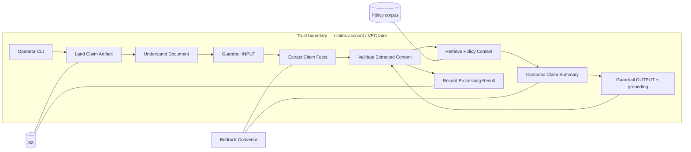
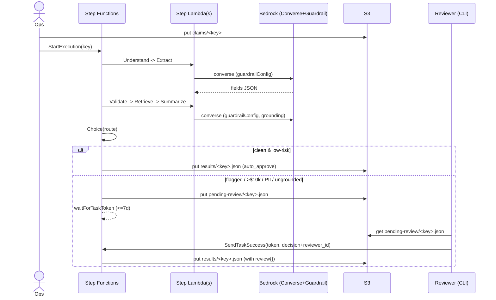

# Solution design — insurance claim document processor

## TL;DR

**Not an agent.** A **fixed, application-decided workflow**: understand →
extract (capable FM) → validate → retrieve policy → summarize (cheap FM) →
route → (human review, if flagged) → record. **Why not one agent?** The path
is fixed and auditable; none of the three multi-agent walls apply (context
overflow, parallelism, expertise that will not fit one prompt —
`cases/aws-ai/ch04.md:614-618`).

**Runtime (ADR 0004):** prove the AI hypothesis first with the existing CLI
against real Bedrock, then host the workflow on **AWS Step Functions
(Standard)** — chosen for its regulator-ready execution history and its native
durable wait for HITL. **HITL (ADR 0005):** a `waitForTaskToken` review state
after a routing Choice; PoC reviewers decide via a CLI token-resume. Component
logic stays in the reusable Python modules under `../build/`; SFN states are
thin wrappers.

- **Vector store (PoC):** in-process keyword RAG. **Production (ADR 0007):**
  Bedrock Knowledge Base on **S3 Vectors** (idle-cheap) + metadata filters
  (`jurisdiction`, `line_of_business`, `policy_form`, `effective_date`), Titan
  Text v2 embeddings, section-aware chunks. Prefer `retrieve` + our Converse
  prompt over `retrieve_and_generate`.
- **Guardrail / Cedar (ADR 0008):** Bedrock Guardrails on Converse I/O from
  the first real-AWS cut — PII ANONYMIZE, contextual grounding (~0.70,
  re-verify), prompt-attack. The app `ContentValidator` stays as
  defense-in-depth (schema, citation-required, residual-PII → HITL). **No
  Cedar in the PoC** (no tools); a later "file to core system" tool gets
  Verified Permissions, not a guardrail.
- **IAM:** one processing role: `s3:GetObject/PutObject` on the claims
  prefix, `bedrock:InvokeModel` on **both** `foundation-model/*` and
  `inference-profile/*`. No `AmazonBedrockFullAccess`.
- **Document understanding (ADR 0006):** images (mostly photos / typed-text)
  read by a **vision FM direct** (Nova / Claude image blocks) on the existing
  Converse path. **Textract / BDA** is the production promote for scanned
  forms / tables / handwriting (per-field confidence → HITL; OCR artifact →
  audit). Understand Document is the swap seam.

Design-time only. Binding: `.aws-ai/binding.toml` (`[roots] claim-document-processor`). Assess:
`../assess/capability-brief.md`.
Components: `../components/logical-components.md`.

**GATE: PENDING HUMAN — four boundaries separately:** topology,
knowledge/memory, guardrail+Cedar, IAM.

---

## 1. Topology — why not one agent?

The corpus default: a single agent with good tools beats a poorly designed
multi-agent system (`cases/aws-ai/ch04.md:610-612`). We go one step
further: **this is not an agent at all**. Extract → validate → retrieve →
summarize is a **Graph/DAG** the *code* decides, not the model. That is
the compliance-friendly pattern (`cases/aws-ai/ch04.md:528-557`) without
paying AgentCore.

**Pick:** a fixed workflow whose path **the application decides** (not the
model), **hosted on AWS Step Functions (Standard)** — see ADR 0004. Sync
within a claim except the HITL review, which is a durable async wait.

**Losing alternatives:**

| Option | Why it loses |
|---|---|
| Single Strands agent with tools | Model chooses order; auditability suffers; extra latency |
| Supervisor multi-agent | Named antipattern *Accidental multi-agent* — triples latency |
| Bedrock Flows | Fine for FM hops; does not own S3 ingest, validator, or DLQ |
| Single Lambda host | Dominated: cannot hold a multi-day HITL wait; audit trail depends on hand-written logging |
| Step Functions **Express** | No execution history — defeats the audit requirement |
| Step Functions **(now selected)** | Previously "too much for 3 docs" (ADR 0003); HITL + hard audit requirement reopened and reversed that — ADR 0004 |



Solid = sync. Guardrails wrap FM I/O, not S3.

---

## 1a. Human-in-the-loop (HITL) review — ADR 0005

After the final validate, a **routing (Choice) state** sends clean, low-risk
claims straight to Record (auto-approve) and everything else to a
**`waitForTaskToken` review state**. The token is resumed with the human
decision (`approve` / `correct` / `reject` + `reviewer_id`).

**Escalation policy (defaults — tune per domain):**

| Signal | Route |
|---|---|
| Schema-invalid / empty required field(s) | Human review |
| `ungrounded=true` (no policy citation) | Human review |
| PII leaked into summary (`pii_*`) | Block → human review (never auto-approve) |
| `claim_amount` > $10,000 | Human review (material-payout gate) |
| Clean: schema-valid, all fields, grounded, ≤ threshold, no PII | Auto-approve → Record |

- **PoC mechanism:** flagged results land under `pending-review/`; an operator
  inspects and resumes the token via a `decide` CLI. Same
  `SendTaskSuccess(taskToken, decision)` contract a UI or Amazon A2I would use
  → the production promote is additive.
- **Timeout:** 7-day heartbeat; on expiry mark `review-expired` and escalate.
- **Audit:** provenance gains `review: {decision, reviewer_id, timestamp,
  field_changes[]}` — model output and human correction recorded distinctly.
- **New actor** (Reviewer) but **still one quantum** until review SLO and
  ingest SLO diverge (characteristics worksheet).
- **Authz (production):** scope review with Verified Permissions / Cedar
  ("only an examiner in the matching LOB / jurisdiction may review").

---

## 2. Knowledge and memory

### Retrieval

| Question | PoC | Production |
|---|---|---|
| Who generates? | Our Converse call after retrieve | Same (`retrieve`, not `retrieve_and_generate`) |
| Store | Files under `samples/policies/` (keyword RAG) | Bedrock KB on **S3 Vectors** (ADR 0007); OpenSearch SL only if hybrid search becomes a measured need |
| Citations | Chunk id + filename always on the result | `retrievedReferences[].location` |
| Filters | Filename / line-of-business prefix | Metadata: jurisdiction, form, effective dates |

**Fail closed on filters:** if jurisdiction is unknown, retrieve nothing
and mark the summary `ungrounded` (C11) rather than pulling a random
state's policy.

### Memory

**None across claims.** Each document is a session of one. AgentCore
Memory namespaces would blur claimants if enabled without `/actor/{id}`
partitioning — do not turn them on "for later."

---

## 3. Tool and integration surface

PoC tools: **none**. S3 get/put and Bedrock converse are application
calls, not model-invoked tools.

Later seams (extra-challenging exam items, not topology):

| Seam | When | Note |
|---|---|---|
| Flask UI | Human asks for a web form | Edge, not a new quantum |
| `use_aws` | Never on this path | Would inherit the execution role — a trust defect |
| MCP prompt templates | If many clients must share templates | Otherwise Render Prompt stays in-process |

---

## 4. Guardrail and safety placement

Two controls, two layers (`cases/aws-ai/ch07.md:753-810`):

| Layer | Control | PoC | Production |
|---|---|---|---|
| Text in/out of the FM | Bedrock Guardrails (PII ANONYMIZE, prompt-attack, contextual grounding ~0.70 **[re-verify]**) | **`guardrailConfig` on Converse day-1 (ADR 0008)**; app `ContentValidator` kept as defense-in-depth (schema + citation + residual-PII → HITL) | Converse-native `guardrailConfig` + Guardrails versioning |
| Tool calls | Cedar / Verified Permissions | N/A — no tools | **Verified Permissions** before any "post to claims core" tool |

Guardrails never see a tool decision. Do not pretend a PII filter stops a
payout write.

---

## 5. IAM and security — ADR 0009

**Three roles**, least-privilege, no `AmazonBedrockFullAccess`, no long-lived
user keys in the app.

- **SFN execution role:** `lambda:InvokeFunction` on the step Lambdas +
  CloudWatch Logs (the execution history). Nothing else.
- **Step Lambda role (single, shared):**
  - `bedrock:InvokeModel` + `InvokeModelWithResponseStream` on **both**
    `arn:aws:bedrock:*::foundation-model/*` **and**
    `arn:aws:bedrock:*:*:inference-profile/*` (`cases/aws-ai/ch06.md:72-81`) —
    the two-ARN trap; model-id segment is a **resolved pattern**
    (`inference-profile/us.anthropic.claude-*`), not a pinned constant.
  - `bedrock:ApplyGuardrail` on the guardrail arn (ADR 0008).
  - `s3:GetObject` on `claims/*`; `s3:PutObject` on `results/*` +
    `pending-review/*`. No bucket-wide `s3:*`.
  - `kms:Decrypt` / `GenerateDataKey` scoped by `kms:ViaService`.
  - *(fast-follow, ADR 0007)* `bedrock:Retrieve` on the `knowledge-base/*` arn.
- **Operator / CLI role (HITL + spike):** `states:SendTaskSuccess` /
  `SendTaskFailure` on the state machine; `s3:GetObject` on `pending-review/*`;
  `bedrock:InvokeModel` for the feasibility spike.

- **KMS:** bucket default encryption; `kms:ViaService` on the key policy.
- **PrivateLink + `aws:sourceVpce`:** when packets must not traverse the public
  internet (`cases/aws-ai/ch08.md:82`). **Not in the PoC.**
- **Region:** `us-east-1` default until residency is set.
- **Production hardening:** split the step-Lambda role by trust (Bedrock-only
  vs write-capable) when the pipeline splits into per-component Lambdas.

---

## 6. Request path (resilience knobs)

See `../risk/resilience-clinic.md`.

| Hop | Timeout (C7) | Retry (C2) | Else |
|---|---|---|---|
| S3 get/put | connect 10s, read 60s | SDK standard, idempotent put (C9) | Fail the claim (hard dependency) |
| Bedrock Converse | connect 10s, read 300s | **adaptive**, max_attempts 5; **no** app-level retry loop | C1 later if error-rate metric exists; C11 skip summary |
| Policy retrieve | in-process | n/a | C11: summarize ungrounded + flag |
| HITL review wait | 7-day token heartbeat/timeout | n/a (single-use token, C9) | On expiry: `review-expired` + escalate |

---

## 7. Data contract + sequence & failure flows

### Result contract (provenance tuple)

Extends the PoC `ProcessingResult` with the routing, HITL, and guardrail
fields. Every recorded result carries the full replay set (illustrative):

```jsonc
{
  "claim_key": "claims/<key>",
  "schema_version": "1.0",
  "extracted_info": { "claimant_name", "policy_number", "incident_date",
                      "claim_amount", "incident_description" },
  "summary": "...",
  "citations": ["<chunk_id>", "..."],
  "ungrounded": false,
  "validation": { "accepted": true, "flags": [] },
  "route": "auto_approve | human_review",
  "review": {                      // present iff route == human_review
    "decision": "approve | correct | reject",
    "reviewer_id": "...",
    "timestamp": "<iso8601>",
    "field_changes": [ { "field": "...", "from": "...", "to": "..." } ]
  },
  "guardrail": { "intervened": false, "actions": [] },
  "understand_model_id": "<resolved, if image packet>",
  "extract_model_id": "<resolved>",
  "summary_model_id": "<resolved>",
  "embeddings": { "model_id": "<resolved>", "dims": 1024 },  // when KB is live
  "prompt_versions": { "extract_info": "...", "generate_summary": "..." },
  "usage": { "extract": {}, "summary": {} },
  "sfn_execution_arn": "<arn>"     // links to the execution-history audit spine
}
```

`sfn_execution_arn` + the Step Functions execution history together are the
audit record. Model ids are **resolved at runtime and recorded**, never
constants (ADR 0001).

### Happy path + HITL (sequence)



### Failure flows (mapped to resilience cards)

| Failure | Where | Handling |
|---|---|---|
| Bedrock throttle | Extract/Summarize | C2 adaptive retries (SDK, `max_attempts=5`) + SFN state Retry on `ThrottlingException` — **no** nested app loop |
| Bedrock timeout / hang | Extract/Summarize | C7 connect 10s / read 300s; state Catch → fail execution (recorded) |
| Policy retrieve empty/down | Retrieve | C11 soft: continue, `ungrounded=true`, summary flagged — extraction still recorded |
| S3 get/put fault | Land/Record | Hard dependency: Catch → fail; packet is durable (Land); re-run overwrites (C9) |
| Guardrail intervened (PII/attack) | Converse | recorded as `guardrail.intervened`; residual PII caught by validator → route human_review |
| HITL timeout | review wait | 7-day heartbeat → `review-expired` + escalate; token single-use → no double-record (C9) |
| Duplicate run of same key | whole execution | C9: `results/<key>.json` overwrite = idempotent |

C2/C7/C9/C11 are **live** in the PoC; C1/C8/C10 stay named-not-applied until a
live error-rate metric exists (`../risk/resilience-clinic.md`).

---

## ADR candidates

1. Workflow host: single Lambda vs Step Functions — **decided → ADR 0004**
   (Step Functions Standard).
2. HITL review mechanism — **decided → ADR 0005** (`waitForTaskToken`, CLI
   token-resume for the PoC).
3. `retrieve` vs `retrieve_and_generate`.
4. RAG store: in-process keyword vs Bedrock KB + vector store — **decided →
   ADR 0007** (KB on S3 Vectors, fast-follow).
5. App validator vs Guardrails-from-day-1 — **decided → ADR 0008** (Guardrails
   full, day-1; validator as defense-in-depth).
6. Document understanding: text-only vs multimodal vs Textract/BDA — **decided
   → ADR 0006** (vision FM direct now; Textract/BDA promote).
