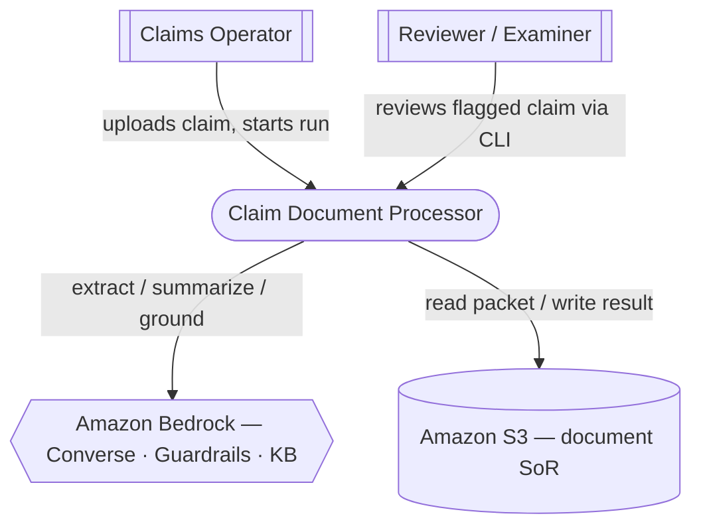
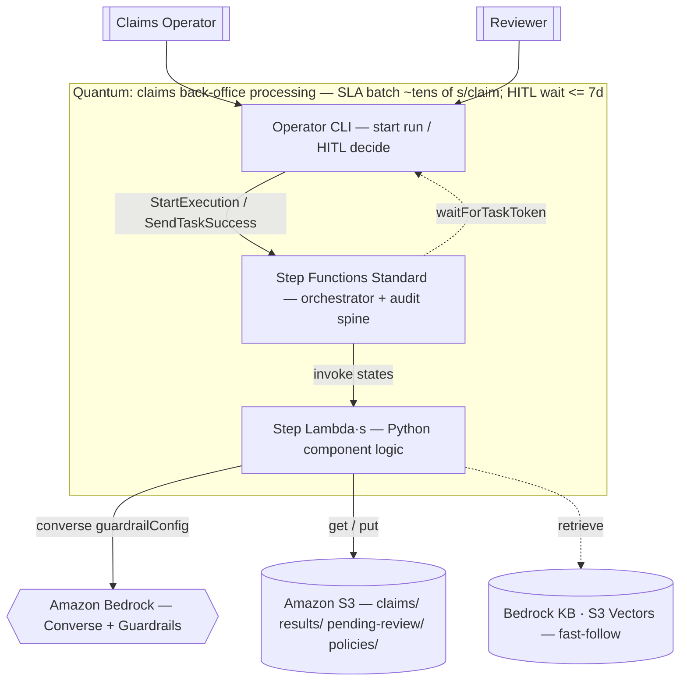
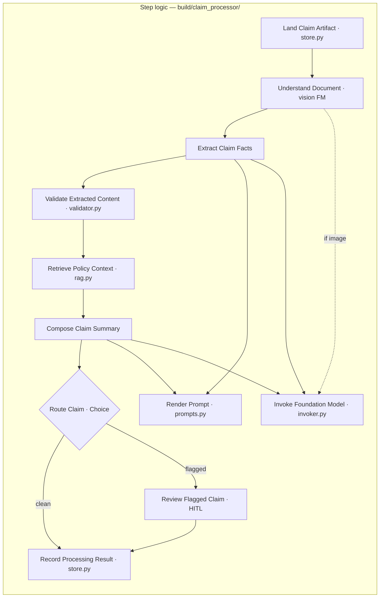

# Architecture validation — claim document processor (arch-validate capstone)

Closes the design stage. Inputs: aws-ai-design §1–§7, ADRs 0001–0009,
characteristics worksheet, resilience clinic, offline eval-report. Kata mode:
verdicts reasoned from the design statement, not a live repo audit.

**GATE: PENDING HUMAN — sign off per intersection, not one global "looks good."**

---

## 1. C4 diagram set

**Key (all three diagrams):** `[[person]]` · `[container]` · `{{managed AWS
service}}` · `[(datastore)]` · `{decision}`. **Solid = sync, dotted = async.**
Every edge is labelled.

### Context

### Container — one quantum, back-office batch

### Component — inside the step logic (modules mirror logical components)

---

## 2. Nine-intersections verdict

| # | Intersection | Verdict | Evidence / probe | Severity · owner-stage |
|---|---|---|---|---|
| 1 | Implementation | ◐ partial | PoC modules mirror components; SFN/HITL/Guardrails/KB glue not yet built | low · aws-ai-build / sdd-implement |
| 2 | Infrastructure | ◐ designed, not stood up | Manual runbook (A9); real-AWS behind gate | low · aws-ai-deploy |
| 3 | Data topology | ● aligned | S3 SoR + KB on S3 Vectors; no relational DB (style Det-2). Note: HITL worklist is an S3 prefix, not queryable → DynamoDB in prod | low · arch-style (if query patterns emerge) |
| 4 | Engineering practices | ● aligned | Offline Stubber/moto (17 tests) + fitness seeds. Gap: SFN state-machine test surface (Step Functions Local) | low · sdd-spec |
| 5 | Team topology | ● aligned | One builder, one quantum; Reviewer is a new actor, same quantum | ok · — |
| 6 | Integration | ● aligned | S3/Bedrock are app calls, not model tools; risky payout-write tool deliberately deferred | ok · — |
| 7 | Enterprise | ○ unknown | **Residency `needs-input` (A2)**; reviewer identity provider (SSO) not set | **medium** · aws-ai-assess |
| 8 | Business | ● aligned | Auto-approve clean + escalate risky serves "reduce manual effort" without ceding integrity | ok · — |
| 9 | GenAI (WA GenAI+ML Lens) | ◐ aligned, unproven live | Converse (not legacy), resolved ids, RAG+citations, Guardrails, HITL, cascade cost — per eval-report. Open: real-AWS model comparison + grounding-threshold tuning are gated | **medium** · aws-ai-validate (real gate) |

---

## 3. Governance table

| Rule (source) | Automation | State |
|---|---|---|
| No `max_tokens_to_sample` / `["completion"]` (ADR-0001) | grep + unit | ✅ live (eval) |
| Bedrock client connect+read timeouts C7 (worksheet, ADR-0004) | assert on Config | ✅ live |
| Schema-valid JSON + amount numeric + citation-or-ungrounded (worksheet, ADR-0002) | offline eval | ✅ live |
| No `boto3.client` at import; package layout ↔ components (ADR-0003) | import/PyTestArch test | ◐ add in Stage S |
| `guardrailConfig` on every Converse (ADR-0008) | unit assert on invoker kwargs | ◐ add when Guardrails wired |
| No raw PII (e.g. SSN) in app logs — log-shape test (ADR-0008) | log-output scan test | ⚠️ **ungoverned — write it** |
| IAM: both ARNs, no `AmazonBedrockFullAccess`/bucket-wide `s3:*`, model-id pattern (ADR-0009) | policy lint on the IAM JSON | ⚠️ **ungoverned — no JSON yet** |
| HITL: reviewer provenance + auto-approve predicate + token timeout (ADR-0005) | unit tests on route/record | ⚠️ **ungoverned — not built** |
| SFN Standard (not Express); one execution per claim (ADR-0004) | deploy check + state-type assert | ⚠️ **ungoverned — not built** |
| KB: 4 metadata tags + filter + unknown→ungrounded; embeds model+dims recorded (ADR-0007) | eval (fail-closed proven on keyword RAG); KB tags at build | ◐ partial |
| Real-AWS model comparison; grounding-threshold tuning | manual, gated | ◻ manual · aws-ai-validate |
| Residency confirmation | manual | ◻ manual · aws-ai-assess |

Legend: ✅ live · ◐ planned in Stage S/build · ⚠️ ungoverned (open item) · ◻ manual.

---

## 4. Team checklists (small, error-prone-only)

- **Code-completion:** DI (no import-time client) · resolved model id recorded ·
  `guardrailConfig` passed · no completions contract · new component has an
  offline test.
- **Testing edge-cases:** empty/missing fields · unknown jurisdiction
  (ungrounded) · PII in output (→ HITL) · throttle → single SDK retry (no nested
  loop) · duplicate key (idempotent) · HITL timeout (review-expired).
- **Release:** offline suite green · fitness greps pass · real-AWS only behind
  approved gate · ADRs updated if a seam changed · IAM has both ARNs + no
  FullAccess.

---

## 5. Retrospective vs top-3 characteristics

- **Data integrity** — ● well served: validator (schema + citation), fail-closed
  RAG, HITL on flags / >$10k, resolved ids, guardrail grounding. Residual risk:
  real model field-accuracy unproven until the gated comparison.
- **Privacy** — ● served: Guardrails PII ANONYMIZE day-1 + validator backup +
  KMS + least-privilege IAM. Residual risk: the no-PII-in-logs test isn't
  written yet (open item).
- **Auditability** — ●● the biggest win: Step Functions execution history +
  provenance tuple + review record + resolved ids + prompt versions form a
  regulator-ready replay. This is what tipped D2 to Step Functions.

---

## 6. Open items (routed by owner-stage)

1. Write the **log-shape PII test** (ADR-0008) → Stage S.
2. **IAM policy JSON + policy-lint fitness** (ADR-0009) → Stage S / build.
3. **HITL route/predicate/timeout tests** (ADR-0005) → Stage S / build.
4. **SFN Standard + one-execution assertion** (ADR-0004) → build / deploy.
5. Confirm **data residency / region** (A2, intersection 7) → aws-ai-assess.
6. **Real-AWS model comparison + grounding tuning** (intersection 9) →
   aws-ai-validate (gated).
7. **Bind the kata in `.sdd/binding.toml`** (no `claim-document-processor` root
   yet) → prerequisite for Stage S.

Advance → **Stage S (sdd-spec)**: the ungoverned fitness functions above become
its EARS acceptance criteria + task list.
