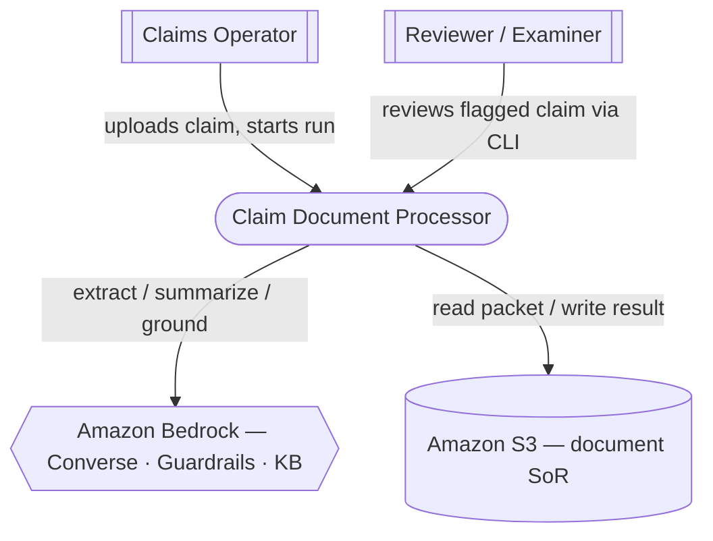
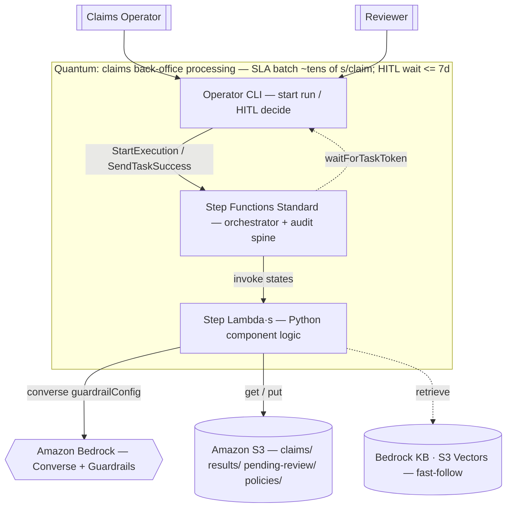
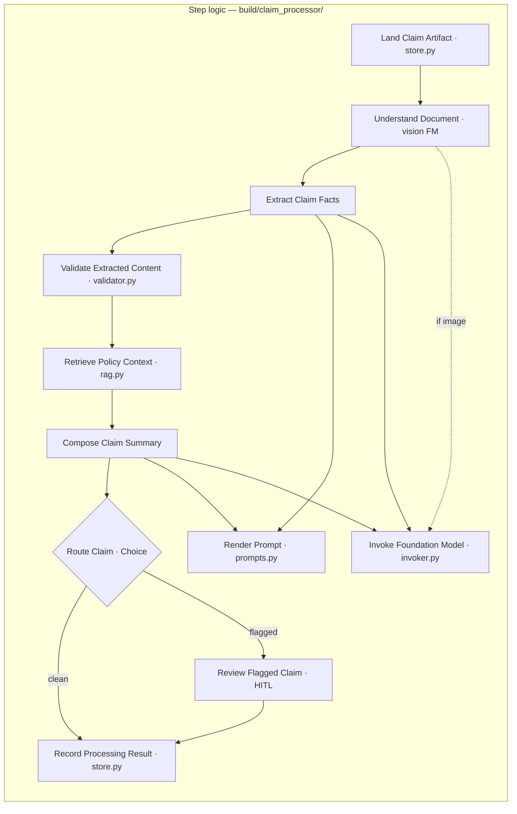

# Architecture validation — claim document processor (arch-validate capstone)

Closes the design stage. Inputs: aws-ai-design §1–§7, ADRs 0001–0009,
characteristics worksheet, resilience clinic, offline eval-report. Kata mode:
verdicts reasoned from the design statement, not a live repo audit.

**GATE: PENDING HUMAN — sign off per intersection, not one global "looks good."**

---

## 1. C4 diagram set

**Key (all three diagrams):** `[[person]]` · `[container]` · `{{managed AWS
service}}` · `[(datastore)]` · `{decision}`. **Solid = sync, dotted = async.**
Every edge is labelled.

### Context

```mermaid
flowchart TB
  op[[Claims Operator]]
  rev[[Reviewer / Examiner]]
  sys([Claim Document Processor])
  br{{Amazon Bedrock — Converse · Guardrails · KB}}
  s3[(Amazon S3 — document SoR)]
  op -->|uploads claim, starts run| sys
  rev -->|reviews flagged claim via CLI| sys
  sys -->|extract / summarize / ground| br
  sys -->|read packet / write result| s3
```

### Container — one quantum, back-office batch

```mermaid
flowchart TB
  op[[Claims Operator]]
  rev[[Reviewer]]
  subgraph q["Quantum: claims back-office processing — SLA batch ~tens of s/claim; HITL wait <= 7d"]
    cli[Operator CLI — start run / HITL decide]
    sfn[Step Functions Standard — orchestrator + audit spine]
    lam[Step Lambda·s — Python component logic]
  end
  s3[(Amazon S3 — claims/ results/ pending-review/ policies/)]
  br{{Amazon Bedrock — Converse + Guardrails}}
  kb[(Bedrock KB · S3 Vectors — fast-follow)]
  op --> cli
  rev --> cli
  cli -->|StartExecution / SendTaskSuccess| sfn
  sfn -->|invoke states| lam
  lam -->|converse guardrailConfig| br
  lam -->|get / put| s3
  lam -.->|retrieve| kb
  sfn -.->|waitForTaskToken| cli
```

### Component — inside the step logic (modules mirror logical components)

```mermaid
flowchart LR
  subgraph steps["Step logic — build/claim_processor/"]
    land[Land Claim Artifact · store.py]
    und[Understand Document · vision FM]
    ext[Extract Claim Facts]
    val[Validate Extracted Content · validator.py]
    ret[Retrieve Policy Context · rag.py]
    sum[Compose Claim Summary]
    route{Route Claim · Choice}
    review[Review Flagged Claim · HITL]
    rec[Record Processing Result · store.py]
    tpl[Render Prompt · prompts.py]
    inv[Invoke Foundation Model · invoker.py]
  end
  land --> und --> ext --> val --> ret --> sum --> route
  route -->|clean| rec
  route -->|flagged| review --> rec
  ext --> tpl
  sum --> tpl
  ext --> inv
  sum --> inv
  und -.->|if image| inv
```

---

## 2. Nine-intersections verdict

| # | Intersection | Verdict | Evidence / probe | Severity · owner-stage |
|---|---|---|---|---|
| 1 | Implementation | ◐ partial | PoC modules mirror components; SFN/HITL/Guardrails/KB glue not yet built | low · aws-ai-build / sdd-implement |
| 2 | Infrastructure | ◐ designed, not stood up | Manual runbook (A9); real-AWS behind gate | low · aws-ai-deploy |
| 3 | Data topology | ● aligned | S3 SoR + KB on S3 Vectors; no relational DB (style Det-2). Note: HITL worklist is an S3 prefix, not queryable → DynamoDB in prod | low · arch-style (if query patterns emerge) |
| 4 | Engineering practices | ● aligned | Offline Stubber/moto (17 tests) + fitness seeds. Gap: SFN state-machine test surface (Step Functions Local) | low · sdd-spec |
| 5 | Team topology | ● aligned | One builder, one quantum; Reviewer is a new actor, same quantum | ok · — |
| 6 | Integration | ● aligned | S3/Bedrock are app calls, not model tools; risky payout-write tool deliberately deferred | ok · — |
| 7 | Enterprise | ○ unknown | **Residency `needs-input` (A2)**; reviewer identity provider (SSO) not set | **medium** · aws-ai-assess |
| 8 | Business | ● aligned | Auto-approve clean + escalate risky serves "reduce manual effort" without ceding integrity | ok · — |
| 9 | GenAI (WA GenAI+ML Lens) | ◐ aligned, unproven live | Converse (not legacy), resolved ids, RAG+citations, Guardrails, HITL, cascade cost — per eval-report. Open: real-AWS model comparison + grounding-threshold tuning are gated | **medium** · aws-ai-validate (real gate) |

---

## 3. Governance table

| Rule (source) | Automation | State |
|---|---|---|
| No `max_tokens_to_sample` / `["completion"]` (ADR-0001) | grep + unit | ✅ live (eval) |
| Bedrock client connect+read timeouts C7 (worksheet, ADR-0004) | assert on Config | ✅ live |
| Schema-valid JSON + amount numeric + citation-or-ungrounded (worksheet, ADR-0002) | offline eval | ✅ live |
| No `boto3.client` at import; package layout ↔ components (ADR-0003) | import/PyTestArch test | ◐ add in Stage S |
| `guardrailConfig` on every Converse (ADR-0008) | unit assert on invoker kwargs | ◐ add when Guardrails wired |
| No raw PII (e.g. SSN) in app logs — log-shape test (ADR-0008) | log-output scan test | ⚠️ **ungoverned — write it** |
| IAM: both ARNs, no `AmazonBedrockFullAccess`/bucket-wide `s3:*`, model-id pattern (ADR-0009) | policy lint on the IAM JSON | ⚠️ **ungoverned — no JSON yet** |
| HITL: reviewer provenance + auto-approve predicate + token timeout (ADR-0005) | unit tests on route/record | ⚠️ **ungoverned — not built** |
| SFN Standard (not Express); one execution per claim (ADR-0004) | deploy check + state-type assert | ⚠️ **ungoverned — not built** |
| KB: 4 metadata tags + filter + unknown→ungrounded; embeds model+dims recorded (ADR-0007) | eval (fail-closed proven on keyword RAG); KB tags at build | ◐ partial |
| Real-AWS model comparison; grounding-threshold tuning | manual, gated | ◻ manual · aws-ai-validate |
| Residency confirmation | manual | ◻ manual · aws-ai-assess |

Legend: ✅ live · ◐ planned in Stage S/build · ⚠️ ungoverned (open item) · ◻ manual.

---

## 4. Team checklists (small, error-prone-only)

- **Code-completion:** DI (no import-time client) · resolved model id recorded ·
  `guardrailConfig` passed · no completions contract · new component has an
  offline test.
- **Testing edge-cases:** empty/missing fields · unknown jurisdiction
  (ungrounded) · PII in output (→ HITL) · throttle → single SDK retry (no nested
  loop) · duplicate key (idempotent) · HITL timeout (review-expired).
- **Release:** offline suite green · fitness greps pass · real-AWS only behind
  approved gate · ADRs updated if a seam changed · IAM has both ARNs + no
  FullAccess.

---

## 5. Retrospective vs top-3 characteristics

- **Data integrity** — ● well served: validator (schema + citation), fail-closed
  RAG, HITL on flags / >$10k, resolved ids, guardrail grounding. Residual risk:
  real model field-accuracy unproven until the gated comparison.
- **Privacy** — ● served: Guardrails PII ANONYMIZE day-1 + validator backup +
  KMS + least-privilege IAM. Residual risk: the no-PII-in-logs test isn't
  written yet (open item).
- **Auditability** — ●● the biggest win: Step Functions execution history +
  provenance tuple + review record + resolved ids + prompt versions form a
  regulator-ready replay. This is what tipped D2 to Step Functions.

---

## 6. Open items (routed by owner-stage)

1. Write the **log-shape PII test** (ADR-0008) → Stage S.
2. **IAM policy JSON + policy-lint fitness** (ADR-0009) → Stage S / build.
3. **HITL route/predicate/timeout tests** (ADR-0005) → Stage S / build.
4. **SFN Standard + one-execution assertion** (ADR-0004) → build / deploy.
5. Confirm **data residency / region** (A2, intersection 7) → aws-ai-assess.
6. **Real-AWS model comparison + grounding tuning** (intersection 9) →
   aws-ai-validate (gated).
7. **Bind the kata in `.sdd/binding.toml`** (no `claim-document-processor` root
   yet) → prerequisite for Stage S.

Advance → **Stage S (sdd-spec)**: the ungoverned fitness functions above become
its EARS acceptance criteria + task list.

---

## v2 addendum — data-preparation plane (2026-09-23)

**GATE: RATIFIED 2026-09-23 ("ratify as recommended" — design/hld-v2-data-prep.md §6; was PENDING HUMAN).** Signed off per intersection at R9, with exceptions #4 and #6 (provisional batch, A2-a). **HLD FINAL 2026-09-23** after the consistency pass (`../design/hld-v2-fold-map.md`).
**Mode:** review. Verdicts cite the v2 HLD artifacts and live v1 files. v2
code does not exist yet, so implementation claims are "aligned-by-design, verify
at build" unless they are about v1.

### 1. C4 diagram set (D2, linted)

Rendered with the workspace diagram skill (`docs/skills/generating-architecture-diagrams/`):
a fact-frozen intermediate representation (IR), then D2, then SVG. Every view
**PASSES** `lint_diagram.py --detail` (verbatim labels, reserved shapes, real
`<text>`, grayscale proof, key, container technology, specific edge verbs,
grounded omissions).

| View | Files (`diagrams-v2/`) | Lint |
|---|---|---|
| Context | `01-context.json` → `.svg` / `@2x.png` / `.view.md` / `-detail.md` | `PASS 19/19 labels verbatim, 19 relocated facts` |
| Container (opens SYS) | `02-container.*` | `PASS 19/19, 56 relocated facts`; 28 numbered edges |
| Component: intake step function (opens ISTEP) | `03-component-intake.*` | `PASS 24/24, 66 relocated facts`; 30 numbered edges (at the decomposition threshold; overlays: none) |

**Consistency pass (2026-09-23):** all three views were re-rendered and
re-linted. The lint was re-run independently, and it PASSES.
- ADR tags now read Accepted.
- **02-container** adds the M14 changes:
  - the Map limits and the > 200-row quarantine;
  - the "Trigger dead-letter queue" [Amazon SQS] node;
  - edges 26–28: execution status events, failed-batch routing, and the DLQ.

  It also adds the M12 keys, with the VersionId on hand-off edge 14; the
  M1 / M6 / H-F14-a detail on the decision step functions; and `intake/v=1/…`
  (M3).
- **03-component-intake** updates the node detail per the fold map, including
  the clarified M6 image rule, and adds edge 30 (Event routing → Account Batch
  Outcome, M14).
- **01-context** marks the AI-services opt-out as an owner action pending
  (R8c-a).

- **Quantum boundary:** one quantum, stated in the context `SYS` detail and
  the container caption (style-decision v2, Q-1).
- **SLAs:** none stated, so none drawn. Honesty rule: volume and SLO are
  `needs-input`.
- The IRs carry `forbidden_facts` that **encode C3-a and the rejections as a
  lint rule**. `SageMaker`, `Rekognition`, `DynamoDB`, other clouds and
  invented SLA/latency/price patterns fail the build if they ever appear.
- Crosscutting omissions are declared, not silent: CloudWatch, orchestration
  edges, per-component S3 access, and the two CLI-hosted components.

### 2. Nine intersections — v2 verdicts

| # | Intersection | Verdict | Evidence / probe | Severity → owner |
|---|---|---|---|---|
| 1 | **Implementation** | **Aligned-by-design / verify at build.** Plus one v1 misalignment. | (a) The goals match: every v2 component serves integrity, privacy or audit (components v2 table). (b) SD-2 gives one leaf module per component, governed by a stdlib-`ast` structure test (PyTestArch-style rule without the dependency). (c) Constraints are governed: no new deps (`tests/test_no_new_deps.py`, extended to `rglob`), C3-a through diagram `forbidden_facts` + a service allowlist in the IAM lint. **v1 drift:** the logical table lists 9 components vs 25 modules (components v2 review finding). | v1 drift: low → arch-components (v1 re-entry) |
| 2 | **Infrastructure** | **Unknown** | Serverless everywhere. "Can support ≠ will": Textract / Comprehend TPS, Transcribe concurrent jobs, account Lambda concurrency and Glue DQ start-up are unmeasured. **M14 bounds the exposure (C-7):** inline Map ≤ 50 claims, Distributed Map for 51–200, > 200 rows quarantined at admission; intake-Lambda reserved concurrency ≥ 20; the execution watchdog + an `ExecutionsFailed` alarm make a failed batch visible, and a DLQ (Amazon SQS) sits on the trigger. **Probe:** read Service Quotas at deploy (DP-24) + smoke `ClaimSettleMs` / `DQRunSeconds` / throttle counts (clinic v2 §2). Single region, no DR: accepted for the PoC. | medium → aws-ai-validate (gated smoke) |
| 3 | **Data topology** | **Aligned** | Document-in / document-out → S3 single-writer zones + catalog metadata + AppConfig, no relational DB (ADR 0017), consistent with one quantum (a shared bucket is inside the quantum). Write-once artifacts, read downstream: S3 fits. Keys are revision-scoped and the S3 VersionId travels in the v1 input and lineage (M12), so a late review of revision *r* can no longer overwrite *r+1*'s decision (C-4). **Open:** retention (`needs-input`). | — (retention → ADR 0017 deferred item) |
| 4 | **Engineering practices** | **Partially misaligned** | Offline TDD (Stubber + fakes + seeded corpus) and the SDD tasks are aligned. **But:** there is no CI, so fitness functions run only when someone runs the suite. The deploy is a manual runbook for more infrastructure (4 new roles, a second state machine, rules, Glue; M14 adds the watchdog rule, an SQS DLQ and an alarm). All deploys stay manual and owner-run (D-a). M18 adds a runbook step against deploy skew (L-6): publish Lambda versions and switch alias-qualified ARNs together (the alias part can wait for IaC). The v1 ledger's F1–F11 show manual-deploy defect rates. | medium → spec revision (a CI hook task) + aws-ai-deploy (CDK stays deferred per v1; revisit on the next deploy) |
| 5 | **Team topology** | **Aligned** | One builder owns both workflows ↔ one quantum. A separate intake team is a named split trigger (ADR 0016). | — |
| 6 | **Systems integration** | **Aligned-by-design / verify at build** (was partially misaligned; resolved by M3) | *Upstream:* S3 PUT + manifest-last; the contract is the CSV header. It had **no version marker**, so schema drift would surface only as rule failures. **M3** puts the contract version in the key path (`intake/v=1/…`) and adds a header exact-match rule (`invalid_schema` → quarantine). *v1:* async `StartExecution` preserves v1's quantum characteristics (no sync coupling), and the bundle has a `schema_version` with a tolerant reader; the S3 VersionId now travels in the v1 input (M12). *AWS AI services:* sync APIs vs quotas (see 2). | low → closed by M3 (ADRs 0017 / 0019); verify at build (G23) |
| 7 | **Enterprise** | **Unknown** | Workspace ADR practice ✓, now with approval criteria (R7q-a): ADRs 0016–0022 are on its go-live review list, so a named security / privacy reviewer signs them off before any real claim data (`../adrs/approval-criteria.md`). Least-privilege / KMS / no-PII-logs ✓. AI-services content opt-out (**M7 / R8c-a**): decided, owner action pending; synthetic data only until verified (G27). **Probe:** records-retention policy and privacy-review sign-off for voice data. | medium → human (needs-input) |
| 8 | **Business environment** | **Aligned** | PoC plus a course assignment plus "real-world depth"; pay-per-use serverless fits a small budget. *Residuality stressors → residues:* CAT volume ×100 → batch cap + Map concurrency + Distributed Map path (M14: inline ≤ 50 claims, Distributed Map 51–200, > 200 rows quarantined at admission); new modality (dashcam video) → reader registry path; regulator lineage request → bundle lineage; partner format change → header rule (M3) + normalizer config + proposals; model deprecation → v1 AppConfig. | — |
| 9 | **Generative AI** | **Aligned, with gaps** | Swappable: v1 adapter + AppConfig model ids (ADRs 0010 / 0011). Rails: Guardrail on claim-derived text (input tagging, H-F14-a) + validator + M1's pre-routing check against the canonical values + **deterministic routing** on the canonical amount (the FM never approves). Evals: v1 has `eval-report.md` for 2–3 docs; v2 adds gold extractions per synthetic claim (spec `truth/…gold.json`). **Gaps:** no trace-level observability for comparing engines on multimodal bundles (CloudWatch EMF only); the Well-Architected GenAI-lens checklist from **aws-ai-validate** has not been run for v2; images are not guardrail-checked, so integrity against visual injection rests on M1 + canonical routing, and image support in the prompt-attack filter is **[re-verify]** (H-F14-a). | low → aws-ai-validate at build/deploy |

### 3. Governance table (fitness functions; source → rule sketch)

All are planned. G21–G38 fold in the ratified amendments, one row per
fold-map item (`../design/hld-v2-fold-map.md`). The rows feed the LLD, then
become spec tasks at the A5-a revision (owner sequence, 2026-09-23).
"Offline" means they run in the `unittest` gate.

**LLD update (2026-09-24).** The LLD (`../design/lld-v2-data-prep.md`)
re-worded G1, G7, G17, G21, G22, G24, G25, G26, G30, G33 and G36 to match the
decided low-level rules (Q1-a, Q6-a, Q8-b, Q10-a; SVC-04; ASL-52), and added
G39–G49 for rules no row covered. Each row names its tests in LLD §10.10.

| # | Fitness function | Char. | Kind | Rule sketch | Source |
|---|---|---|---|---|---|
| G1 | ASL structure: `Admit` first; retrier T on every Task (FULL jitter, `MaxDelaySeconds` 30, 4 retries), none on permanent errors; Task timeout > Lambda timeout; every Catch keeps the state (`ResultPath $.error`) and catches `States.DataLimitExceeded` before `States.ALL`; DQ poll ≤ 48 × 15 s, call poll ≤ 20 × 30 s; both Maps `MaxConcurrency` 4, inline ≤ 50 items, identical iterations; execution timeout 10,800 s; the only `Fail` states are the two deploy-defect ones (ASL-52), and the Distributed Map tolerates no child failure | reliability | offline, structural | `tests/test_intake_asl.py` (§3.11) | ADR 0016, clinic v2, §3; LLD §10.10 (2026-09-24) |
| G2 | Import boundary: `dataprep/contracts.py` imports no other `claim_processor` module; v1 imports only `dataprep.contracts` | evolvability | offline, structural | stdlib `ast` import-graph test | ADR 0016, style v2 D3 |
| G3 | One leaf module per logical component (names match the component table) | maintainability | offline, structural | `ast` + a name map | SD-2, intersection 1 |
| G4 | Prefix ownership: no role writes another component's prefix; v1 reads only `bundles/*` among the new prefixes | privacy, audit | offline, IAM lint | an ownership table in `test_iam_policy.py` | ADR 0017, 0020 |
| G5 | `Resource:"*"` only on the allowlisted no-resource-type actions; scoped Glue / Transcribe / PassRole / StartExecution | privacy | offline, IAM lint | allowlist + pattern checks | ADR 0020, spec Z6 |
| G6 | No `bedrock:*` in the intake role; no Transcribe / Comprehend / Textract / `raw/*` in the v1 role | privacy | offline, IAM lint | set difference | ADR 0020 |
| G7 | PII scanner over every persisted artifact of the corpus run **and** every captured log, EMF line, exception message and step input or output: 0 high-risk hits; canaries absent from logs and state | privacy | offline, e2e + `[gate]` | `tests/pii_scan.py` (TST-29); smoke copy (TST-30) | ADR 0020, §7 F2; LLD §10.10 (2026-09-24) |
| G8 | Rendered DQDL == committed snapshot; every rule has a row check or is batch-only; escape-hatch rules listed | integrity | offline, golden | catalog render test | ADR 0019 |
| G9 | Seeded-defect recall 100 %; 0 blocking flags on clean; ≥ 3 auto-approve; one DMY proposal with 100 % replay fix | integrity | offline, e2e | `intake --fake` corpus assertions | spec Z9, ADR 0019 / 0022 |
| G10 | Conservation: `ConservationGap == 0` per batch | reliability, audit | offline + `[gate]` | batch-summary assertion + metric alarm | clinic v2, worksheet v2 |
| G11 | Bias guard: routing / reconciliation / prompt renderers never reference `sentiment` | fairness (via design) | offline, structural | `ast` name scan | ADR 0018 |
| G12 | Formatter: fixed section order + tags; ≤ 20 images, each ≤ 3.75 MB, user role; placeholders preserved; transcript cap | integrity, privacy, cost | offline, unit | formatter tests | ADR 0021 |
| G13 | H1: a 3.8 MB image fails at ingest | reliability | offline, unit | `understand.py` test | ADR 0021 |
| G14 | Every `bundle:` flag → human review, through the **handler path** (not only `process()`) | integrity | offline, unit | extends `tests/test_handler_routing_path.py` | spec W3, ADR 0016 |
| G15 | Proposal types are a closed enum; no FM client reachable from `proposals.py`; names stored as a boolean only | integrity, privacy | offline, structural | enum schema + `ast` | ADR 0022 |
| G16 | Idempotency: lock 412 → duplicate, zero calls; FAILED holder → takeover; `ExecutionAlreadyExists` → `already_started`; feedback metric dedup | reliability | offline, Stubber | per-mechanism tests | ADR 0017, clinic v2 |
| G17 | Intake clients: `total_max_attempts == 1` on the **built** client (`max_attempts: 1` would mean two attempts); no `time.sleep` in `dataprep/` | reliability | offline, structural | `client.meta.config.retries` + grep | clinic v2 C2, SVC-04, ASL-24; LLD §10.10 (2026-09-24) |
| G18 | Metric vocabulary coverage; no `claim_id` dimension; dashboard references only vocabulary metrics | observability, cost | offline, unit | vocabulary tests | spec Y1 / Y2, SD-6 |
| G19 | Diagrams: `forbidden_facts` encode C3-a; lint PASS per view | governance | offline, lint | `lint_diagram.py --detail` | this addendum |
| G20 | Smoke: v1 role denied `raw/claims/*`; intake role denied `bedrock:InvokeModel` | privacy | `[gate]` | `simulate-principal-policy` | ADR 0020 |
| G21 | Pre-routing check (bundle keys): an M1 field (`policy_number`, `incident_date`, `claim_amount`) present in the model output and different from the canonical intake value → blocking `bundle:fm_source_mismatch:<field>` (amount within max($1.00, 2 %), a code constant; the date ISO only; policy numbers compared uppercased without spaces or hyphens); one absent → `bundle.fm_absent[]`, no flag; two or three absent → blocking `bundle:fm_evidence_missing`; the threshold routes on the canonical amount; the extraction view shows no canonical intake value | integrity | offline, unit | `fm-1` – `fm-6` through the handler path; FMT-49's sentinel | M1 (ADR 0021, Q1-a tightened); LLD §10.10 (2026-09-24) |
| G22 | Ambiguous dates: a numeric date whose first two parts are ≤ 12 and differ → blocking `dq_warn:ambiguous_date`, unless a self-unambiguous non-claimant source (the police report answer ≥ `textract.min_confidence`) confirms the reading; a source equal to the alternate adds `recon_mismatch:loss_date`; nothing flips; the issuer order (`partner_id`, never `channel`) is strict for every numeric date | integrity | offline, golden | `date-1` – `date-12`; the `ast` scan | M2 (ADR 0019, Q6-a); LLD §10.10 (2026-09-24) |
| G23 | Catalog hardening + key contract: completeness renders as non-empty; header exact-match → `invalid_schema`; report_date ≥ loss_date; exactly one CSV per partition; attachments only under `raw/claims/<claim_id>/`; intake keys under `intake/v=1/…` | integrity | offline, golden + unit | extends G8's render snapshot; seeded batches with a changed header, two CSVs in one partition, a report dated before the loss, and an attachment outside its claim → each is refused | M3 (ADR 0017 / 0019) |
| G24 | Unverifiable is not clean: blocking `recon_unverifiable:<field>`, `source_disabled:<src>`, `source_failed:<src>`, `history_failed`, `history_unavailable`; loss-run join keys and dates go through Canonicalize Values | integrity | offline, unit | `flag-10` – `flag-12`, `flag-15`; the `ast` scan | M4 (ADR 0018), ASL-17; LLD §10.10 (2026-09-24) |
| G25 | Revision and replay governance: a marker for **any other** revision of the claim (earlier or later, decided or in flight) → blocking `resubmission_review`, with no exception (`rerun_proposal_id` is lineage only); markers are create-only at Gate Claim Rows, before any per-claim spend, and only for rows that pass; replay covers every claim the change can affect (that partner for `set_date_order`, every partner otherwise), reports fixed / broken / unchanged per partner, and any break blocks; the extraction view hides the intake record; degraded results are excluded | integrity, audit | offline, unit + e2e | `mark-1` – `mark-7`, `replay-1` – `replay-7`, B0002 | M5 (ADR 0022, Q8-b); LLD §10.10 (2026-09-24) |
| G26 | PII: `REDACT_PII_TYPES` and `KEEP_PII_TYPES` cover botocore's enum exactly; transcripts and OCR text redacted; runs of ≥ 4 digits masked in transcripts; an image reaches the model only when OCR is not sufficient (TXT-09) and Layer 2 found no PII in that document; otherwise blocking `image_withheld:pii`, or `image_skipped:<reason>` when it cannot be sent; an explicit Deny on `raw/*` in v1's role | privacy | offline, unit + IAM lint | CMP-07; `flag-16` – `flag-18`; FMT-50; IAM-76 | M6 (ADR 0020); LLD §10.10 (2026-09-24) |
| G27 | AI-services content opt-out in force for the account | privacy | manual check | `aws organizations describe-effective-policy --policy-type AISERVICES_OPT_OUT_POLICY --target-id <account>` shows the opt-out for all services; recorded in `../build/DEPLOY-LEDGER.md` "Stage A". Owner action pending; synthetic data only until it passes | M7 / R8c-a (ADR 0020) |
| G28 | No v1 grant matches a v2 resource: `sfn-exec.json` names explicit function ARNs; `remediation.json` reaches the `model-selection` profile only | privacy | offline, IAM lint | in `test_iam_policy.py`: every v1 Allow resource vs the v2 resource list (intake functions and state machine, the `data-quality` profile, v2 prefixes) → no match; SD-4's `bundles/*` read is the one allowlisted match | M8 (ADR 0020) |
| G29 | Quarantine and feedback records hold no values (row index + rule ids + object version); `dq propose` runs S3-side only | privacy | offline, unit + structural | record schemas allow only those keys; G7's scanner finds no row values under `quality/`; `ast`: no local file I/O in `proposals.py` | M9 (ADR 0017) |
| G30 | Claimant-derived text is normalized (NFKC, format characters removed) and then escaped (`&`, `<`, `>`; `"` in attributes), so every `<` in a rendered section is a tag our code wrote | integrity | offline, unit + property | FMT-44, FMT-45 | M10 (ADR 0021); LLD §10.10 (2026-09-24) |
| G31 | Revision-scoped keys: `bundles/<claim_id>/r<rev>`, `processed/claims/<claim_id>/r<rev>/…`; v1 result / pending keys follow the bundle key; the S3 VersionId travels in the v1 input and the lineage; feedback pairs by revision | audit, integrity | offline, Stubber | two revisions of one claim → two bundles and two results, nothing overwritten; a late review of *r* leaves *r+1*'s decision intact; the `StartExecution` input carries the VersionId, and it reaches the decision record | M12 (ADR 0017) |
| G32 | Lock correctness: a 412 whose holder ARN == `$$.Execution.Id` → the self-retry proceeds; takeover uses `states:DescribeExecution` on intake executions; `CreatePartition` `AlreadyExistsException` counts as success | reliability | offline, Stubber + IAM lint | refines G16: 412 with its own holder → proceeds, no `duplicate_batch`; `AlreadyExistsException` → success; the IAM lint scopes `states:DescribeExecution` to intake executions | M13 (ADR 0017) |
| G33 | Watchdog + limits: a rule on intake FAILED / TIMED_OUT / ABORTED → a `batch_failed` record + `BatchFailed{Status}`; alarm A1 on the machine's `ExecutionsFailed` + `ExecutionsTimedOut` + `ExecutionsAborted`, A3 on `BatchFailed`, A2 on the DLQ, all notify-only (`claim-processor-intake-alerts`); reserved concurrency ≥ 4 × `MaxConcurrency` + 4 (20); inline Map ≤ 50, Distributed Map (Standard children) for 51–200, > 200 rows quarantined at admission; `ResultSelector` on every Task | reliability, audit | offline, structural + `[gate]` | as today, plus F4 and F7 | M14 (ADR 0016), §7; LLD §10.10 (2026-09-24) |
| G34 | Bundle RAG scope = the canonical intake jurisdiction and line of business | integrity | offline, unit | extends `tests/test_rag.py`: a bundle whose narrative names another state or line retrieves only canonical-scope chunks | M15 (ADR 0021) |
| G35 | Bundle degrade floor = the canonical intake fields (deterministic; still routes to review) | integrity, reliability | offline, unit | extends `tests/test_degrade.py`: a degraded bundle claim takes its fields from the canonical intake (never the claim id as the policy number, L-5) and routes to review | M16 (ADR 0021) |
| G36 | DQ config read once per batch at Admit through a fresh AppConfig session: no cache, no fallback (an error after retrier C → `dq_config_unavailable`; a failed bound or a missing `VersionLabel` → `dq_config_invalid`); pinned create-only, and every later step reads the pin; the ruleset name and description carry the catalog hash | integrity | offline, unit + `[gate]` | `out-6`, `out-7`, `conf-3`, `conf-4`; `[gate]`: the deployed ruleset description | M17 (ADR 0019, Q4-a); LLD §10.10 (2026-09-24) |
| G37 | Fail closed on missing flags: a `bundles/` key whose state lacks `bundle_flags` → review; Record re-checks routing for dict payloads; the runbook publishes Lambda versions and switches alias-qualified ARNs together | integrity | offline, unit + runbook review | handler-path tests (extends G14): no `bundle_flags` → review; Record given a dict payload with a blocking flag → review; the runbook has the version / alias step (the alias part can wait for IaC) | M18 (ADR 0016) |
| G38 | Input tagging: with a guardrail configured, a claim-derived sentinel never appears in a plain `text` block; instructions, schema and policy excerpts stay plain `text`; images are plain `image` blocks | integrity, privacy | offline, unit | sentinel formatter test, the v2 twin of v1's `tests/test_guardrail_input_tagging.py`: plant a sentinel in each claim-derived section (intake record values, narrative, OCR text, transcript, loss history, reconciliation notes) → found only in `guardContent`; M10 escaping holds inside it | H-F14-a (ADR 0021) |
| G39 | Batch verdict: any batch-form rule failing (blocking at 0.80, the warning rule at 0.50) → `dq_rule_failed`; score < `dq.batch_min_score` → `dq_score_low`; one row-only warning on more than half of a batch of ≥ 10 rows → `dq_warn_systemic`; under 10 rows skip the first two | integrity, cost | offline, unit + `[gate]` | `batch-1` – `batch-8`; smoke 6 | CAT-10, CAT-14 (ADR 0019, Q10-a) |
| G40 | Markers and fencing: revision markers and dispatch markers are create-only; another batch's marker → `revision.not_reused`; a dispatch marker makes `claim_check` skip with no AI call; `dispatch` and `batch_outcome` of an execution that lost the lock return `superseded` and write nothing | reliability, integrity | offline, Stubber | `mark-5`, `mark-6`, `mark-8`, `mark-9`, `fence-1`, `fence-2` | REC-10, REC-11, REC-13 (M13) |
| G41 | Catalog ↔ Glue: the ruleset named by the catalog hash exists with that description; every Glue rule result maps to exactly one catalog rule by normalized text and back; an `ERROR` result or a row count ≠ `rows_in` quarantines | integrity | offline (Glue fake) + `[gate]` | `out-8`, `out-9`; smoke 6 | CAT-07 – CAT-09, GDQ-07 (M17) |
| G42 | Normalize, then redact: every source step normalizes before Layer 2 and before the digit scrub; Format Model Context re-normalizes and requires a no-op (`FormatError` otherwise) | privacy | offline, unit + e2e | N1, N2; FMT-45; TST-28.10 | FMT-08, REC-02, CMP-10, TRN-10 (M6, M10) |
| G43 | Telemetry: one metric path (v1 `emit_metric`, a bare stdout EMF logger at INFO); a closed vocabulary, ≤ 2 dimensions from closed enums, never an id or `partner_id`, ≤ 137 series; one step line per invocation with closed keys, written after the side effect | observability, privacy, cost | offline + `[gate]` | F1 – F10; F11, F12 | OBS-01 – OBS-19 (§7) |
| G44 | Vocabulary reachability: every flag family, reason code, info item, batch outcome and claim fate is produced by at least one seeded case, or is on a reviewed defensive list | integrity, maintainability | offline, coverage | TST-25 | FLG-01, SVC-11 (§10) |
| G45 | Error classification: one `classify_error`; a deploy defect fails the execution visibly and never becomes a flag; every reason code has one `ReasonClass` | reliability | offline, Stubber | one case per error-table row | SVC-08 – SVC-11 (§4) |
| G46 | Admission shedding: every batch-level refusal happens before the first Comprehend, Textract or Transcribe call and before any v1 start; a 201-row batch makes no AppConfig or Glue call | cost, reliability | offline, fakes | `out-1` – `out-11` with call counters | ASL-45, ASL-46 (C10) |
| G47 | State payload: every step output ≤ 32 KB with every key its row names; no claim value in any step input, output or ASL literal | reliability, privacy | offline, unit + e2e | TST-28.9, TST-28.10; ASL-08 | STP-02, STP-05, ASL-35, OBS-21 |
| G48 | Config bounds: the draft-04 schema and `dq_config.validate` agree on one table of good and bad documents; no proposal can leave §8.2's ranges | integrity | offline, unit | `conf-1`, `conf-5` | CFG-01 – CFG-03, CFG-09 |
| G49 | Vetted bytes only: v1 checks the bundle's and each image's VersionId (a mismatch → `bundle:version_mismatch`, the image not sent); Assemble copies an image only from the version Read Document Text vetted (else `image_skipped:changed`) | integrity, privacy | offline, Stubber | `fm-8`, `flag-16` (I3a) | V1-02, FMT-31, BUN-10 (M6, M12, Q2) |

**Ungoverned (flagged):**
- raw-media retention (no policy);
- $/claim alarm thresholds (manual until volume);
- CI execution of the offline rows in G1–G49 (manual runs only — intersection 4);
- aws-ai-validate GenAI-lens review (intersection 9).

### 4. Team checklists (small; automate items out over time)

**Code-completion (v2 changes):**
- A new AWS call site ships with a Stubber test, a fake, and an IAM lint row.
- A new flag goes into the vocabulary, is classified blocking or info, and
  gets a routing test.
- A new metric goes into the vocabulary and onto the dashboard, with bounded
  dimensions.
- A prompt or template change bumps its version.

**Testing edge cases** (QA-found bugs add rows):
- ambiguous DMY/MDY dates;
- empty string vs null in the CSV (OpenCSVSerde);
- a duplicate `claim_id`;
- an oversized or corrupt image;
- a corrupt or silent WAV;
- a non-English narrative;
- PII variants (undashed SSN, spaced card numbers);
- the batch header changes.

**Release (manual runbook):**
- Render `deploy-out/` placeholders.
- Run `simulate-principal-policy` for all four new roles plus the v1 delta.
- Enable EventBridge on the bucket before the first upload.
- Upload raw artifacts first, the CSV last.
- Re-verify the cost estimate.
- Add teardown entries for every new resource.

### 5. Retrospective against the v2 top 3

- **Integrity (inputs):** gates at two grains from one catalog, confidence-gated
  reconciliation, and a deterministic router the FM cannot bypass (M1: it
  routes on the canonical amount after a pre-routing check). The risk-storm
  consensus (`../risk/risk-storm-v2-data-prep.md`) names where
  silent-misparse exposure remains.
- **Privacy:** four layers plus IAM separation of duties. **Residual:** PII
  inside document images (accepted, flagged). M6 narrows it: an image reaches
  the FM only when OCR confidence is insufficient and no PII was found in that
  document; pixel redaction is deferred. Images are not guardrail-checked
  (H-F14-a).
- **Auditability:** lineage with S3 versions, named executions per revision,
  and proposals with evidence and an approver. Gap: raw-media retention is
  undefined.

### 6. Open items routed by owner-stage

| Item | Owner |
|---|---|
| **D0 (live v1): closed 2026-09-23.** D0-a (Catch without `ResultPath` ×6) is fixed and TestState-proven on real AWS. D0-b (summary call without `guardrailConfig`) is fixed. F14, which D0-b exposed, is fixed with input tagging (ADR 0008 amendment, v1 AC-A5a). Evidence: `../build/DEPLOY-LEDGER.md` "Hotfix R0" and "Fix F14"; `../risk/risk-storm-v2-data-prep.md` §0. The live state is kept (D-a). | v1 owner — **done** |
| Risk-storm mitigations: **all packages accepted** (R8b) — must-have, should-have and hygiene; M11 → v1 re-entry. Folded per `../design/hld-v2-fold-map.md` and governed by G21–G38. | LLD, then the spec revision |
| **Decided 2026-09-23:** **R7q-a**, the ADR approval criteria (`../adrs/approval-criteria.md`: a flagged ADR needs its own approval, and a named security / privacy reviewer before any real claim data; 0016–0022 are on its go-live review list), and **H-F14-a**, input tagging in the v2 formatting contract (ADR 0021; G38). | — (recorded) |
| **Decided 2026-09-23: R8c-a** (M7), opt out of all AWS AI services' content use. **Owner action pending** until verified (`describe-effective-policy`; `../build/DEPLOY-LEDGER.md` "Stage A"). Synthetic data only until then (G27). | owner |
| Spec revision (A5-a), run **after the LLD** (owner sequence, 2026-09-23: HLD → LLD → spec → build → manual deploy): SD-1…SD-6, the accepted M-series (M3 carries the header rule + intake version path), CI hook task, governance G1–G38 as tasks | sdd-spec, after the LLD |
| v1 re-entry (fold-map list): the v1 top-of-file "GATE: PENDING HUMAN" markers; ADRs 0001–0009 still reading "Proposed"; the v1 component-table drift; the stale v1 style text; the v1 5 × 5 retry amplification; **M11** (pin a numbered guardrail version); **F2** (the `await-review` Lambda has no handler, so the HITL token is never persisted); **F5** (contextual grounding inert: no `grounding_source` / `query` qualifiers) | arch-components / arch-style / arch-decide / v1 owner |
| `needs-input`: volume, SLO, retention, residency, privacy review of voice data | human |
| IaC (CDK) for v1 + v2 deploy (M18's alias-qualified ARNs can wait for it) | aws-ai-deploy (deferred; revisit on the next deploy) |
| sdp reserved categories (claim-check, choreography, manifest-last, zones, lease lock) | sdp family (next waves) |
