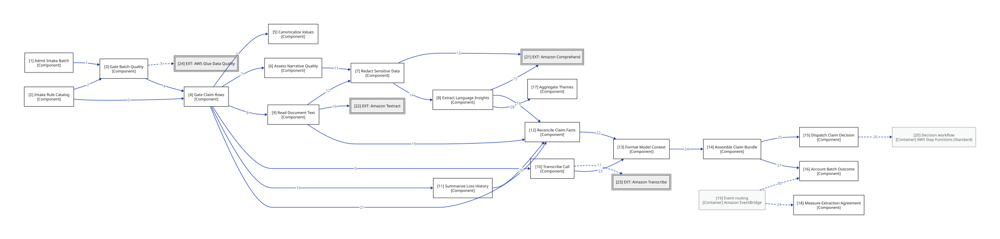

# Insurance claim processor v2 - Component view (intake step function)

> Opens the Intake step function container from the Container view. Each component runs as a state of the Intake workflow, except where Event routing delivers events directly (edges 29 and 30); edges show the per-batch and per-claim data flow. Edges carry numbers resolved in the edge-detail table.

**Locator:** this view opens `ISTEP` from `02-container`. It is a **completeness reference** at this grain.

## Node explainer (numbered — matches the `[n]` on the canvas)

| # | Node | Detail the short label hides |
|---|------|------------------------------|
| 1 | ADM | S3 conditional-put lock with takeover; registers the partition intake contract version in the key path `intake/v=1/…`; attachment keys confined to `raw/claims/<claim_id>/` (M3) lock correctness: holder ARN == `$$.Execution.Id` → self-retry proceeds; `states:DescribeExecution` for takeover; `CreatePartition` `AlreadyExistsException` counts as success (M13) pins the DQ config per batch; `config_source=fallback` → batch quarantined, fail closed (M17) |
| 2 | RCAT | defines each rule once and renders the DQDL (ADR 0019) completeness renders as non-empty; header exact-match → `invalid_schema`; report_date ≥ loss_date; exactly one CSV per partition (M3) |
| 3 | GBQ | quarantines the whole batch below the score threshold catalog hash stamped into the Glue ruleset description and compared (M17) |
| 4 | GCR | quarantines blocking rows, flags warnings, splits claims |
| 5 | CAN | dates, amounts, policy numbers, VINs under configured formats and date orders a date with day ≤ 12 valid both ways → blocking `dq_warn:ambiguous_date` unless independently corroborated; date order keyed by source / issuer, not channel (M2) |
| 6 | ANQ | deterministic checks and score |
| 7 | RSD | typed placeholders before persistence (ADR 0020) adds `DRIVER_ID`, `PASSPORT_NUMBER` and peer PII types; transcripts and OCR text are redacted, not verified; stdlib scrub of runs of ≥ 4 digits in transcripts (M6) |
| 8 | ELI | sentiment is context only, never a decision input |
| 9 | RDT | answers below confidence 80 are never reconciliation sources |
| 10 | TRC | redacted speaker turns; context, not a reconciliation source |
| 11 | SLH | deterministic text and stats; no FM |
| 12 | RCF | per-field agreement across sources; uses Canonicalize Values unverifiable is not clean: blocking `recon_unverifiable:<field>`, `source_disabled:<src>`, `history_failed`, `history_unavailable` (M4) |
| 13 | FMC | tagged, lineage-attributed sections then images (ADR 0021) claim-derived sections travel in Converse `guardContent`; instructions, schema and policy excerpts as plain `text`; images as plain `image` blocks, not guardrail-checked (H-F14-a) an image only when OCR confidence is insufficient and no PII was found; OCR insufficient with PII found: blocking `image_withheld:pii`; OCR sufficient: no image, no flag (M6) escapes `<` and `>` in claimant-derived text inside the context tags (M10) |
| 14 | ASM | bundle plus lineage plus quality block; copies images (ADR 0017) writes the revision-scoped key `bundles/<claim_id>/r<rev>` (M12) |
| 15 | DSP | one decision execution per claim revision resubmitting a decided claim → human review only, unless it is a DQ-owner-tagged proposal re-run (M5) passes the bundle key plus its S3 VersionId in the v1 input (M12) |
| 16 | ACC | conservation: rows in equals processed plus quarantined plus failed quarantine records hold no values: row index + rule ids + object version (M9) second entry: a FAILED / TIMED_OUT / ABORTED intake execution → `batch_failed` summary + `BatchFailed{Status}` metric (M14) |
| 17 | THM | ranked batch phrases and entity types |
| 18 | MEA | FM fields versus sources, per field and channel the measuring prompt hides the intake record; degraded results are excluded (M5) feedback records hold no values (M9) |

## Edge detail

| # | Edge | Mode | Claim |
|---|------|------|-------|
| 1 | ADM → GBQ | sync | Admit Intake Batch hands the admitted, registered batch to Gate Batch Quality. |
| 2 | RCAT → GBQ | sync | Intake Rule Catalog renders the DQDL ruleset that Gate Batch Quality submits. |
| 3 | GBQ → GDQ | async | Gate Batch Quality starts and polls the ruleset run on the batch partition. |
| 4 | GBQ → GCR | sync | Gate Batch Quality passes a fit batch to Gate Claim Rows. |
| 5 | RCAT → GCR | sync | Intake Rule Catalog supplies the row checks with their severities to Gate Claim Rows. |
| 6 | GCR → CAN | sync | Gate Claim Rows canonicalizes raw row values with Canonicalize Values. |
| 7 | GCR → ANQ | sync | Gate Claim Rows sends each claim's narrative to Assess Narrative Quality. |
| 8 | GCR → RDT | sync | Gate Claim Rows sends each claim's document images to Read Document Text. |
| 9 | GCR → TRC | sync | Gate Claim Rows sends each claim's call recording to Transcribe Call. |
| 10 | GCR → SLH | sync | Gate Claim Rows sends each claim's policy number to Summarize Loss History. |
| 11 | ANQ → RSD | sync | Assess Narrative Quality passes the scored narrative to Redact Sensitive Data. |
| 12 | RDT → RSD | sync | Read Document Text redacts OCR text with Redact Sensitive Data. |
| 13 | RSD → CMP | sync | Redact Sensitive Data detects PII offsets through Comprehend. |
| 14 | RSD → ELI | sync | Redact Sensitive Data passes redacted narrative text to Extract Language Insights. |
| 15 | ELI → CMP | sync | Extract Language Insights detects entities, key phrases and sentiment through Comprehend. |
| 16 | RDT → TXT | sync | Read Document Text analyzes document images through Textract QUERIES. |
| 17 | TRC → TRS | async | Transcribe Call starts and polls a redacted transcription job. |
| 18 | ELI → RCF | sync | Extract Language Insights hands narrative facts to Reconcile Claim Facts. |
| 19 | RDT → RCF | sync | Read Document Text hands confidence-gated OCR answers to Reconcile Claim Facts. |
| 20 | SLH → RCF | sync | Summarize Loss History hands the loss-history summary and frequency flag to Reconcile Claim Facts. |
| 21 | GCR → RCF | sync | Gate Claim Rows hands canonical intake fields and warning flags to Reconcile Claim Facts. |
| 22 | RCF → FMC | sync | Reconcile Claim Facts passes reconciled facts and mismatch flags to Format Model Context. |
| 23 | TRC → FMC | sync | Transcribe Call passes redacted dialog turns to Format Model Context. |
| 24 | FMC → ASM | sync | Format Model Context passes Converse context blocks to Assemble Claim Bundle. |
| 25 | ASM → DSP | sync | Assemble Claim Bundle passes the written bundle key to Dispatch Claim Decision. |
| 26 | DSP → DWF | async | Dispatch Claim Decision starts one decision execution per claim revision and does not wait. |
| 27 | ASM → ACC | sync | Assemble Claim Bundle reports each claim's fate to Account Batch Outcome. |
| 28 | ELI → THM | sync | Extract Language Insights feeds key phrases and entity types to Aggregate Themes. |
| 30 | EB → ACC | async | Event routing routes failed intake executions (FAILED, TIMED_OUT, ABORTED) to Account Batch Outcome for batch-failure accounting (M14). |
| 29 | EB → MEA | async | Event routing delivers decision-record events to Measure Extraction Agreement. |

## Not shown for brevity

- **Intake workflow orchestration** — every component below is invoked as a state of the Intake workflow container, except the Event routing entries (edges 29 and 30)
- **Claim data store** — every component reads and writes only its own S3 prefix (single writer per prefix)
- **Propose Quality Rule Change and Answer Adjuster Question** — these run in the Operator CLI container, not in this step function

## Key

- rectangle = an application or data store (C4 container)
- rectangle = a grouping of code inside a container (C4 component)
- double-bordered rectangle, `EXT:` = an external system we don't own
- faded fill/grey text = shown for context, not the subject of this view
- solid arrow = synchronous call
- dashed arrow = asynchronous message/event
- `[Type]` under a name = the element's C4 type (container/component)

> **Export caveat:** if this diagram's SVG is used detached from this page (e.g. a slide), re-inline its honesty tags onto the affected nodes — off-canvas tags do not travel with a bare SVG.

