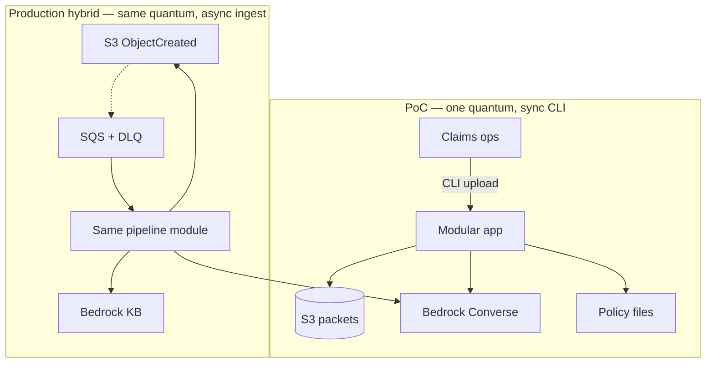

# Style decision — insurance claim document processor

**GATE: PENDING HUMAN.** Pick the style (and any hybridization). Nothing
here is Accepted.

Inputs: characteristics worksheet + logical components + AWS-AI brief.

---

## Decision-readiness

| Input | State |
|---|---|
| Domain | Back-office claim packet → structured facts + grounded summary |
| Characteristics | Integrity, privacy, audit, reliability (top cluster); one quantum |
| Data | Packets in S3; policy corpus; **residency `needs-input`** |
| Cloud | AWS; Bedrock on-demand |
| Org / team | Exam PoC; one builder |
| AWS AI option | Folded from aws-ai-assess: Bedrock Converse + RAG, not SageMaker, not Q Business |

---

## Determination 1 — quanta

Characteristics form **one** back-office cluster. Shared S3 bucket as the
document SoR ⇒ Land and Record are the same quantum (`ArchCharScope.md:52`).
**One quantum** for the PoC.

A later claimant-facing portal (different availability/scale) would be a
second cluster — not in the brief. Do not invent it.

---

## Determination 2 — where data lives

| Data | Home | Why |
|---|---|---|
| Claim packet (immutable bytes) | S3 object | Exam constraint + audit original |
| Extraction + summary + provenance | S3 sidecar object (and later a table) | Replay next to the packet |
| Policy corpus | S3 prefix now; Bedrock KB when it outgrows files | Knowledge changes independently of code |
| Prompt templates | Versioned in the app (later Prompt Management) | Configurability |

Default "one relational DB" is **challenged**: this workflow is
document-in, document-out. A database appears when HITL queues and payout
writes need query patterns S3 listing cannot give. Defer the table.

---

## Determination 3 — sync or async?

Default **synchronous** inside one claim (extract then retrieve then
summarize — each step needs the previous output).

**Async at the edge** as soon as volume is more than a CLI: S3
`ObjectCreated` → queue → worker. The PoC is a CLI/function call (sync).
Production hybridization: **event-driven ingest, synchronous processing
pipeline per message**. Sync Bedrock calls between mismatched "services"
would collapse them back into one quantum — keep FM invoke *inside* the
processing quantum, not a second service chat-calling it.

---

## Candidate styles (scored on driving characteristics)

| Characteristic | Modular monolith (single Python app) | Event-driven pipeline (S3 → queue → worker) | Orchestrated workflow (Step Functions) | Space-based / microservices |
|---|---|---|---|---|
| Data integrity | ● simple to put a validator in-process | ● same code, harder to see the hop | ● visible per-state validation | ○ over-split the five-field JSON |
| Privacy | ● one IAM role to reason about | ◐ more principals | ◐ | ○ |
| Auditability | ◐ you must remember to write the tuple | ● event id on every hop | ● execution history is the audit | ◐ |
| Reliability | ○ process crash loses in-flight | ● queue + DLQ | ● retries per state | ◐ |
| Testability | ● offline Stubber | ◐ | ○ state machines in unit tests | ○ |
| Configurability | ● | ● | ◐ | ● |
| Cost (PoC) | ● | ◐ | ○ SF + Lambdas for 3 docs | ○ |
| Time-to-value | ● | ◐ | ○ | ○ |

**Least-worst for the PoC:** **modular monolith** — one package, DI clients,
CLI that can later sit behind a Lambda handler. Matches "prove it before
you scale" (`cases/aws-skill/analyze-requirements.md`).

**Least-worst for production (when volume/`needs-input` lands):**
**event-driven pipeline** hybridized with the same modular core: S3 event →
SQS → the same pipeline function → result object + DLQ. Step Functions wins
when HITL, compensation, or multi-day waits appear (Saga territory —
`sdp-coordination`, reserved). Microservices lose: semantically coupled
steps of one form (`choosing-appropriate-arch.md`).

**Losing alternatives:**

- Microservices per component — Dynamic Quantum Entanglement the moment
  Extract sync-calls Validate across the network.
- AgentCore Runtime — no tool-permission problem to solve yet (aws-ai-assess).
- Streaming WebSocket — no interactive chat in the brief (`sdp-messaging`
  would own that later).

---

## Topology

Dotted = async. The production box is a **recommendation**, not an
implemented style.

---

## Edge / access (component stage excluded UIs)

| Actor | Access | ADR? |
|---|---|---|
| PoC operator | CLI; AWS creds later, gated | Defer UI |
| Production adjuster | Not in brief — do not invent Flask as architecture. Flask is an **extra challenging** exam add-on, not a style pick | Deferred stub |
| Systems of record (policy admin, payouts) | Out of scope | — |

---

## Decisions requiring ADRs

1. Style: modular monolith now / event-driven later (this document).
2. Bedrock vs SageMaker vs Q Business (from aws-ai-assess).
3. RAG store promotion trigger.
4. Document understanding path (text-only PoC vs Textract/BDA).
5. Sync pipeline vs Step Functions when HITL appears — **deferred** until
   HITL is in scope.
