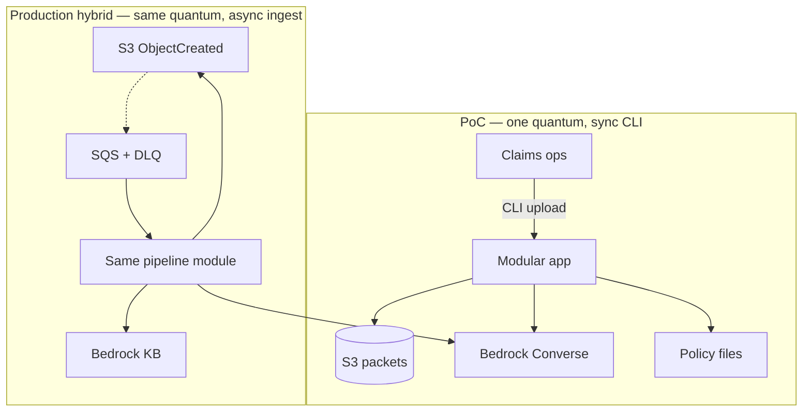
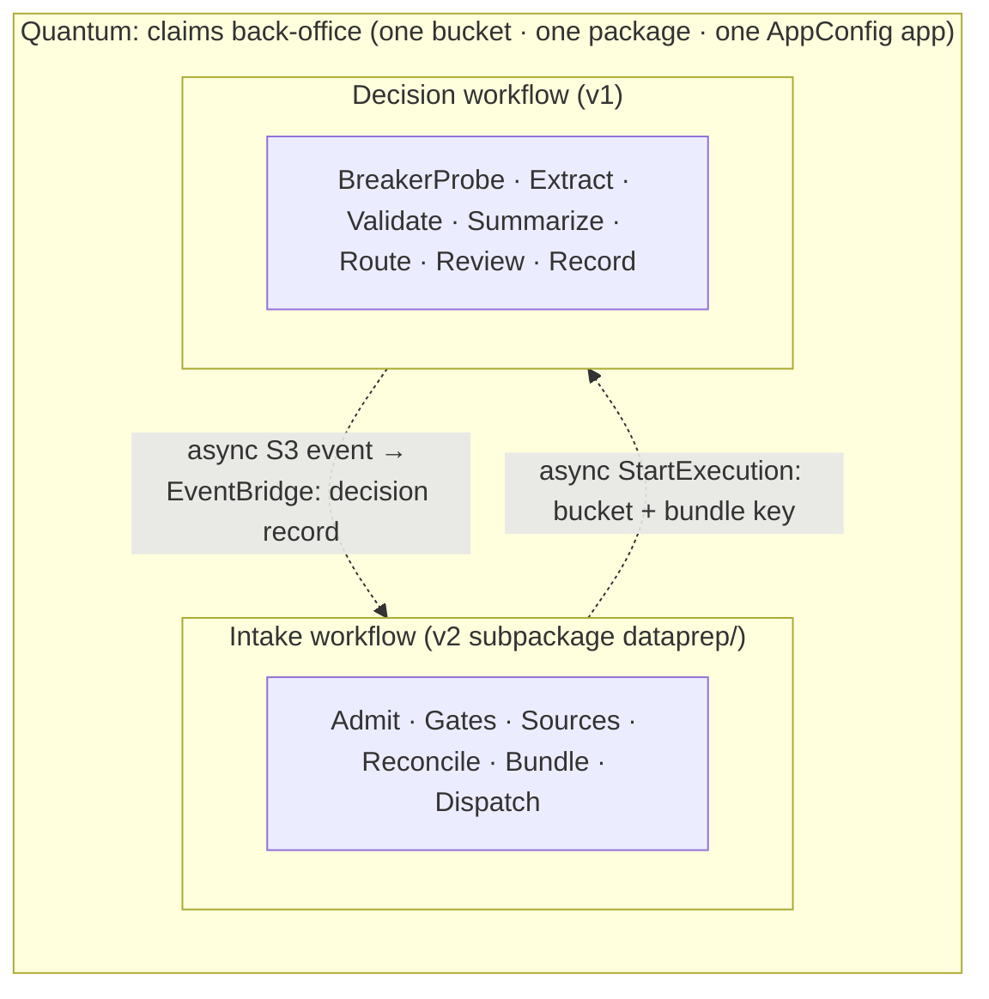

# Style decision — insurance claim document processor

**GATE: PENDING HUMAN.** Pick the style (and any hybridization). Nothing
here is Accepted.

Inputs: characteristics worksheet + logical components + AWS-AI brief.

---

## Decision-readiness

| Input | State |
|---|---|
| Domain | Back-office claim packet → structured facts + grounded summary |
| Characteristics | Integrity, privacy, audit, reliability (top cluster); one quantum |
| Data | Packets in S3; policy corpus; **residency `needs-input`** |
| Cloud | AWS; Bedrock on-demand |
| Org / team | Exam PoC; one builder |
| AWS AI option | Folded from aws-ai-assess: Bedrock Converse + RAG, not SageMaker, not Q Business |

---

## Determination 1 — quanta

Characteristics form **one** back-office cluster. Shared S3 bucket as the
document SoR ⇒ Land and Record are the same quantum (`ArchCharScope.md:52`).
**One quantum** for the PoC.

A later claimant-facing portal (different availability/scale) would be a
second cluster — not in the brief. Do not invent it.

---

## Determination 2 — where data lives

| Data | Home | Why |
|---|---|---|
| Claim packet (immutable bytes) | S3 object | Exam constraint + audit original |
| Extraction + summary + provenance | S3 sidecar object (and later a table) | Replay next to the packet |
| Policy corpus | S3 prefix now; Bedrock KB when it outgrows files | Knowledge changes independently of code |
| Prompt templates | Versioned in the app (later Prompt Management) | Configurability |

Default "one relational DB" is **challenged**: this workflow is
document-in, document-out. A database appears when HITL queues and payout
writes need query patterns S3 listing cannot give. Defer the table.

---

## Determination 3 — sync or async?

Default **synchronous** inside one claim (extract then retrieve then
summarize — each step needs the previous output).

**Async at the edge** as soon as volume is more than a CLI: S3
`ObjectCreated` → queue → worker. The PoC is a CLI/function call (sync).
Production hybridization: **event-driven ingest, synchronous processing
pipeline per message**. Sync Bedrock calls between mismatched "services"
would collapse them back into one quantum — keep FM invoke *inside* the
processing quantum, not a second service chat-calling it.

---

## Candidate styles (scored on driving characteristics)

| Characteristic | Modular monolith (single Python app) | Event-driven pipeline (S3 → queue → worker) | Orchestrated workflow (Step Functions) | Space-based / microservices |
|---|---|---|---|---|
| Data integrity | ● simple to put a validator in-process | ● same code, harder to see the hop | ● visible per-state validation | ○ over-split the five-field JSON |
| Privacy | ● one IAM role to reason about | ◐ more principals | ◐ | ○ |
| Auditability | ◐ you must remember to write the tuple | ● event id on every hop | ● execution history is the audit | ◐ |
| Reliability | ○ process crash loses in-flight | ● queue + DLQ | ● retries per state | ◐ |
| Testability | ● offline Stubber | ◐ | ○ state machines in unit tests | ○ |
| Configurability | ● | ● | ◐ | ● |
| Cost (PoC) | ● | ◐ | ○ SF + Lambdas for 3 docs | ○ |
| Time-to-value | ● | ◐ | ○ | ○ |

**Least-worst for the PoC:** **modular monolith** — one package, DI clients,
CLI that can later sit behind a Lambda handler. Matches "prove it before
you scale" (`cases/aws-skill/analyze-requirements.md`).

**Least-worst for production (when volume/`needs-input` lands):**
**event-driven pipeline** hybridized with the same modular core: S3 event →
SQS → the same pipeline function → result object + DLQ. Step Functions wins
when HITL, compensation, or multi-day waits appear (Saga territory —
`sdp-coordination`, reserved). Microservices lose: semantically coupled
steps of one form (`choosing-appropriate-arch.md`).

**Losing alternatives:**

- Microservices per component — Dynamic Quantum Entanglement the moment
  Extract sync-calls Validate across the network.
- AgentCore Runtime — no tool-permission problem to solve yet (aws-ai-assess).
- Streaming WebSocket — no interactive chat in the brief (`sdp-messaging`
  would own that later).

---

## Topology

```mermaid
flowchart TB
  subgraph poc["PoC — one quantum, sync CLI"]
    OPS[Claims ops] -->|CLI upload| APP[Modular app]
    APP --> S3[(S3 packets)]
    APP --> BR[Bedrock Converse]
    APP --> POL[Policy files]
  end
  subgraph prod["Production hybrid — same quantum, async ingest"]
    S3e[S3 ObjectCreated] -.-> Q[SQS + DLQ]
    Q --> W[Same pipeline module]
    W --> S3e
    W --> BR
    W --> KB[Bedrock KB]
  end
```

Dotted = async. The production box is a **recommendation**, not an
implemented style.

---

## Edge / access (component stage excluded UIs)

| Actor | Access | ADR? |
|---|---|---|
| PoC operator | CLI; AWS creds later, gated | Defer UI |
| Production adjuster | Not in brief — do not invent Flask as architecture. Flask is an **extra challenging** exam add-on, not a style pick | Deferred stub |
| Systems of record (policy admin, payouts) | Out of scope | — |

---

## Decisions requiring ADRs

1. Style: modular monolith now / event-driven later (this document).
2. Bedrock vs SageMaker vs Q Business (from aws-ai-assess).
3. RAG store promotion trigger.
4. Document understanding path (text-only PoC vs Textract/BDA).
5. Sync pipeline vs Step Functions when HITL appears — **deferred** until
   HITL is in scope.

---

## v2 addendum — data-preparation plane (2026-09-23)

**GATE: RATIFIED 2026-09-23 ("ratify as recommended" — design/hld-v2-data-prep.md §6; was PENDING HUMAN)** (provisional batch, A2-a). R4 ratified
**each determination** as drafted: quantum count, data placement,
communication types, style. The ratified amendments do not change them (see
the consistency note at the end).

Inputs: the v2 addenda in `characteristics-worksheet.md`,
`../components/logical-components.md` and `../assess/capability-brief.md`.
Decision C2-a ("a separate intake state machine → bundle → v1") is a fixed
input. This stage tests what it implies *structurally*.

### Review finding — v1 as-built style (drift)

The v1 sections above still recommend a modular monolith and defer Step
Functions. **ADR 0004 amended that.** The as-built v1 style is an
**orchestrated workflow over a modular core**:
- one Python package, deployed as per-state Lambdas from **one zip**
  (`../build/DEPLOY-LEDGER.md` Stage 5);
- driven by a Step Functions Standard machine (ledger Stage 8);
- one S3 bucket and one AppConfig application;
- **one quantum.**

v2 decisions below are made against *this* baseline. The stale v1 text is
routed to the next v1 re-entry, not rewritten here.

### Decision-readiness (v2)

| Input | State |
|---|---|
| Domain | v2 addenda (validation · multimodal · formatting · quality loop) |
| Characteristics | v2 top 3 = integrity (inputs), privacy, auditability. **No counteracting clusters.** Operational-profile divergence: batch vs per-claim, config-heavy vs ADR-stable change cadence. |
| Data | One versioned, SSE-KMS bucket (ledger Stage 1); Glue catalog new; AppConfig app `claim-processor` exists |
| Cloud | AWS serverless, `us-east-1` |
| Org / team | One builder; no separate intake team (**`needs-input`** if that changes) |
| AWS-AI option | Folded from aws-ai-assess v2: managed perception + NLP + deterministic code; FM only for judgment |
| Missing | Volume, SLO, retention periods for raw audio and narratives — **`needs-input`** |

### Determination 1 — one quantum or two?

Apply the quantum features (`ArchCharScope.md:18-28`) to the boundary between
the intake plane and the decision workflow:

| Feature | Evidence | Reading |
|---|---|---|
| Independent deployability | One package / one zip today. v2 needs one coupled change in v1 (bundle consumption, W-series ACs). | *Not* independent today |
| Shared data store | Same bucket, different prefixes. v1 reads `bundles/`; v2 reads `results/` / `pending-review/`. "Shared database ⇒ same quantum" (`ArchCharScope.md:52`). | **Same quantum** |
| Functional cohesion | Data preparation vs claim decisioning: two bounded contexts | Separable |
| Synchronous coupling | None. Hand-off = `StartExecution` fire-and-forget; feedback = S3 → EventBridge. | No dynamic entanglement |
| Characteristics sets | One governance cluster; operational divergence only | Monolith-family default (`ArchCharScope.md:92-94`) |

Options on the spectrum:
- **Q-1 — one quantum, two workflows.** The v2 plane is a new subpackage and
  a second state machine *inside* the existing quantum. The seam is
  **pre-cut**: a contract module, separate IAM roles, zone ownership, and
  async edges both ways.
- **Q-2 — two quanta now.** A separate bucket (or bucket-policy-enforced
  zones), a separate deploy package, versioned contracts with a tolerant
  reader, and independent release trains.

| Driving characteristic | Q-1 one quantum, pre-cut seam | Q-2 two quanta now |
|---|---|---|
| Data integrity | ● the bundle contract and v1's consumer change atomically, so no version skew — *when deployed as one package*; a manual per-function deploy can skew (L-6), and M18 makes that fail closed | ◐ version skew is possible; needs tolerant-reader discipline |
| Privacy | ◐ one bucket; zone isolation by IAM prefix scoping + SD-4 | ● bucket-level isolation of raw PII |
| Auditability | ● one account view; correlation by `claim_id` / `revision` / execution names | ● same, across two deployables |
| Reliability | ● async edges already isolate failures (intake faults cannot break decisions in flight) | ● same |
| Testability | ● one offline suite proves both sides of the contract | ◐ contract tests per side + a consumer-driven contract test |
| Observability | ● | ● |
| Cost / simplicity | ● one runbook, one package | ○ two release trains for one builder |

**Recommendation: Q-1.** It is **consistent with C2-a**: a separate state
machine does not imply a separate quantum. Q-2's real gains (bucket-level PII
isolation, independent releases) are bought cheaply inside Q-1:
- **SD-4:** v1 reads only the curated `bundles/` zone.
- **Config-not-code changes:** the feedback loop edits AppConfig, so intake
  *code* churn stays low.

**Split triggers** (record them in the ADR; when one fires, move to Q-2):
- a separate team owns intake;
- intake code changes start forcing risky v1 redeploys;
- raw-media retention or residency diverges from claim-record retention;
- volume needs isolation beyond per-function concurrency controls.

**Quantum map:**

```mermaid
flowchart LR
  subgraph Q["Quantum: claims back-office (one bucket · one package · one AppConfig app)"]
    subgraph P["Intake workflow (v2 subpackage dataprep/)"]
      I1[Admit · Gates · Sources · Reconcile · Bundle · Dispatch]
    end
    subgraph D["Decision workflow (v1)"]
      D1[BreakerProbe · Extract · Validate · Summarize · Route · Review · Record]
    end
    P -.->|async StartExecution: bucket + bundle key| D
    D -.->|async S3 event → EventBridge: decision record| P
  end
```

### Determination 2 — where does data live?

The "one relational DB" default is challenged again: the flow is still
document-in, document-out. The rule is **single writer per prefix**. Readers
consume only *published contracts*.

| Data | Home | Writer (only) | Readers | Contract |
|---|---|---|---|---|
| Intake batches | `intake/v=1/batch_id=<id>/claims.csv` (M3) + Glue table `claim_processor_dq.claims_intake` | upstream (drop zone) | Admit, Gate Batch, Gate Rows | CSV header (spec §3) |
| Raw artifacts (PII-dense) | `raw/claims/<id>/…` | upstream | intake only | file names by type |
| Loss runs (reference) | `history/loss_runs.csv` | upstream | Summarize Loss History | CSV header |
| Transcripts | `transcripts/<id>/` | Transcribe (on behalf of the intake role) | Transcribe Call | Transcribe JSON (redacted) |
| Per-source records | `processed/claims/<id>/r<rev>/*.json` (M12) | the owning source component | Assemble Claim Bundle | internal |
| **Bundles** (curated, the FM-ready package) | `bundles/<id>/r<rev>` (M12) + the copied images beside that revision (SD-4; exact image key = LLD input L2) | Assemble Claim Bundle | **v1 (read-only)**, Answer Adjuster Question | **published: schema_version 2.x** |
| Decision records | `results/…`, `pending-review/…` | v1 Record | Measure Extraction Agreement | **published: §7 contract (AC-F1)** |
| DQ plane | `quality/{locks,dq-results,quarantine,themes,feedback,proposals}/` | intake components (one prefix each) | intake ops, DQ owner, `dq propose` | internal + proposal schema |
| DQ policy | AppConfig profile `data-quality` (same app, new profile) | DQ owner (human deploy) | intake via Resolve Configuration | the config document |

**SD-4 (a spec delta):** Assemble *copies* the images the FM needs into the
bundle zone. v1's role then gets `s3:GetObject` on `bundles/*` only, never on
`raw/claims/*`, so the decision plane cannot read raw narratives or call
audio.
- Cost: one `CopyObject` per image (tiny).
- Rejected alternative: an image-suffix-scoped IAM pattern on
  `raw/claims/*.png`. It is cheaper, but it couples v1 to raw-zone naming and
  leaves the zone boundary implicit.

**Retention** for raw audio and narratives vs claim records:
**`needs-input`**. It is the likeliest future Q-2 split trigger.

A database appears only when quarantine or proposal work queues need
querying beyond S3 listing. First step then: Athena over `quality/` through
the Glue catalog (deferred). DynamoDB for locks is rejected: an S3
conditional put suffices (spec P-j).

### Determination 3 — sync or async?

| Edge | Type | Why |
|---|---|---|
| Inside intake, per claim | Orchestrated steps (the state machine invokes Lambda synchronously per state). **Async** for Glue DQ and Transcribe: start → poll with a budget. | Each step needs the previous output; long jobs never block a Lambda (P-f) |
| Batch fan-out | Orchestrated `Map` (bounded concurrency), then a join | Conservation accounting needs the join (reliability, audit) |
| Intake → v1 | **Async**: `StartExecution` fire-and-forget, named `claim-<id>-r<rev>` | `.sync` would pin intake to v1's up-to-7-day HITL wait — **Dynamic Quantum Entanglement** (`ArchCharScope.md:72-74`). v1's latency must not leak into intake. |
| v1 → feedback | **Async choreography**: S3 Object Created → EventBridge → Measure Agreement | v1 stays unaware of v2 (no new outbound call from v1) |
| Upstream → intake | **Async**: S3 drop (manifest-last) → EventBridge → state machine | At-least-once delivery → Admit dedupes (spec AC-Z2) |

**Contract-level dependency direction.** v1 → `dataprep.contracts` (bundle
schema); `dataprep.agreement` → v1's record (read as a dict, tolerant
reader). There are no runtime calls either way. This must not become an
import cycle, so two structural rules are handed to arch-validate:
- `dataprep/contracts.py` imports nothing from `claim_processor` outside
  itself;
- v1 modules import only `dataprep.contracts`, never other `dataprep`
  modules (CR-01 / CR-02 style).

### Candidate styles (intake plane), scored

Domain isomorphism: intake is **pipeline-shaped** (ordered, deterministic,
one-way: validate → enrich → assemble → dispatch). Its source readers are
**plug-in-shaped**: add a modality = add a reader. Ratings below are
prose-reconstructed where the book gives them; the star figures are missing
from the notes, and none are invented.

| Characteristic | **A. Orchestrated pipeline** (Step Functions Standard; Map + Parallel; Lambda steps from the shared core) | **B. Event-driven choreography** (S3/EventBridge/SQS per stage — the assignment's shape, made robust) | **C. Glue-native ETL pipeline** (PySpark job + `EvaluateDataQuality` row-level outcomes) |
|---|---|---|---|
| Data integrity | ● gates are explicit states; the join refuses a bundle until every source has settled | ◐ the join needs a stateful aggregator; partial bundles are possible | ● native row-level DQ outcomes (would remove the Lambda row gate) |
| Privacy | ● per-role IAM; claim-check payloads (S3 refs only) | ◐ more principals and queues | ◐ one job role sees all data on executors |
| Auditability | ● execution history per batch; named v1 runs per revision | ○ the trace must be rebuilt across events | ◐ job-run logs; no step history |
| Reliability | ● Retry/Catch per state; conservation at the join | ◐ DLQ per stage; conservation needs extra accounting (EDA 4★ fault tolerance, `event-driven-arch-style.md:633-637`) | ◐ job-level retry; partial failures handled in code |
| Testability | ◐ ASL structural tests + offline Lambda units | ○ EDA testability LO (same cite) | ○ needs `pyspark` → **violates R1** (no new deps); slow local runs |
| Observability | ● | ◐ ("observability is optional" fallacy bites) | ◐ |
| Cost (PoC) | ● per transition / invocation | ● | ○ DPU minimums per batch for 16 rows |
| Evolvability (new modality) | ◐ edit the Parallel in the ASL | ● add a subscriber (EDA evolvability 5★, same cite) | ◐ edit the job |
| Async services (Transcribe) | ● Wait/poll states | ◐ needs a completion event bridge | ○ awkward from Spark executors |

**Least-worst: A — an orchestrated pipeline**, hybridized with
**event-driven edges** (the S3 → EventBridge trigger in, the decision-record
feedback out). Glue is used **only** as the batch DQ gate engine, not as the
processing runtime. The same style as v1 (ADR 0004), so it adds one new
concept (Map/Parallel), not a new paradigm.

**Losers, and the characteristic that sank each:**
- **B — auditability + reliability.** Conservation and the four-source join
  need an extra stateful aggregator; the trace is reconstructed, not
  recorded.
- **C — testability.** A new `pyspark` dependency (R1), DPU minimums, and
  awkward async services. Revisit C if volume reaches thousands of rows per
  batch (`needs-input`); its native row-level DQ is its real advantage.
- **Microservices per modality — Grains of Sand** (`microservices-arch.md:52`).
  The four readers are semantically coupled by one join.

**Fashion check:** B is the assignment's shape and today's default "serverless
event" reflex. It is rejected on fit, not taste. Its evolvability win is real,
but it arrives only with more modalities than v2 has.

**Microkernel note:** if modalities multiply (dashcam video, telematics,
medical bills), evolve the source readers into a **registry with one reader
interface** (microkernel *inside* the pipeline, `microkernel-arch-style.md`).
Not now.

### Fallacies pre-scan (the distributed parts of A)

| Fallacy | How v2 pays for it |
|---|---|
| Network is reliable | Retry/Catch per state; source failure → `failed` status (spec AC-Z4) |
| Latency is zero | Transcribe runs for minutes → poll budgets. p95/p99 of the join is the metric to watch, not the average. |
| Bandwidth is infinite | **Claim-check**: states carry S3 refs, ≤ 32 KB (AC-Z5). Avoids stamp coupling. |
| Network is secure | Per-role least privilege; SSE-KMS; SD-4 keeps v1 out of raw PII |
| Topology changes | EventBridge rules decouple producer and consumer; named state machines |
| **Versioning is easy** | `schema_version` on the bundle + tolerant reader. The contract module is the only shared code. |
| Compensating updates always work | None needed: writes are idempotent overwrites; quarantine is never deletion |
| **Observability is optional** | EMF vocabulary; correlation ids (`batch_id`, `claim_id`, `revision`) in every record and execution name |
| Transport cost is zero | S3 request costs are negligible at PoC scale; revisit at volume |
| One administrator / homogeneous network | Single account, single region (PoC) |

### Edge / access topology (v2)

| Actor | Access today (PoC) | Production direction | ADR? |
|---|---|---|---|
| Upstream systems / partners (TPAs) | **S3 drop zone**: attachments first, CSV last (manifest-last commit), operator credentials | Presigned-URL upload API, or managed SFTP for partners — **`needs-input`** | **Yes: ingestion contract** |
| Intake ops (quarantine) | S3 records + CLI | A work-queue UI (deferred; Athena first) | Deferred |
| DQ owner | `python -m claim_processor dq propose` + AppConfig deploy (linear-bake) | same | Covered by the feedback ADR |
| Adjuster | `ask` CLI over a bundle | HITL UI (with F2) | Deferred with F2 |
| Auditor | S3 versions + SFN history (operator creds) | read-only audit role | Deferred |

### Decisions requiring ADRs (→ arch-decide)

1. **Plane placement:** one quantum, two orchestrated workflows, a pre-cut
   seam, and the split triggers. Revises ADR 0016's framing: *plane*, not
   *quantum*.
2. **Data topology:** single writer per prefix; a curated, self-contained
   bundle zone (SD-4); retention `needs-input`.
3. **Communication:** async hand-off (named `StartExecution`) + async feedback
   (choreography); orchestration inside intake.
4. **Ingestion contract:** S3 drop zone + manifest-last + EventBridge (vs an
   upload API).
5. Carried from aws-ai-assess v2: service set / deterministic-first; DQ
   engine; document path; PII minimization point; transcription tier.

**Sealed self-check (opened only after the determinations above were
written):**
- It **converges with the Silicon Sandwiches pattern**: one characteristics
  set → one quantum, and the monolith family stays the default.
- It is **distinct from the Going, Going, Gone pattern**: there, differing
  characteristics per role forced distribution and async across *mismatched
  quanta*. Here async is used *inside* one quantum, because of a latency
  mismatch (the HITL wait of up to 7 days), not a characteristics mismatch.

No sealed content entered context early.

### Consistency note — ratified amendments (2026-09-23)

Checked against `../design/hld-v2-fold-map.md`. No determination changes.
- **Determination 1 is unchanged (M14).** The Distributed Map child executions
  (a Standard child per claim, for 51–200 claims) stay inside the one quantum:
  the same package, bucket and config. The v1-side amendments (M1, M12, M15,
  M16, M18) ship in the same package too.
- **Consistent with Determination 3 (M14).** The watchdog is event-driven
  choreography, like the feedback edge: an EventBridge rule on intake
  execution FAILED / TIMED_OUT / ABORTED → Account Batch Outcome.
- **SD-4 is unchanged.** M6 adds an explicit Deny on `raw/*` to v1's
  step-lambda role, which backs SD-4 in IAM.
- **M12 strengthens the seam contract.** The S3 VersionId travels in the v1
  input and the lineage, so the hand-off names one exact bundle object, not
  only a key. The Determination 2 keys are now updated in place to the M3 /
  M12 forms (`intake/v=1/…`, `bundles/<claim_id>/r<rev>`,
  `processed/claims/<claim_id>/r<rev>/…`).
- **Q-1's "no version skew" is qualified in the Q-1 table (M18).** It holds for one
  package, not during a manual, per-function deploy (L-6). M18 makes skew
  fail closed (a `bundles/` key without `bundle_flags` → review). The runbook
  publishes Lambda versions and switches alias-qualified ARNs together (the
  alias part can wait for IaC).
